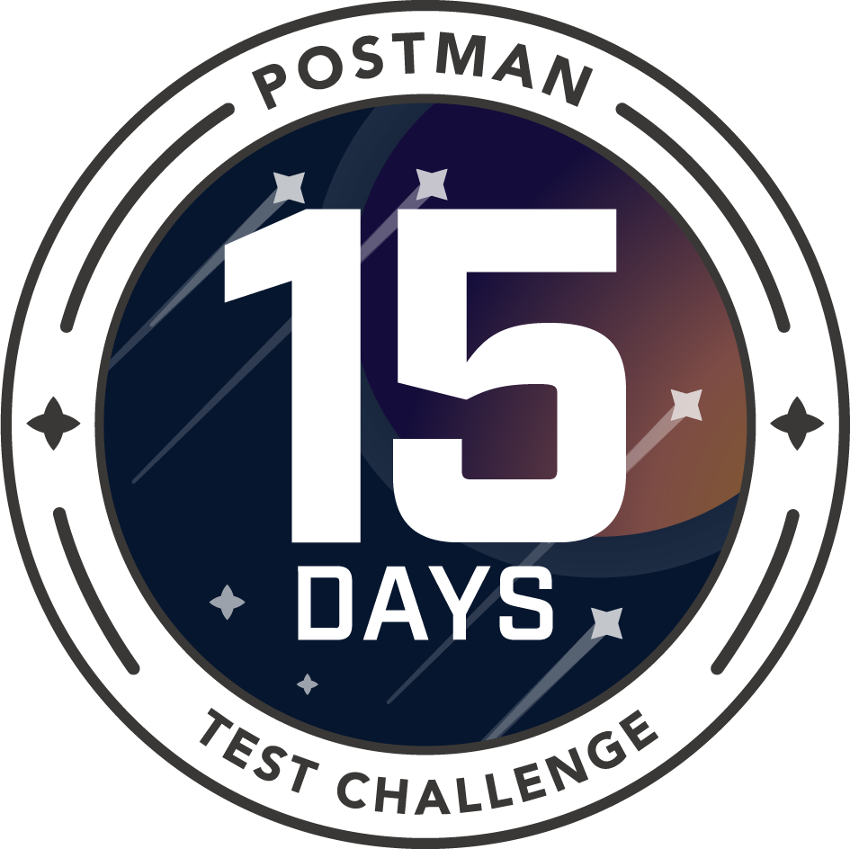

author: Arlemi
id: 15_days_of_postman_fr
summary: This is a sample Postman Guide
categories: Tester, Intermediate
environments: web
status: Hidden
feedback link: https://github.com/loopDelicious/pmquickstarts
tags: Intermediate, Tester, Automation, Badge, fr

# 15 Jours de Postman - pour les testeurs

<!-- ------------------------ -->

## Vue d'ensemble

Duration: 2

Améliorez vos compétences en vous attaquant à un challenge Postman par jour pendant 15 jours.

### Evaluez votre niveau d’expérience sur Postman

- Répondez au [quiz sur les compétences Postman](https://loopdelicious.github.io/postman-skills/)

### Niveau d’expérience pour ce défi

- Intermédiaire

### Comment ça marche

1. **Récupérer les challenges journaliers**: Forkez la collection correspondante à chaque jour dans votre propre workspace public sur Postman.
1. **Passer les instructions en revue**: Lisez la documentation de la collection du jour pour voir comment compléter le challenge. Des ressources additionelles sont disponibles si vous voulez approfondir n'importe lequel des sujets.
1. **Vérifier vos solutions**: Quand vous pensez avoir la solution, validez la en suivant les instructions dans le dossier `Submit your solution`. Vous pouvez vérifier votre travail pour chaque jour.
1. **Réclamer votre badge**: Pour le challenge final, soumettez votre solution final à l'équipe Postman. Compléter tous les challenges avec succès vous permet de réclamer le badge [15 days of Postman](https://badgr.com/public/badges/bG6IYzbkTsKrP3t6C2q0BQ).

**Regardez cette vidéo** pour des conseils sur le challenge de 15 jours :
<video id="3_w2Bz0BnlY"></video>
Pour activer les sous-titres automatiques en Français, consulter [cette page d'aide](https://support.google.com/youtube/answer/6373554?hl=fr).

### Prérequis

1. **Se connecter à Postman:** Créez un compte Postman si vous n'en avez pas déjà un puis connectez vous à [Postman web](https://go.postman.co) dans votre navigateur. Pour utiliser Postman dans un navigateur, téléchargez et lancez [l'agent Postman](https://www.postman.com/downloads/) sur votre machine pour éviter les soucis de "cross-origin resource sharing" (CORS). L'agent est différent de l'application. Sur Mac, vous verrez un icone montrant que l'agent Postman est lancé dans la barre de menu en haut à droite. Sur Windows, l'icone de l'agent Postman apparait dans la barre des tâches en bas a droite de votre écran.
1. **Créer un workspace public**: [Créez un nouveau workspace Postman](https://learning.postman.com/docs/collaborating-in-postman/using-workspaces/creating-workspaces/#creating-a-public-workspace) avec une visibilité `Public` pour montrer votre travail. Choisissez un nom de workspace unique pour évitez que d'autres copient vos solutions directement.

Negative
: Si vous ne voulez pas utiliser Postman dans votre navigateur avec l'agent, vous pouvez à la place télécharger et installer l'application Postman pour Mac, Windows, ou Linux.

Negative
: Si vous faites déjà parti d'une équipe Postman et votre organisation ne veut pas publier ce workspace sous leur profile d'équipe, vous pouvez créer un compte séparé pour que le workspace s'affiche sous votre propre nom.

### Ce que vous apprendrez

- Compétences de test basiques, comme écrire et envoyer des tests APIs avec Postman
- Compétences plus avancées de test, comme utiliser les variables, les scripts, et de l'automatisation
- Compétences avancées de test, comme générer des variables dynamiquement, utiliser des librairies et des serveurs de mock

### Ce dont vous avez besoin

- Un [compte Postman](https://postman.com/)

### Ce que vous allez créer

- Un workspace public Postman avec des collections, moniteurs, serveurs de mock, examples de code, et plus encore.

### Foire Aux Questions

- **Combien de temps est néssaire pour compléter le challenge des 15 jours de Postman ?** Prévoyez de passer entre 5 et 45 minutes chaque jour pour explorer le sujet et approfondir ceux que vous trouvez intéressant. Allez à votre propre vitesse. Il n'y a pas de pénalité si vous prenez plus longtemps. **Note** : si beaucoup de temps passe entre le moment où vous forkez le challenge et le moment où vous soumettez la solution finale, il est possible que vous deviez récupérer les derniers changements pour vous assurer que la solution que vous soumettez est à jour.
- **Dois-je compléter tous les 15 challenges ?** Compléter tous les challenges est requis pour réclamer votre badge **15 days of Postman**. Vous pouvez approfondir n'importe lequel des sujets que vous trouvez intéressant, cependant certains challenges sont basés sur des examples et concepts introduits dans des challenges précédents. Vous recevrez donc moins d'aide pour les concepts ayant été introduits plus tôt dans la série.
- **Je débute avec le code et les APIs. Est-ce que ce challenge est pour moi ?** Les challenges sont faits pour les testeurs et conviennent aux testeurs débutants. Si vous connaissez les concepts de base de programmation et de JavaScript (ou autre language de programmation), ce challenge est fait pour vous. Si vous travaillez avec des APIs mais ne vous identifiez pas comme un testeur, vous devrez peut être effectuer quelques recherches pour compléter certains challenges.
- **Ais-je besoin de créer un workspace public ?**: Oui. La vérification nécessite que tout votre travail soit dans un workspace public. Si vous faites partie du compte Postman de votre entreprise, cette dernière ne voudra peut être pas que le workspace apparaisse sur leur profil d'équipe public. Dans ce cas, utilisez votre compte Postman personnel, ou créez un compte séparé pour compléter le challenge.
- **Je suis bloqué. Quelqu'un peut m'aider?**
  - Relisez les instructions avec attention, et vérifiez la documentation ainsi que les ressources additionelles listées dans les instructions.
  - Essayez de soumettre une solution incomplète pour révèler des indices dans les résultats de tests.
  - Cherchez des examples similaires sur le [forum de la communauté](https://community.postman.com/).
  - Si vous cherchez de l'aide, postez dans la catégorie [Training](https://community.postman.com/c/training/38) do forum de la communauté. Soyez sûrs d'inclure une explication détaillée de votre question, ce que vous avez déjà essayé, et mettez le lien de votre workspace public pour que les autres puissent constater où vous êtes coincé
  - Si votre question est à propos de l'administration du badge (i.e. pas une question technique sur Postman), vous pouvez demander de l'ade dans la catégorie [Training](https://community.postman.com/c/training/38) du forum de la communauté.

<!-- ------------------------ -->

## Day 01: Client API

Duration: 4

### Objectifs d'apprentissage

Une fois ce challenge complété, vous serez capable :

- D'importer des données dans Postman
- D'envoyer et recevoir des données depuis une API
- D'inspecter les requêtes et réponses d'API
- D'utiliser les variables de collection pour stocker des données

### Comment démarrer

1.  **Récupérez le challenge :** Forkez la collection `Day 01: API client` dans votre propre workspace.
     
    
2.  **Lisez la documentation :** Dans votre fork, sélectionnez le premier dossier `API client`. Ouvrez la barre de navigation à droite pour suivre les instructions de la documentation de la collection. Si vous trouvez embêtant le fait devoir passer de la documentation à d'autres parties de Postman, vous pouvez ouvrir la documentation dans un nouvel onglet et passer de l'un à l'autre à la place.
3.  **Soumettre votre solution:** Sélectionnez le second dossier `Submit your solution` puis suivez les instructions dans la documentation pour valider votre solution.

### Concepts abordés

- [Forker une collection](https://learning.postman.com/docs/collaborating-in-postman/version-control-for-collections/#forking-a-collection)
- [Voir la documentation](https://learning.postman.com/docs/publishing-your-api/viewing-documentation/)
- [Envoyer une requête](https://learning.postman.com/docs/sending-requests/requests/)
- [Utiliser les variables](https://learning.postman.com/docs/sending-requests/variables/)

### Ressources complémentaires

- [Intro to APIs](https://youtu.be/iFMLyMgCUTs) - série vidéo
- [Postman API](https://learning.postman.com/docs/developer/intro-api/) - documentation
- [Initial vs Current Values for Variables](https://youtu.be/I6vClap0ajU) - vidéo
- [Create a public workspace](https://learning.postman.com/docs/collaborating-in-postman/using-workspaces/creating-workspaces/#creating-a-new-workspace) - documentation
- [Agent for the Postman web client](https://youtu.be/6xlJUx2ZMy4) - vidéo

<!-- ------------------------ -->

## Day 02: Contrôle des versions

Duration: 5

### Objectifs d'apprentissage

- Configurer les en-têtes de requête
- Expliquer le contrôle de version dans Postman
- Forker et merger les changements d'une collection
- Utiliser les variables d'environement pour stocker des données

### Comment démarrer

Forkez la collection dans votre workspace.
 

### Concepts abordés

- [Forker une collection](https://learning.postman.com/docs/collaborating-in-postman/version-control-for-collections/#forking-a-collection)
- [Envoyer des données dans le body](https://learning.postman.com/docs/sending-requests/requests/#sending-body-data)
- [Utiliser les environements](https://learning.postman.com/docs/sending-requests/managing-environments/#creating-environments)
- [Configurer les en-têtes de requêtes](https://learning.postman.com/docs/sending-requests/requests/#configuring-request-headers)

### Ressources complémentaires

- [Version Control for Collections](https://youtu.be/QKxukXJWRPI) - vidéo
- [How to use Postman environments](https://youtu.be/oCEDjp3XMco) - vidéo

<!-- ------------------------ -->

## Day 03: Debugging

Duration: 3

### Objectifs d'apprentissage

- Inspecter les données de la console
- Enregistrer des données sur la console
- Écrire un script

### Comment démarrer

Forkez la collection dans votre workspace.
 

### Concepts abordés

- [Déboguer et logger](https://learning.postman.com/docs/sending-requests/troubleshooting-api-requests/#debugging-and-logs)
- [Scripts](https://learning.postman.com/docs/writing-scripts/intro-to-scripts/)

### Ressources complémentaires

- [Debugging with the console](https://youtu.be/YCsURct9wCk) - vidéo
- [Powerful Debugging with the Postman Console](https://blog.postman.com/powerful-debugging-with-the-postman-console/) - blog
- [How to use the Postman Console](https://www.postman.com/postman/workspace/postman-team-collections/collection/1559645-9349429e-3744-467b-a127-e3881f0dffc8?ctx=documentation) - collection
- [Import a HAR file in Postman](https://youtu.be/E3uo-oQ9WtE) - vidéo
- [Reverse engineering a private API](https://youtu.be/mAjvWZASyEI) - vidéo
- [Capture API calls with a proxy](https://youtu.be/bjrCHUITZ3k) - vidéo

<!-- ------------------------ -->

## Day 04: Authentification

Duration: 5

### Objectifs d'apprentissage

- Authentifier des requêtes API en utilisant une clé API
- Utiliser une en-tête d'authentification
- Expliquer l'héritage de type d'authentification
- Authentifier des requêtes APIs en utilisant des cookies

### Comment démarrer

Forkez la collection dans votre workspace.
 

### Concepts abordés

- [Authentifier des requêtes](https://learning.postman.com/docs/sending-requests/authorization/)
- [Hériter des données d'authentification](https://youtu.be/WFiYsfSkyXE)
- [Utiliser des clés APIs de façon sécurisée sur Postman](https://blog.postman.com/how-to-use-api-keys/)

### Ressources complémentaires

- [Use cookies](https://learning.postman.com/docs/sending-requests/cookies/)
- [Sync cookies for authentication](https://youtu.be/jfgFNw5SoUg) - vidéo

<!-- ------------------------ -->

## Day 05: Variables et scripts

Duration: 5

### Objectifs d'apprentissage

- Définir et accéder à des variables en utilisant du code
- Utiliser des variables pour stocker et passer des données
- Éxécuter une collection ou un dossier

### Comment démarrer

Forkez la collection dans votre workspace.
 

### Concepts abordés

- [Définir des variables](https://learning.postman.com/docs/sending-requests/variables/#defining-variables)
- [Accéder aux variables](https://learning.postman.com/docs/sending-requests/variables/#defining-variables)
- [Scopes de variables](https://learning.postman.com/docs/sending-requests/variables/)
- [Scripting dans Postman](https://learning.postman.com/docs/writing-scripts/intro-to-scripts/)
- [Collection Runner](https://learning.postman.com/docs/running-collections/intro-to-collection-runs/)

### Ressources complémentaires

- [10 tips for working with variables](https://blog.postman.com/10-tips-for-working-with-postman-variables/) - blog

<!-- ------------------------ -->

## Day 06: Écrire des tests API

Duration: 8

### Objectifs d'apprentissage

- Analyser une réponse objet
- Insérer un snippet de test
- Écrire un test Postman personnalisé
- Utiliser des calls APIs pour répliquer un scénario utilisateur
- Ajouter plusieurs assertions à un test
- Expliquer comment la syntaxe BDD de Chai.js est utilisée dans Postman

### Comment démarrer

Forkez la collection dans votre workspace.
 

### Concepts abordés

- [Écrire des tests](https://learning.postman.com/docs/writing-scripts/test-scripts/)
- [Snippets de tests](https://learning.postman.com/docs/writing-scripts/test-scripts/#using-snippets)
- [Collection Runner](https://learning.postman.com/docs/running-collections/intro-to-collection-runs/)
- [La sandbox Postman](https://learning.postman.com/docs/sending-requests/grpc/postman-sandbox-api/)

### Ressources complémentaires

- [Test script examples](https://learning.postman.com/docs/writing-scripts/script-references/test-examples/) - docs
- [Intro to writing tests - with examples](https://www.postman.com/postman/workspace/postman-team-collections/collection/1559645-13bd44c4-94ec-420a-8390-8ff44b60f14d?ctx=documentation) - example de collection
- [Chai.js](https://www.chaijs.com/) - docs
- [Continuous Quality](https://youtu.be/zrmQAgixMpU) - wébinaire vidéo
- [Continuous Testing](https://youtu.be/sB2HHrezQOo) - wébinar vidéo

<!-- ------------------------ -->

## Day 07: Éxécuter des suites de tests

Duration: 5

### Objectifs d'apprentissage

- Écrire des tests de requête, dossier, ou collection
- Écrire des tests dynamiques utilisant des variables
- Éxécuter une collection en local utilisant le Collection Runner
- Planifier une éxécution de collection sur le cloud Postman
- Planifier un moniteur basé sur une collection sur le cloud Postman

### Comment démarrer

Forkez la collection dans votre workspace.
 

### Concepts

- [Écrire des tests](https://learning.postman.com/docs/writing-scripts/test-scripts/)
- [Collection Runner](https://learning.postman.com/docs/running-collections/intro-to-collection-runs/)
- [Planifier des éxécutions de collection](https://learning.postman.com/docs/running-collections/scheduling-collection-runs/)
- [Planifier des moniteurs basés sur des collections](https://learning.postman.com/docs/monitoring-your-api/intro-monitors/#collection-based-monitors)

### Ressources complémentaires

- [Run collections on the command line with Newman](https://learning.postman.com/docs/running-collections/using-newman-cli/command-line-integration-with-newman/) - docs
- [Trigger runs with webhooks](https://learning.postman.com/docs/running-collections/collection-webhooks/) - docs
- [Log Response Data in Collection Runs](https://youtu.be/UreV_7fHKiU) - vidéo

<!-- ------------------------ -->

## Day 08: Produire des résultats de tests

Duration: 6

### Objectifs d'apprentissage

- Écrire des log dynamiquement
- Éxécuter des collections depuis l'invité de commande
- Expliquer les autres méthodes pour produire des résultats de tests Explain additional methods to output test results
- États de mise en place et de déstruction dans les tests

### Comment démarrer

Forkez la collection dans votre workspace.
 

### Concepts

- [Écrire des tests](https://learning.postman.com/docs/writing-scripts/test-scripts/)
- [Collection Runner](https://learning.postman.com/docs/running-collections/intro-to-collection-runs/)
- [Planifier des éxécutions de collection](https://learning.postman.com/docs/running-collections/scheduling-collection-runs/)
- [Éxécuter des collections avec Newman](https://learning.postman.com/docs/running-collections/using-newman-cli/command-line-integration-with-newman/) docs

### Ressources complémentaires

- [Use custom reporters with Newman](https://learning.postman.com/docs/running-collections/using-newman-cli/newman-custom-reporters/) - docs
- [Newman with Docker](https://learning.postman.com/docs/running-collections/using-newman-cli/newman-with-docker/) - docs
- [Manage CLI environment variables](https://youtu.be/n8O2KP-Zx8I) - vidéo
- [Write to your local file system](https://blog.postman.com/write-to-your-local-file-system-using-a-postman-collection/) - blog
- [Visualizing responses](https://learning.postman.com/docs/sending-requests/visualizer/) - docs

<!-- ------------------------ -->

## Day 09: Workflows d'APIs

Duration: 15

### Objectifs d'apprentissage

- Mettre à jour des requêtes dynamiquement pour de la pagination par exemple
- Écrire du code pour bifurquer et boucler des éxécutions d'API
- Définir des variables de façon conditionelle pour garder une trace des données

### Comment démarrer

Forkez la collection dans votre workspace.
 

### Concepts abordés

- [Variables](https://learning.postman.com/docs/sending-requests/variables/)
- [Scripts](https://learning.postman.com/docs/writing-scripts/intro-to-scripts/)
- [Écrire des tests](https://learning.postman.com/docs/writing-scripts/test-scripts/)
- [Créer des workflows de requêtes](https://learning.postman.com/docs/running-collections/building-workflows/)
- [Éxécuter une collection](https://learning.postman.com/docs/running-collections/intro-to-collection-runs/)

### Ressources complémentaires

- [Example](https://www.postman.com/postman/workspace/postman-answers/collection/9215231-b9133e48-73c3-4aa4-b189-e038ee4c5e00?ctx=documentation) dans le workspace Postman Answers
- [Sending asynchronous requests](https://learning.postman.com/docs/writing-scripts/script-references/postman-sandbox-api-reference/#sending-requests-from-scripts)

<!-- ------------------------ -->

## Day 10: Couverture de test

Duration: 4

### Objectifs d'apprentissage

- Utiliser des librairies externes pour faire passer des valeurs Postman
- Générer des examples de données dynamiquement
- Augmenter les scénarios de tests

### Comment démarrer

Forkez la collection dans votre workspace.
 

### Concepts

- [Utiliser des variables dynamiques](https://learning.postman.com/docs/writing-scripts/script-references/variables-list/)
- [Travailler avec des fichiers de données](https://learning.postman.com/docs/running-collections/working-with-data-files/)
- [Éxécuter une collection](https://learning.postman.com/docs/running-collections/intro-to-collection-runs/)

### Ressources complémentaires

- [Looping through a data file with the Postman collection runner](https://blog.postman.com/looping-through-a-data-file-in-the-postman-collection-runner/) - blog
- [Loop through a data file](https://youtu.be/RH8b3gbujPY) - vidéo
- [How to break an API](https://youtu.be/c-5UMf6sWk4) - livestream
- [Unbreakable API](https://www.postman.com/postman/workspace/unbreakable-api/overview) - example de code
- [Big List of Naughty Strings](https://github.com/minimaxir/big-list-of-naughty-strings)

<!-- ------------------------ -->

## Day 11: Validation

Duration: 3

### Objectifs d'apprentissage

- Valider des réponses par rapport à un schéma défini
- Expliquer l'importance de la validation par schéma
- Écrire un test conditionel pour valider différentes réponses
- Écrire un test néfatif pour valider une réponse qui ne fonctionne pas

### Comment démarrer

Forkez la collection dans votre workspace.
 

### Concepts

- [Écrire des tests](https://learning.postman.com/docs/writing-scripts/test-scripts/)
- [Valider des réponses](https://learning.postman.com/docs/writing-scripts/test-scripts/#validating-responses)

### Ressources complémentaires

- [ajv](https://learning.postman.com/docs/sending-requests/grpc/postman-sandbox-api/#using-external-libraries) et autres librairies intégrées
- [Validate using ajv](https://www.postman.com/postman/workspace/postman-answers/request/9215231-333ddae8-eb72-496d-9e45-6b49a87c7d09) - example de code
- Validate data formats using [JSON schema](https://json-schema.org/)
- [Validate API definitions](https://learning.postman.com/docs/designing-and-developing-your-api/developing-an-api/validating-elements-against-schema/) - docs
- [Security warnings during API definition](https://blog.postman.com/security-warnings-during-api-validation/) - blog

<!-- ------------------------ -->

## Day 12: Utiliser des librairies

Duration: 3

### Objectifs d'apprentissage

- Utiliser les librairies intégrées
- Visualiser les données de réponse en utilisant Handlebars.js
- Définir et référencer une librairie externe
- Ré-utiliser des scripts de tests et des requêtes
- Envoyer des requêtes HTTP asynchrones depuis les scripts

### Comment démarrer

Forkez la collection dans votre workspace.
 

### Concepts abordés

- [Visualiser des réponses](https://learning.postman.com/docs/sending-requests/visualizer/)
- [Utiliser des librairies externes](https://learning.postman.com/docs/writing-scripts/script-references/postman-sandbox-api-reference/#using-external-libraries)
- [Ré-utiliser des scripts de tests et des requêtes](https://www.postman.com/postman/workspace/test-examples-in-postman/collection/1559645-e86aead2-0cb9-4144-b568-46d84251af9b?ctx=documentation) code samples
- [Envoyer des requêtes HTTP depuis les scripts](https://learning.postman.com/docs/sending-requests/grpc/postman-sandbox-api/#sending-http-request-from-scripts)

### Ressources complémentaires

- [Handlebars.js](https://handlebarsjs.com/) - docs
- [Add external libraries](https://www.postman.com/postman/workspace/postman-answers/collection/13455110-7a6c90f0-0062-4089-b206-27c803dc1c37?ctx=documentation) - examples de code

<!-- ------------------------ -->

## Day 13: Serveurs de mock

Duration: 3

### Objectifs d'apprentissage

- Utiliser les serveurs de mocks pour prototyper des scénarios
- Expliquer les tests de contrats consommateurs utilisant les mocks
- Établir un process de tests instantanés utilisant les mocks
- Générer du code boilerplate pour imiter des requêtes API

### Comment démarrer

Forkez la collection dans votre workspace.
 

### Concepts abordés

- [Installer des serveurs de mock](https://learning.postman.com/docs/designing-and-developing-your-api/mocking-data/setting-up-mock/)
- [Générer des snippets de code](https://learning.postman.com/docs/sending-requests/generate-code-snippets/)

### Ressources complémentaires

- [Fake it till you make it: mocks for agile development](https://medium.com/better-practices/https-medium-com-postman-engineering-fake-it-till-you-make-it-mocks-for-agile-development-f4d050cad694) - blog
- [Mock Servers](https://youtu.be/n_7UUghLpco) - vidéo
- [Consumer-driven contract testing](https://medium.com/better-practices/consumer-driven-contract-testing-using-postman-f3580dba5370) - blog
- [Snapshot testing for APIs using Postman](https://medium.com/better-practices/snapshot-testing-for-apis-using-postman-7f9f26295d6b) - blog

<!-- ------------------------ -->

## Day 14: Plus de tests

Duration: 5

### Objectifs d'apprentissage

- Passer des tests et requêtes de façon conditionelle
- Configurer les délais d'expiration et les re-tentatives de tests

### Comment démarrer

Forkez la collection dans votre workspace.
 

### Concepts abordés

- [Écrire des tests](https://learning.postman.com/docs/writing-scripts/test-scripts/)
- Passer des tests et requêtes de façon conditionelle
- Délais d'expiration et les re-tentatives de tests

### Ressources complémentaires

- [Ignore requests in a collection run](https://www.postman.com/st-makuake-2022/workspace/api-testing/collection/11783815-4984e574-5840-4315-a864-9a88d26c7039?ctx=documentation) - example de code
- [Ignore specific tests](https://www.postman.com/st-makuake-2022/workspace/api-testing/collection/11783815-bce7bb65-8868-4d83-8270-df4565cbcd6f?ctx=documentation) - example de code

<!-- ------------------------ -->

## Day 15: Soumettre votre badge

Duration: 5

### Objectifs d'apprentissage

Une fois ce challenge fini, vous devriez avoir expérimenté la plupart de ces compétences de tests sur Postman. [insert link to quiz]

- Importer des données dans Postman
- Utiliser des variables pour stocker et réutiliser des données
- Écrire des tests Postman en utilisant les snippets de tests et Chai.js
- Écrire des tests personnalisé en utilisant des variables dynamiques
- Générer des examples de données, des variables, et des logs dynamiquement
- Organiser plusieurs tests Postman par sujet
- Passer des valeurs au "runner" via des variables d'environement et des fichiers de données
- Valider des réponses par rapport à un schéma
- Sélectionner des requêtes à éxécuter en utiliser des arguments d'invité de commande et des paramètres de "runner"
- S'authentifier en utilisant une clé API
- S'authentifier en utilisant des cookies
- États de mise en place et de déstruction dans les tests
- Re-lancer des requêtes et des tests
- Installer et utiliser Newman pour éxécuter des collections depuis l'invité de commande
- Déboguer des comportements d'API imprévus
- Ralentir des requêtes réseau en utilisant les serveurs de mock
- Enregistrer les requêtes réseau en utilisant l'Interceptor
- Contrôler des workflows d'API en bifurquant et bouclant
- Visualiser les données de réponse
- Utiliser des librairies externes
- Générer du code boilerplate pour imiter des requêtes API
- Collaborer avec des membres de la même équipe pour éditer des collections en utilisant le contrôle de version
- Trouver les réponses à vos questions sur Postman

Si vous ne vous sentez pas à l'aise avec certains de ces sujets, c'est le bon moment pour vous rafraichir la mémoire avant de passer à la suite.

### Vérifiez que votre workspace est complet

Assurez-vous que tous vos tests soient valides en local, et que vous avez compléter les conditions requises. Cela inclut toutes les collections, serveurs de mocks, et les éxécutions de collections planifiés nécessaires pour compléter les challenges.

Si vous avez besoin d'aide pour compléter ces conditions, demandez sur le [forum de la communauté Postman dans la catégorie "Training"](https://community.postman.com/c/training).

### Soumettez votre workspace

Fork the parent collection and environment to your own workspace.
 
[](https://god.gw.postman.com/run-collection/1559645-b9fe5159-54c3-4fbc-a2fd-78969be49b8b?action=collection%2Ffork&collection-url=entityId%3D1559645-b9fe5159-54c3-4fbc-a2fd-78969be49b8b%26entityType%3Dcollection%26workspaceId%3D7a8604d2-6966-4313-8b07-282d2ba5501c#?env%5Bsecret%5D=W3sia2V5IjoidXJsIiwidmFsdWUiOiJodHRwczovL2YzMWY1MTFkLTYyNzEtNGE0ZS1iZWQ5LTQwMTAyNDc3MjU5MS5tb2NrLnBzdG1uLmlvIiwiZW5hYmxlZCI6dHJ1ZSwidHlwZSI6ImRlZmF1bHQiLCJzZXNzaW9uVmFsdWUiOiJodHRwczovL2YzMWY1MTFkLTYyNzEtNGE0ZS1iZWQ5LTQwMTAyNDc3MjU5MS5tb2NrLnBzdG1uLmlvIiwic2Vzc2lvbkluZGV4IjowfV0=)

Si votre workspace est complet, vous recevrez le badge **[15 days of Postman - for testers](https://badgr.com/public/badges/bG6IYzbkTsKrP3t6C2q0BQ)**.

<!-- ------------------------ -->

## Étapes suivantes

Duration: 1

Si vous avez reçu votre badge avec succès, ne vous arrêtez pas là ! Regardez les autres badge que nous proposons, ou apprenez à tester des APIs avec d'autres protocoles et modèles comme GraphQL, SOAP, gRPC, WebSockets, et d'autres.

Il y a aussi plusieurs [intégrations](https://learning.postman.com/docs/integrations/intro-integrations/) qui n'ont pas été abordées dans cette leçon.

- Expliquer comment Postman marche avec les outils d'APM
- Expliquer comment Postman marche avec les technologies de controle de source
- Expliquer comment Postman marche avec les plate-formes de CI/CD
- Expliquer comment Postman marche avec les gateways d'API
- Expliquer comment Postman marche avec les outils d'alertes et de moniteur

### Ressources complémentaires

- [Guide de référence Postman](https://postman-quick-reference-guide.readthedocs.io/en/latest/cheatsheet.html) - antisèche créée par la communauté
- [Showcase de la Communauté](https://community.postman.com/c/content-showcase/7) avec des articles de blog, tutoriels, collections, et plein d'autre trucs cools créés par des membres de la communauté comme vous!
