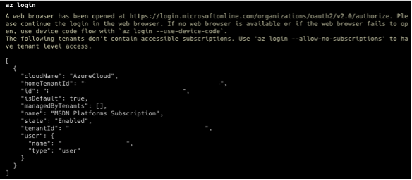
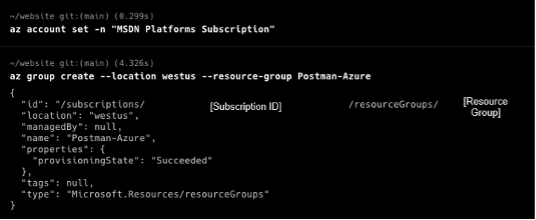
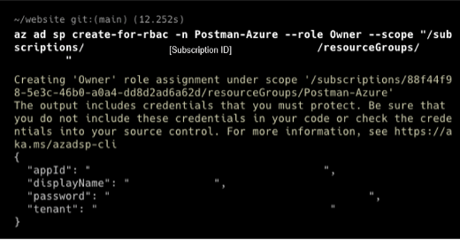

author: Joyce
id: azure
summary: Get started with Azure APIs
categories: Getting-Started, DevOps
environments: web
status: Published 
feedback link: https://github.com/loopDelicious/pmquickstarts
tags: Getting Started, DeveOps

# Get Started with Azure APIs
<!-- ------------------------ -->
## Overview 
Duration: 1

Learn how to get started with Azure APIs in Postman. If you are using Azure APIs for the first time, you can follow the steps in this guide to call the APIs using requests sent through the Postman client. You can use these requests to experiment with an API before you develop your application, or programmatically run a sequence of API calls to create and manage your infrastructure on Azure.

> aside negative
> Browse a complete listing of [Azure REST APIs](https://learn.microsoft.com/en-us/rest/api/?view=Azure) on the Microsoft website.

### Prerequisites

- Basic familiarity with APIs

### What You’ll Learn

- how to authenticate to Azure APIs
- how to troubleshoot unexpected API behavior
- how to automate API workflows for Azure in Postman

### What You'll Need

- [Azure Cloud](https://azure.microsoft.com/) with an active subscription
- Download and install [Postman Desktop App](https://www.postman.com/downloads/)
- Download and install [Azure CLI](https://learn.microsoft.com/en-us/cli/azure/install-azure-cli)
  - For [MacOS](https://learn.microsoft.com/cli/azure/install-azure-cli-macos?wt.mc_id=studentamb_58170)
  - For [Windows](https://learn.microsoft.com/cli/azure/install-azure-cli-windows?tabs=azure-cli&wt.mc_id=studentamb_58170)

### What You’ll Build

- A Postman Collection with authorized API requests
- Code samples to integrate into your own workflows and applications
- API workflows to automate the setup of your infrastructure

<!-- ------------------------ -->
## Authorization

Duration: 5

In this section, let's use the Azure CLI to generate credentials to access the Azure API.

### Get credentials using Azure CLI

1. **Log in**: From the terminal, use the [Azure CLI](https://learn.microsoft.com/en-us/cli/azure/install-azure-cli) to run the `az login` command. You will be redirected to log in to your Azure account in a web browser. Upon successful login, you will be presented with your account details, as shown below. Please take note of the `id` variable, as we need this information later. The `id` variable is our subscription ID on Azure.
  
1. **Set the subscription**: Set the subscription for the Azure Account using the `az account set` command. Use the `-n` parameter to specify the subscription name, i.e: `az account set -n "MSDN Platforms Subscription"`. A [list of your subscriptions](https://portal.azure.com/?quickstart=true#view/Microsoft_Azure_Billing/SubscriptionsBlade) can be found in the Azure portal.
1. **Create a resource group**: Create a resource group using the command `az group create --location [Azure Location, i.e: westus] --resource-group [Resource Group]`
  
1. **Create a service principal**: Create a service principal credential on Azure using the command `az ad sp create-for-rbac -n [SP_Name] --role Owner --scope "/subscriptions/[Subscription_ID]/resourceGroups/[ Resource Group]"`. The output should look like this:
  

  This command will provide the credentials we need to work on Postman to test Azure APIs:
   - AppID
   - displayname
   - Password
   - Tenant
  
  Copy the credentials to somewhere safe. Please do not expose the credentials! 
  
  You can also explore other roles when creating a service principal by using the `--role` flag and specify the scope of the SP credentials with the `--scope` flag. Documentations included [here](https://learn.microsoft.com/cli/azure/ad/sp?view=azure-cli-latest#commands&wt.mc_id=studentamb_58170).
  
  Some built-in roles in Azure role-based access control (RBAC) include:
   - Owner - Total control of a Resource Group
   - Contributor - Has control on Actions on a Resource Group like modifying a Resource Group (i.e. Deleting a VM) but cannot assign permission to the RG.
   - Reader - only has the ability to view the resource group.
  
  Learn More [here](https://learn.microsoft.com/cli/azure/ad/sp?view=azure-cli-latest#commands&wt.mc_id=studentamb_58170).
  
  The example of generating service principal details are as following:
  ```bash
  az ad sp create-for-rbac -n Postman --role Owner --scope 
  ```
  ```json
  {
    "appId": "e8df7f8a-XXXX-XXXX-XXXX-XXXXXXXXXXX",
    "displayName": "azure-cli-2023-XX-XX-XX-XX-XX",
    "password": "XXXXX~XXXXXXXX.XXXXXXXXXXX",
    "tenant": "XXXXXX-XXXXX-XXXX-XXXX-XXXXXXXXXXX"
  }
  ```

  To get the ID for the service principal credentials, you can run the command `get-AzADServicePrincipal -DisplayName $name"`. Replace the `$name` with the `displayName` found from the previous output.
  ```bash
  get-AzADServicePrincipal -DisplayName [displayName]
  ```
  ```bash
  DisplayName                   Id                                   AppId
  -----------                   --                                   -----
  azure-cli-2023-XX-XX-XX-XX-XX XXXXXXX-XXXX-XXXX-XXXX-XXXXXXXXXX XXXXXX-XXXX-XXXX-XXXX-XXXXXXXXX
  ```
1. **Get the subscription ID for your Azure Instance**: From the terminal, use the Azure CLI command `az account show --query id -o tsv` or `az account subscription list`. The output should look like the following:
  ```bash
  az account subscription list
  The command requires the extension account. Do you want to install it now? The command will continue to run after the extension is installed. (Y/n): y
  Run 'az config set extension.use_dynamic_install=yes_without_prompt' to allow installing extensions without prompt.
  Command group 'account subscription' is experimental and under development. Reference and support levels: https://aka.ms/CLI_refstatus
  [
    {
      "authorizationSource": "Legacy",
      "displayName": "MSDN Platforms Subscription",
      "id": "/subscriptions/[subscription ID]",
      "state": "Enabled",
      "subscriptionId": "[subscription ID]",
      "subscriptionPolicies": {
        "locationPlacementId": "Public_2014-XX-XX",
        "quotaId": "MSDN_2014-XX-XX",
        "spendingLimit": "On"
      }
    }
  ]
  ```

### Input Azure credentials into Postman

1. Click the orange **Run in Postman** button below to fork [this example collection]() to your own Postman workspace.
  <br/>
  []()
1. In the Postman app, enter a label for your fork and select the workspace to fork the collection:
  
1. Select the Postman collection that you forked to your workspace. Find the **Variables** tab, and paste your information into each variable value. Map the values from the Service Principal and Subscription ID output from earlier.
    - ClientId = AppID
    - clientSecret = Password
    - tenantId = tenant
    - resource = https://management.azure.com/
    - resourceGroup = [Resource Group]
    - subscriptionId = [Subscription ID]
    - bearerToken = leave it blank, we will programmatically fill the field next
    
  > aside negative
  > If you are working in a public or team workspace, you may want to create [a Postman environment](https://learning.postman.com/docs/sending-requests/managing-environments/) and use ["Current value"](https://learning.postman.com/docs/sending-requests/managing-environments/) to prevent unintentional disclosure of sensitive data, such as authorization credentials.
  > 

### Generate bearer token for authorization

1. **Review code**: Select the Postman collection that you forked to your workspace. Find the **Pre-request Script** tab containing JavaScript that will execute before every request in the collection. The code will retrieve an OAuth 2.0 bearer token, and then save the value as a collection variable to be re-used throughout the collection.
    ```javascript
    pm.test("Check for collectionVariables", function () {
        let vars = ['clientId', 'clientSecret', 'tenantId', 'subscriptionId'];
        vars.forEach(function (item, index, array) {
            console.log(item, index);
            pm.expect(pm.collectionVariables.get(item), item + " variable not set").to.not.be.undefined;
            pm.expect(pm.collectionVariables.get(item), item + " variable not set").to.not.be.empty; 
        });

        if (!pm.collectionVariables.get("bearerToken") || Date.now() > new Date(pm.collectionVariables.get("bearerTokenExpiresOn") * 1000)) {
            pm.sendRequest({
                url: 'https://login.microsoftonline.com/' + pm.collectionVariables.get("tenantId") + '/oauth2/token',
                method: 'POST',
                header: 'Content-Type: application/x-www-form-urlencoded',
                body: {
                    mode: 'urlencoded',
                    urlencoded: [
                        { key: "grant_type", value: "client_credentials", disabled: false },
                        { key: "client_id", value: pm.collectionVariables.get("clientId"), disabled: false },
                        { key: "client_secret", value: pm.collectionVariables.get("clientSecret"), disabled: false },
                        { key: "resource", value: pm.collectionVariables.get("resource") || "https://management.azure.com/", disabled: false }
                    ]
                }
            }, function (err, res) {
                if (err) {
                    console.log(err);
                } else {
                    let resJson = res.json();
                    pm.collectionVariables.set("bearerTokenExpiresOn", resJson.expires_on);
                    pm.collectionVariables.set("bearerToken", resJson.access_token);
                }
            });
        }
    });
    ```
1. **Set token**: Within the "Get Started" folder, select the "Get Resource Groups" request. **Send** the API request. Upon a successful response from the server, note two events that occurred.
    - **Bearer token**: Select the collection, tab over to **Variables**, and notice a current value is saved under `bearerToken`. This happened when the pre-request script executed.
    
    - **Authorization header**: Select the request "Get Resource Groups". Under the **Authorization** tab, note the request inherits the same authorization method, "Bearer Token", from the collection. Under the **Headers** tab, you may need to expand the headers auto-generated by Postman to see an `Authorization` header with a value formatted like `Bearer xxx` where `xxx` is the saved token. 
    
  
Now that you have properly configured the authorization at the collection-level, you can re-use it throughout other requests within the collection, unless otherwise configured.

<!-- ------------------------ -->
## Cognitive Search

Duration: 5