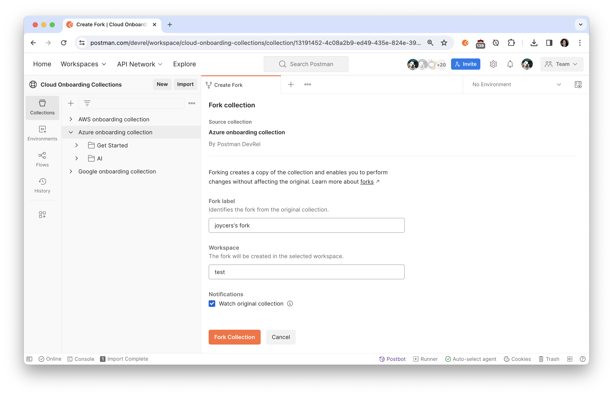
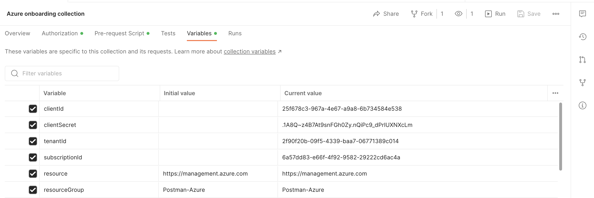
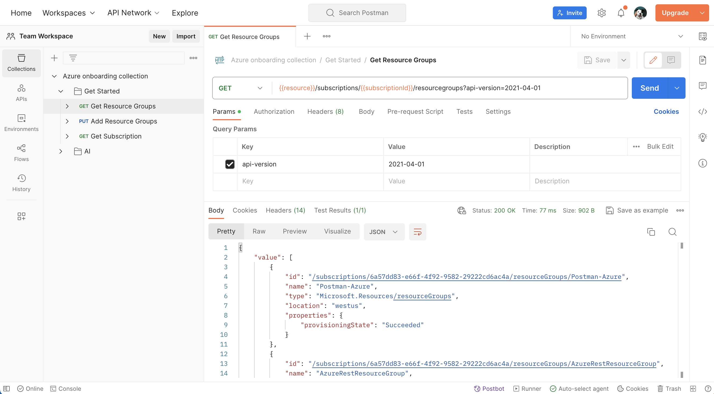
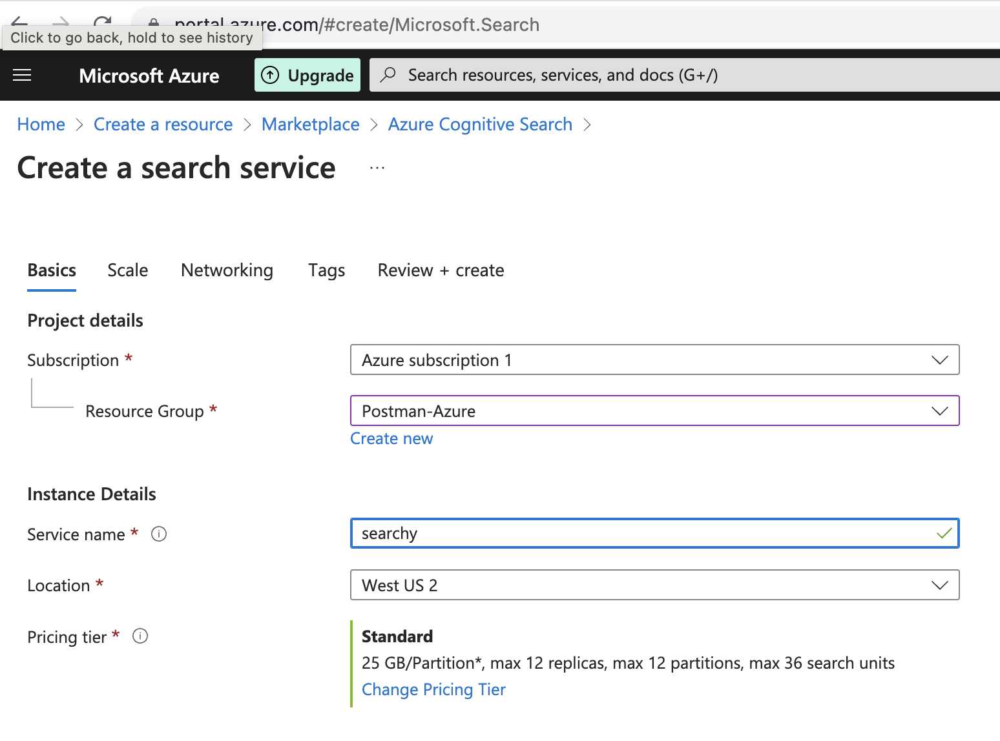
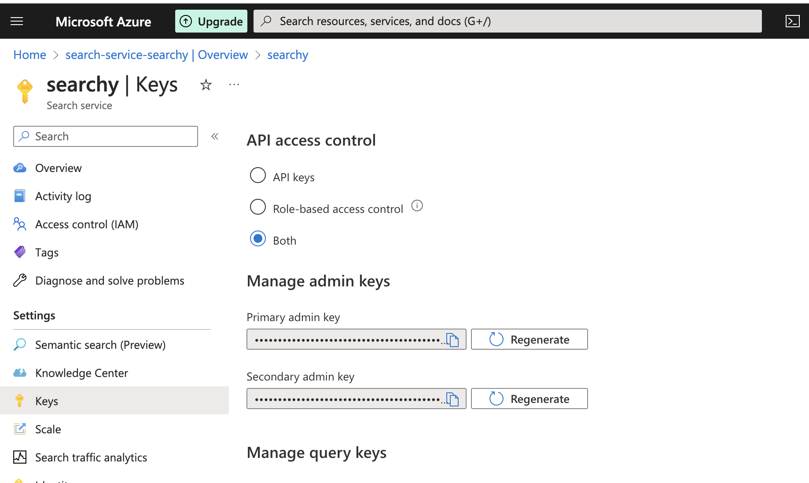
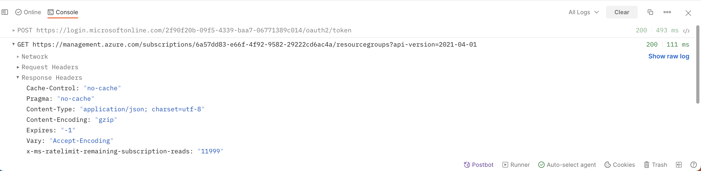

author: Joyce
id: azure
summary: Get started with Azure APIs
categories: Getting-Started, DevOps
environments: web
status: Published 
feedback link: https://github.com/loopDelicious/pmquickstarts
tags: Getting Started, DeveOps

# Get Started with Azure APIs
<!-- ------------------------ -->
## Overview 
Duration: 1

Microsoft Azure provides a number of ways to interact with Azure resources
- [Azure SDKs](https://azure.com/sdk) in many languages, including .NET, Python, Java, JavaScript/TypeScript, Go, C++, C, Android, iOS, PHP, and Ruby
- [Azure CLI](https://docs.microsoft.com/cli/azure/install-azure-cli) to execute commands
- [Azure REST APIs](https://docs.microsoft.com/rest/api/azure/)

> aside negative
> Browse a complete listing of [Azure REST APIs](https://learn.microsoft.com/en-us/rest/api/?view=Azure) on the Microsoft website.

Learn how to get started with Azure APIs in Postman. If you are using Azure APIs for the first time, you can follow the steps in this guide to call the APIs using requests sent through the Postman client. You can use these requests to experiment with an API before you develop your application, or programmatically run a sequence of API calls to create and manage your infrastructure on Azure.

> aside negative
> 🏆 Special acknowledgements to Azure ambassadors, Mireille Tan and Muhammad Suzarilshah, for their contributions to this guide. 

### Prerequisites

- Basic familiarity with APIs
- Basic familiarity with CLI

### What You’ll Learn

- how to authenticate to Azure APIs using roles
- how to authenticate to Azure APIs using API keys
- how to add resource groups with Azure APIs
- how to troubleshoot unexpected API behavior
- how to automate API workflows for Azure in Postman

### What You'll Need

- [Azure Cloud](https://azure.microsoft.com/) with an active subscription
  - You must be an **Owner** or have `Microsoft.Authorization/roleAssignments/write` permissions to manage role assignments
  - Or have a service principal with **Contributor** role to create and manage resources
- Download and install [Postman Desktop App](https://www.postman.com/downloads/)
- Download and install [Azure CLI](https://learn.microsoft.com/en-us/cli/azure/install-azure-cli)
  - For [MacOS](https://learn.microsoft.com/cli/azure/install-azure-cli-macos?wt.mc_id=studentamb_58170)
  - For [Windows](https://learn.microsoft.com/cli/azure/install-azure-cli-windows?tabs=azure-cli&wt.mc_id=studentamb_58170)

### What You’ll Build

- A Postman Collection with authorized API requests
- Code samples to integrate into your own workflows and applications
- API workflows to automate the setup of your infrastructure

<!-- ------------------------ -->
## Authorization

Duration: 5

In this section, let's use the Azure CLI to generate credentials, and explore how to [authenticate with the Azure REST APIs](https://docs.microsoft.com/rest/api/azure/#register-your-client-application-with-azure-ad).

### Get credentials using Azure CLI

1. **Log in**: From the terminal, use the [Azure CLI](https://learn.microsoft.com/en-us/cli/azure/install-azure-cli) to run the `az login` command. You will be redirected to log in to your Azure account in a web browser. Upon successful login, you will be presented with your account details, as shown below. Please take note of the `id` variable, as we need this information later. The `id` variable is our subscription ID on Azure.
  
1. **Select an active subscription**: Select an active Azure subscription using the `az account set` command. Use the `-n` parameter to specify the subscription name, i.e: `az account set -n "MSDN Platforms Subscription"`. A [list of your subscriptions](https://portal.azure.com/?quickstart=true#view/Microsoft_Azure_Billing/SubscriptionsBlade) can be found in the Azure portal.
1. **Create a resource group**: Create a resource group using the command `az group create --location [Azure Location, i.e: westus] --resource-group [Resource Group]`
  
1. **Create a service principal**: Azure REST API authentication is done via a Bearer token in the Authentication header. Let's use a service principal to get that token for us. A service principal is an Azure account that allows you to perform actions on Azure resources. Think about it like a system account that you can assign roles to and get tokens with. Create a service principal using the command `az ad sp create-for-rbac -n [SP_Name] --role Owner --scope "/subscriptions/[Subscription_ID]/resourceGroups/[ Resource Group]"`. The output should look like this:
  

    This command will provide the credentials we need to work on Postman to test Azure APIs. Copy the credentials to somewhere safe. Please do not expose the credentials!
    - AppID
    - displayname
    - Password
    - Tenant

    You can also explore other roles when creating a service principal by using the `--role` flag and specify the scope of the SP credentials with the `--scope` flag. Documentations included [here](https://learn.microsoft.com/cli/azure/ad/sp?view=azure-cli-latest#commands&wt.mc_id=studentamb_58170).
    
    Some built-in roles in [Azure role-based access control](https://learn.microsoft.com/en-us/azure/role-based-access-control/overview) (RBAC) include:
    - Owner - Total control of a Resource Group
    - Contributor - Has control on Actions on a Resource Group like modifying a Resource Group (i.e. Deleting a VM) but cannot assign permission to the RG.
    - Reader - only has the ability to view the resource group.
    
    Learn More [here](https://learn.microsoft.com/cli/azure/ad/sp?view=azure-cli-latest#commands&wt.mc_id=studentamb_58170).
  
    The example of generating service principal details are as following:

      ```bash
      az ad sp create-for-rbac -n Postman --role Owner --scope 
      ```
      ```json
      {
        "appId": "e8df7f8a-XXXX-XXXX-XXXX-XXXXXXXXXXX",
        "displayName": "azure-cli-2023-XX-XX-XX-XX-XX",
        "password": "XXXXX~XXXXXXXX.XXXXXXXXXXX",
        "tenant": "XXXXXX-XXXXX-XXXX-XXXX-XXXXXXXXXXX"
      }
      ```
1. **Get the subscription ID for your Azure Instance**: From the terminal, use the Azure CLI command `az account show --query id -o tsv` or `az account subscription list`. The output should look like the following:
    ```bash
    az account subscription list
    The command requires the extension account. Do you want to install it now? The command will continue to run after the extension is installed. (Y/n): y
    Run 'az config set extension.use_dynamic_install=yes_without_prompt' to allow installing extensions without prompt.
    Command group 'account subscription' is experimental and under development. Reference and support levels: https://aka.ms/CLI_refstatus
    [
      {
        "authorizationSource": "Legacy",
        "displayName": "MSDN Platforms Subscription",
        "id": "/subscriptions/[subscription ID]",
        "state": "Enabled",
        "subscriptionId": "[subscription ID]",
        "subscriptionPolicies": {
          "locationPlacementId": "Public_2014-XX-XX",
          "quotaId": "MSDN_2014-XX-XX",
          "spendingLimit": "On"
        }
      }
    ]
    ```

### Input Azure credentials into Postman

1. Click the orange **Run in Postman** button below to fork [this example collection](https://www.postman.com/devrel/workspace/cloud-onboarding-collections/collection/13191452-4c08a2b9-ed49-435e-824e-3981c7439a5e) to your own Postman workspace.
  <br/>
  [](https://god.gw.postman.com/run-collection/13191452-4c08a2b9-ed49-435e-824e-3981c7439a5e?action=collection%2Ffork&source=rip_markdown&collection-url=entityId%3D13191452-4c08a2b9-ed49-435e-824e-3981c7439a5e%26entityType%3Dcollection%26workspaceId%3D0a0d015d-e451-49cd-87fe-e3772ddae97a)
1. In the Postman app, enter a label for your fork and select the workspace to fork the collection:
  
1. Select the Postman collection that you forked to your workspace. Find the **Variables** tab, and paste your information into each variable value. Map the values from the Service Principal and Subscription ID output from earlier.
  | **Postman variable**  | **Azure data**  |
  |---|---|
  | `clientId`  | `appID`  |
  | `clientSecret`  | `password`  |
  | `tenantId`  | `tenant`  |
  | `resource` | `https://management.azure.com/`  |
  | `resourceGroup`  | [Resource Group]  |
  | `subscriptionId`  | [Subscription ID]  |
  | `bearerToken` | [leave it blank, we will programmatically fill the field next]  |

  > aside negative
  > If you are working in a public or team workspace, you may want to create [a Postman environment](https://learning.postman.com/docs/sending-requests/managing-environments/) and use ["Current value"](https://learning.postman.com/docs/sending-requests/managing-environments/) to prevent unintentional disclosure of sensitive data, such as authorization credentials. [Learn more](https://learning.postman.com/docs/sending-requests/variables/#initial-and-current-values) about the difference between initial and current values.
  > 

### Generate bearer token for authorization

1. **Review code**: Select the Postman collection that you forked to your workspace. Find the **Pre-request Script** tab containing JavaScript that will execute before every request in the collection. The code will retrieve an OAuth 2.0 bearer token, and then save the value as a collection variable to be re-used throughout the collection.
    ```javascript
    pm.test("Check for collectionVariables", function () {
        let vars = ['clientId', 'clientSecret', 'tenantId', 'subscriptionId'];
        vars.forEach(function (item, index, array) {
            console.log(item, index);
            pm.expect(pm.collectionVariables.get(item), item + " variable not set").to.not.be.undefined;
            pm.expect(pm.collectionVariables.get(item), item + " variable not set").to.not.be.empty; 
        });

        if (!pm.collectionVariables.get("bearerToken") || Date.now() > new Date(pm.collectionVariables.get("bearerTokenExpiresOn") * 1000)) {
            pm.sendRequest({
                url: 'https://login.microsoftonline.com/' + pm.collectionVariables.get("tenantId") + '/oauth2/token',
                method: 'POST',
                header: 'Content-Type: application/x-www-form-urlencoded',
                body: {
                    mode: 'urlencoded',
                    urlencoded: [
                        { key: "grant_type", value: "client_credentials", disabled: false },
                        { key: "client_id", value: pm.collectionVariables.get("clientId"), disabled: false },
                        { key: "client_secret", value: pm.collectionVariables.get("clientSecret"), disabled: false },
                        { key: "resource", value: pm.collectionVariables.get("resource") || "https://management.azure.com/", disabled: false }
                    ]
                }
            }, function (err, res) {
                if (err) {
                    console.log(err);
                } else {
                    let resJson = res.json();
                    pm.collectionVariables.set("bearerTokenExpiresOn", resJson.expires_on);
                    pm.collectionVariables.set("bearerToken", resJson.access_token);
                }
            });
        }
    });
    ```
1. **Set token**: Within the "Get Started" folder, select the "Get Resource Groups" request. **Send** the API request. Upon a successful response from the server, note two events that occurred.
    - **Bearer token set**: Select the collection, tab over to **Variables**, and notice a current value is saved under `bearerToken`. This happened when the pre-request script executed.
    
    - **Verify Authorization helper**: Select the request "Get Resource Groups". Under the **Authorization** tab, note the request inherits the same authorization method, "Bearer Token", from the collection. Configuring Authorization in this manner ensures that Postman will append the token value to the text `Bearer` in the required format to the request `Authorization` header.
    
    - **Inspect Authorization header**: Under the **Headers** tab, you may need to expand the headers auto-generated by Postman to see an `Authorization` header with a value formatted like `Bearer xxx` where `xxx` is the saved token. 
    

Now that you have properly configured the authorization at the collection-level, you can re-use it throughout other requests within the collection, unless otherwise configured.

  > aside negative
  > In Postman, you can also set a [collection-level authorization method](https://learning.postman.com/docs/sending-requests/authorization/authorization-types/#bearer-token) to use throughout the collection, instead of using a collection-level pre-request script as we have done in this example.

  > aside negative
  > In Microsoft Azure, there are other ways to [authenticate with the Azure REST APIs](https://docs.microsoft.com/rest/api/azure/#register-your-client-application-with-azure-ad).

In the next sections, let's explore other Azure APIs. 

<!-- ------------------------ -->
## Resources

Duration: 3

In the previous section, you may have already made your first successful Azure REST API request. Let's review.

1. **Get resource groups**: Within the "Get Started" folder, select the "Get Resource Groups" request. **Send** the API request.
     
1. **Add resource group**: Next, select the "Add Resource Groups" request. Notice the HTTP method is `PUT` (instead of `GET`). Also notice a path variable notated as `:resourceGroup` in the request URl and editable under the **Params** tab next to `resourceGroup` key. Feel free to update the value to your own resource group name. Under the **Body** tab, feel free to update the required `location`. And then **Send** the API request.
 

Check out other Azure REST APIs for the [Resource Group](https://docs.microsoft.com/rest/api/resources/resourcegroups/createorupdate). 

<!-- ------------------------ -->
## AI services

Duration: 5

For each Azure resource that you plan to work with, add the resource to your resource group.

Each of the following APIs will explore a specific Azure resource corresponding to the specific AI service as a prerequisite. However, if you will be using multiple AI services in the same project, you can create a Cognitive Services resource instead, which provides access to Vision, Language, Search, and Speech services using a single API.

Not all of the following services are available in every region. Please refer to [Azure Products by Region](https://azure.microsoft.com/en-us/explore/global-infrastructure/products-by-region/?products=all) to ensure that you pick a correct region when creating your resource.

### Cognitive Search

[Azure Cognitive Search](https://learn.microsoft.com/azure/search/) is a cloud search service that gives developers infrastructure, APIs, and tools for building a rich search experience over private, heterogeneous content in web, mobile, and enterprise applications.

### Create resource and index

1. **Create Azure resource**: From the [Azure portal](https://portal.azure.com/), click the plus sign ("+ Create Resource") in the top-left corner, and use the search bar to find "Azure Cognitive Search".  Set up an Azure Cognitive Search resource OR an Azure Cognitive Services resource (recommended if you are using multiple AI services within the same project)
  
1. **Configure service**: Choose a subscription, set a resource group, name the service, choose a region and tier, and create the new service. Your service is deployed within minutes. 
  
1. **Import data**: Go to your newly deployed resource. On the **Overview** page, select **Import data** to create and populate a search index.
  
1. **Connect to a data source**: In the **Import data** wizard on the C**onnect to your data** tab, expand the **Data Source** dropdown list and select **Samples**. In the list of built-in samples, select **hotels-sample**. Select **Skip to: Customize target index** to continue.
  
1. **Customize target index**: Accept the system-generated values. Select **Next: Create an indexer** to continue.
1. **Create an indexer**: Accept the system-generated values. Select **Submit** to create and simultaneously run the indexer.

### Authorization
1. **Authorize API access with key**: Go to your newly deployed resource. Under the **Keys** tab in the sidebar, you can see the default API access control is set up to "API keys". 
    > aside negative
    > **Authorize API access with roles (optional)**: You could also leverage the role-based authorization method we set up previously by selecting "Both" so we can either explore the API [using API keys](https://learn.microsoft.com/en-us/azure/search/search-security-api-keys?tabs=portal-use%2Cportal-find%2Cportal-query) or [using Azure roles](https://learn.microsoft.com/en-us/azure/search/search-security-rbac?tabs=config-svc-portal%2Croles-portal%2Ctest-portal%2Ccustom-role-portal%2Cdisable-keys-portal). You would also need to add a [role assignment](https://learn.microsoft.com/en-us/azure/search/search-security-rbac?tabs=config-svc-portal%2Croles-portal%2Ctest-portal%2Ccustom-role-portal%2Cdisable-keys-portal#assign-roles) to grant scope permissions.
    
1. **Input API key into Postman**: In Postman, you can use an API key by including a header `api-key` with each individual request or at the folder-level so that requests within the folder inherit the authorization method. Select the "Cognitive Search" folder and configure the Authorization method to automatically add an `api-key` header to each request within the folder. Remember to also save your API key as a collection variable.
  
1. **Input Postman variables**: In addition to adding your API key as a collection variable, update the `searchServiceName` and `searchIndexName` to begin exploring the Azure Cognitive Search API.

### Other AI APIs

In Postman, explore other Azure AI services within the "AI" folder. Notice folder-level authorization methods. And expand the request documentation using the icon on the far right for more details and links to additional resources.

<!-- ------------------------ -->
## Working in Postman

Duration: 4

### Debugging unexpected behavior

If your API request isn't behaving as expected, there can be many possible reasons. To find out what the problem is, you can use the [Postman Console](https://learning.postman.com/docs/sending-requests/troubleshooting-api-requests/) to troubleshoot your request.

Open the Console by selecting Console icon in the Postman footer. You can view network data, log statements, and the raw calls being sent through Postman.
  

### Organize workflows in Postman

Once you explore an API, you understand the basic building blocks of popular services on Azure. Next, organize your work into your own collections and workspaces in Postman.

- Create your own [collections](https://learning.postman.com/docs/collections/collections-overview/) of API calls for automating deployments and monitoring infrastructure. 
- Create your own [workspaces](https://learning.postman.com/docs/collaborating-in-postman/using-workspaces/creating-workspaces/) to organize work for an API or collaborate with team members. 
- Create your own [Flows](https://learning.postman.com/docs/postman-flows/gs/flows-overview/) to visualize API workflows

  

### Automate workflows in Postman

Once you group API requests into collections, there are multiple ways to programmatically run those collections.

- Add [tests and scripts](https://learning.postman.com/docs/writing-scripts/intro-to-scripts/) to dynamically pass information from one request to another
- Utilize inbuilt Postman integrations, such as [deploying to Azure API Management](https://learning.postman.com/docs/designing-and-developing-your-api/deploying-an-api/deploying-an-api-azure/)
- [Run collections](https://learning.postman.com/docs/collections/running-collections/running-collections-overview/) on a scheduled frequency on Postman servers, as part of your CI/CD pipeline, or via webhooks

### Build your own applications

Once you have an API call working the way you want it to in Postman, [generate client code](https://learning.postman.com/docs/sending-requests/generate-code-snippets/) to paste into your own applications.
    

<!-- ------------------------ -->
## Next Steps

Duration: 3

### What we've covered

- how to authenticate to Azure APIs using roles
- how to authenticate to Azure APIs using API keys
- how to add resource groups with Azure APIs
- how to troubleshoot unexpected API behavior
- how to automate API workflows for Azure in Postman

For more hands-on tutorials, check out these resources.
- Check back for more [Azure tutorials](https://quickstarts.postman.com/)
- Contribute your own tutorials [here](https://github.com/loopDelicious/pmquickstarts)

### Other Azure integrations in Postman
- [Azure DevOps](https://learning.postman.com/docs/integrations/available-integrations/azure-devops/) to sync your Postman APIs to Git repositories
- Manage API deployments to [Azure API Management](https://learning.postman.com/docs/designing-and-developing-your-api/deploying-an-api/deploying-an-api-azure/) in Postman
- Integrate Postman with [Azure Pipelines](https://learning.postman.com/docs/integrations/available-integrations/ci-integrations/azure-pipelines/)
- Configure SSO with Microsoft Entra ID (formerly [Azure Active Directory](https://learning.postman.com/docs/administration/sso/azure-ad/))
- [Connect your API to an on-premises Git repository](https://learning.postman.com/docs/designing-and-developing-your-api/versioning-an-api/using-on-prem-git-repo/)