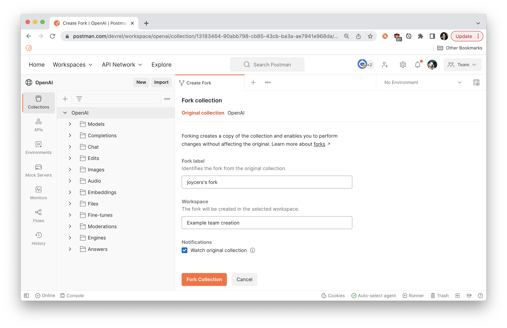
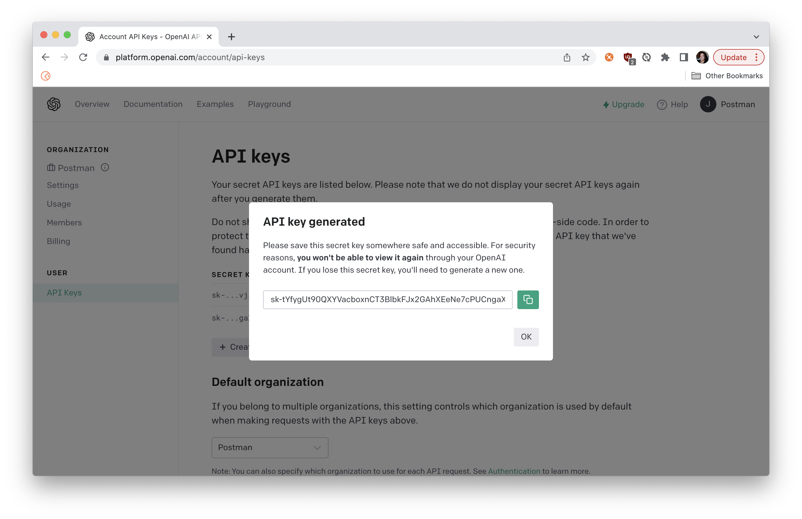
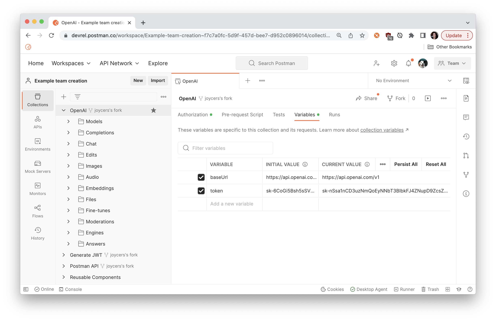
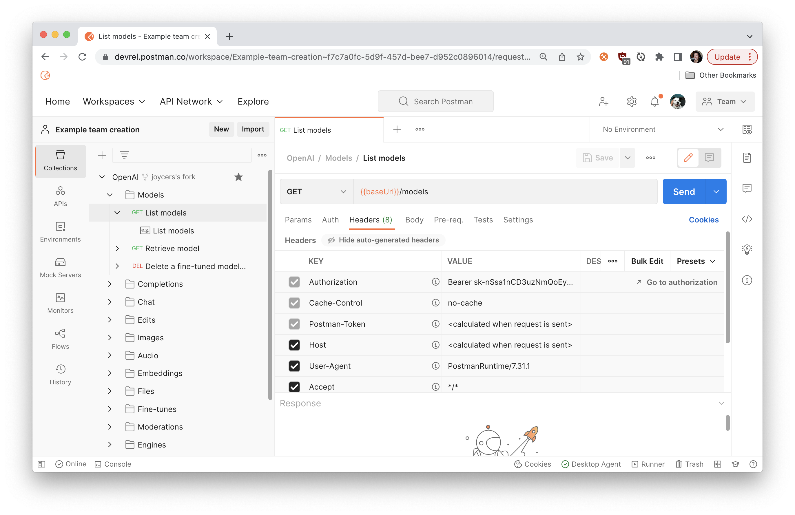
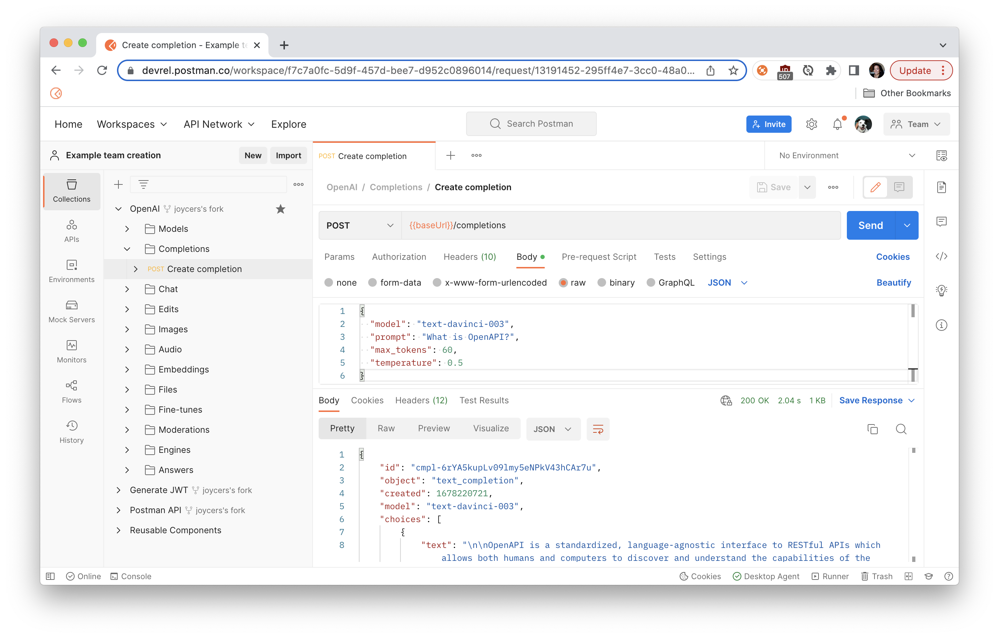
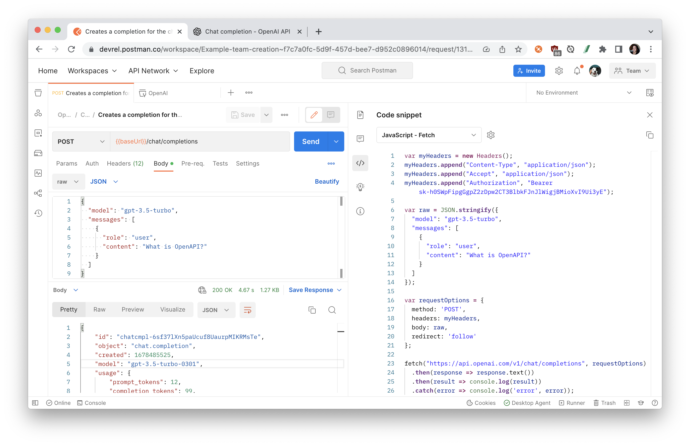

author: Joyce
id: chatgpt
summary: Make your first OpenAI API call
categories: Getting-Started
environments: web
status: Published
feedback link: https://github.com/loopDelicious/pmquickstarts
tags: Getting Started, Developer

# Get Started with the ChatGPT API

<!-- ------------------------ -->

## Overview

Duration: 1

This is a beginner's introduction to OpenAI's API in Postman. Make your first API request to simulate a ChatGPT query.


### Prerequisites

- An [OpenAI account](https://platform.openai.com/)
- A [Postman account](https://identity.getpostman.com/signup)

### What You’ll Learn

- Discover different AI models provided by OpenAI
- Authorize and send HTTP API requests
- Use variables to store and reuse information

### What You’ll Build

- A Postman Collection with authorized API requests.
- Code samples to integrate into your own bots or applications.

<!-- ------------------------ -->

## Fork the OpenAI collection

Duration: 2

1. Sign in to your [Postman](https://www.postman.com/) account.
1. Select the **Run in Postman** button below to [fork](https://learning.postman.com/docs/collaborating-in-postman/using-version-control/forking-entities/#creating-a-fork) the [public collection](https://www.postman.com/devrel/workspace/openai/collection/13183464-90abb798-cb85-43cb-ba3a-ae7941e968da?ctx=documentation) to your own workspace.
   <br/>
   [](https://god.gw.postman.com/run-collection/13183464-90abb798-cb85-43cb-ba3a-ae7941e968da?action=collection%2Ffork&collection-url=entityId%3D13183464-90abb798-cb85-43cb-ba3a-ae7941e968da%26entityType%3Dcollection%26workspaceId%3D6f729c41-9538-4a0f-a4e0-8a02d92d1e73)
   <br/>
1. Enter a label for your fork, and select a workspace to save it to.
   

If you leave the checkbox selected to `Watch original collection`, you will receive notifications when new endpoints are added to the collection.

   <!-- ------------------------ -->

## Authorization

Duration: 2

Update the collection variable `token` with your own OpenAI API key.

1. On the [API Keys page of the OpenAI website](https://platform.openai.com/account/api-keys), create a new API key under API Keys > `+ Create new secret key`, and then copy the key to your clipboard for the next step.
   
1. In Postman, select your fork of the OpenAI collection.
1. Under the **Variables** tab, create a new collection variable `token` and paste the value of your API key.
   
1. Select **Save**.

You can look under the **Authorization** tab and see how Postman will now add an `Authorization` header with your API key to every request in the collection, unless otherwise specified. Look under the **Headers** tab of any request to see for yourself. You may need to un-hide the auto-generated headers.



To change the way Postman configures the authorization, you can update the settings under the **Authorization** tab of the request, folder, or collection.

<!-- ------------------------ -->

## Make an API call with Postman

Duration: 2

This example uses the [Completions API](https://platform.openai.com/docs/api-reference/completions) and the `text-davinci-003` artificial intelligence model to to perform a query similar to what you can do on [the ChatGPT website](https://chat.openai.com/).

Negative
: You can also use the [Chat API](https://platform.openai.com/docs/api-reference/chat) and the `gpt-3.5-turbo` artificial intelligence model to perform a single-turn or turn-based chat. Learn about the difference between [chat and completions](https://platform.openai.com/docs/guides/chat/chat-vs-completions)

To create a query:

1. In your Postman workspace, navigate to your fork of the OpenAI collection.
1. Select `Completions` > `Create completion`. Under the **Body** tab, add a request body formatted like the following example:

   ```json
   {
     "model": "text-davinci-003",
     "prompt": "What is OpenAPI?",
     "max_tokens": 60,
     "temperature": 0.5
   }
   ```

1. Click **Send** to see a response body like the following example:

   ```json
   {
     "id": "cmpl-6rYA5kupLv09lmy5eNPkV43hCAr7u",
     "object": "text_completion",
     "created": 1678220721,
     "model": "text-davinci-003",
     "choices": [
       {
         "text": "\n\nOpenAPI is a standardized, language-agnostic interface to RESTful APIs which allows both humans and computers to discover and understand the capabilities of the service without any prior knowledge of how the service works. It uses a language-agnostic interface definition to describe the capabilities of an API, which",
         "index": 0,
         "logprobs": null,
         "finish_reason": "length"
       }
     ],
     "usage": {
       "prompt_tokens": 5,
       "completion_tokens": 60,
       "total_tokens": 65
     }
   }
   ```

Upon a successful `200 OK` response, you can inspect the response body, including the property `choices` which contains `text` responding to the query.



Negative
: Be careful hitting **Send** too many times, since you might reach [OpenAI rate limits](https://platform.openai.com/docs/guides/rate-limits) if you're on a free account.

<!-- ------------------------ -->

## Generate a code sample

Duration: 1

Now that you have the API request working the way you want it to, let's generate code so we can use the API in our own applications.

1. Select the request you want to use for a code snippet, then select the code icon in the right pane.
1. Select a language or framework from the dropdown list.
   
1. Select the copy icon to copy the code snippet to your clipboard.

You can now paste this code into your own applications or bots.

<!-- ------------------------ -->

## Next Steps

Duration: 1

### What we've covered

- Fork the OpenAI collection to your own workspace
- Discover different AI models provided by OpenAI
- Authorize and send HTTP API requests
- Use variables to store and reuse information for authorization

Now that you made your first call with the OpenAI API, continue exploring the other endpoints in the `OpenAI` collection and other artificial intelligence models.

### Additional resources

To continue your journey with OpenAI, here are some additional resources to check out.

- Review the [OpenAI API introduction](https://platform.openai.com/docs/introduction/overview)
- Try [other OpenAI models](https://platform.openai.com/docs/models)
- Learn about the difference between [chat and completions](https://platform.openai.com/docs/guides/chat/chat-vs-completions)
