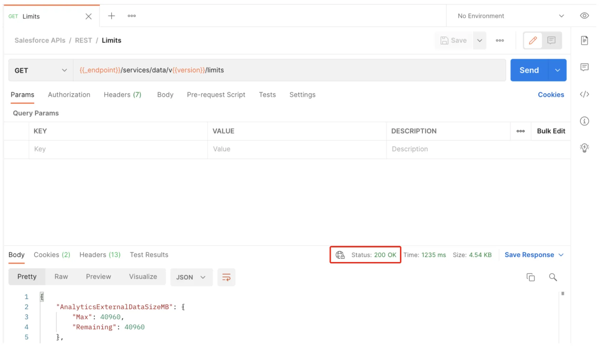
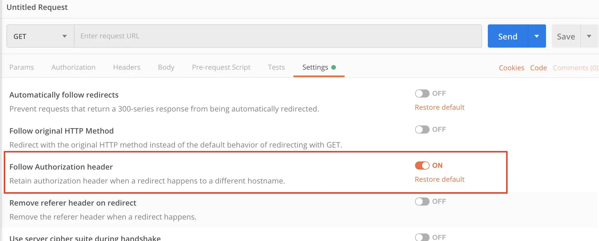
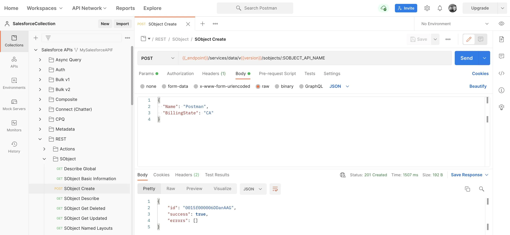

author: Joyce
id: connect-postman-to-salesforce
summary: Set up Postman with the Salesforce API collection to access data in your Salesforce org.
categories: Getting-Started
environments: web
status: Published
feedback link: https://github.com/loopDelicious/pmquickstarts
tags: Getting Started, Developer

# Connect Postman to Salesforce

<!-- ------------------------ -->

## Overview

Duration: 1

> aside negative
> This course was originally created by [Salesforce](https://trailhead.salesforce.com/content/learn/projects/quick-start-connect-postman-to-salesforce) and has been modified to suit the Quickstart format. Complete this lesson in Trailhead to collect your Salesforce learning badge.

### Prerequisites

- A Salesforce org
- A Postman account

### What You’ll Learn

- Get your org ready to use Postman.
- Load the Salesforce Platform APIs for Postman collection.
- Connect Postman to your org.
- Verify the connection with Postman.
- Add new data to your org.

<!-- ------------------------ -->

## Set Up Your Org

Duration: 10

### Learning Objectives

- Get your org ready to use Postman.
- Load the Salesforce Platform APIs for Postman collection.
- Connect Postman to your org.
- Verify the connection with Postman.

### Why Use Postman to Access the Salesforce Platform APIs?

Salesforce exposes a rich set of application programming interfaces (APIs) that integrate with third-party systems. All of these APIs are thoroughly documented, but how can you quickly try them on a given org, or better yet, on multiple orgs? Postman helps you discover, explore, and test integration options with the Salesforce Platform APIs.

#### About Salesforce Platform APIs

Salesforce provides programmatic access to your org's information through simple, powerful, and secure APIs. The APIs provided by Salesforce include REST, SOAP, Connect, User Interface, Analytics, Bulk, Metadata, and Streaming.

#### About Postman

Postman is an application that you can use to configure and call HTTP-based APIs, such as REST or SOAP. You configure this powerful tool in an easy-to-use graphical user interface. It supports environment variables, team workspaces, and JavaScript automation.

#### Web or Desktop?

Use Postman as a desktop app or in a web browser. In this project, you set up and use Postman in a web browser, because it doesn't require downloading and installing software.

#### About the Salesforce Platform APIs for Postman Collection

The Salesforce Platform APIs for Postman collection is a resource that wraps together 200+ request templates for many Salesforce Platform APIs. This open source collection uses the configurable Postman environment and variables so that you can easily authenticate and try the requests on multiple Salesforce orgs.

### Create a New Trailhead Playground

For this project, you need to create a new Trailhead Playground. Scroll to the bottom of this page, click the playground name, then click **Create Playground**. It typically takes 3–4 minutes to create a new Trailhead Playground.

> aside negative
> Note: Yes, we really mean a brand-new Trailhead playground! If you use an existing org or playground, you can run into problems completing the project.

### Get Your Trailhead Playground Username and Password

Let's get started by opening your Trailhead Playground. Scroll to the bottom of this page and click **Launch**. If you see a tab in your org labeled Get Your Login Credentials, great! Skip ahead to step 1. Otherwise, from the App Launcher, find and open **Playground Starter** and follow the steps.

1. Click the **Get Your Login Credentials** tab and take note of your username.
1. Click **Reset My Password**.
1. This sends an email to the address associated with your username.
1. Click the link in the email.
1. Enter a new password, confirm it, and click **Change Password**.

Save your username and password for use later in this project.

### Set Up Cross-Origin Resource Sharing in Salesforce

Cross-Origin Resource Sharing (CORS) allows code running in a web browser to communicate with Salesforce from a specific origin. Let's add the URL patterns for Postman.

1. In your Trailhead Playground, from Setup, enter `cors` in the Quick Find box and select **CORS**.
1. In the Allowed Origins List, click **New**.
1. Enter `https://_.postman.com` as the Origin URL Pattern.
1. Click **Save**.
1. Select **CORS** again.
1. Click **New** and enter `https://_.postman.co` (note the .co domain extension) as the Origin URL Pattern.
1. Click **Save**.

Your playground is ready for you to connect Postman to it. You do that in the next step.

<!-- ------------------------ -->

## Set Up and Connect Postman

Duration: 10

### Sign Up for Postman and Create a Workspace

Postman has two options for working with its app: desktop and web. You use the web browser app for this project.

1. [Sign in](https://identity.getpostman.com/login?continue=https%3A%2F%2Fwww.postman.com%2F) to your Postman account or [sign up](https://identity.getpostman.com/signup) for an account.
1. Select the **Workspaces** menu.
1. Select **Create Workspace**.
1. Name your workspace `SalesforceCollection`.
1. Set Visibility to **Personal**.
1. Click **Create Workspace**.

### Fork the Salesforce Collection

1. Open the public [Salesforce Developers](https://www.postman.com/salesforce-developers/workspace/salesforce-developers) workspace to create a fork of the Salesforce APIs collection.
1. In Collections, select **Salesforce Platform APIs** to expand it.
1. Click the **Create Fork** icon to create a fork of the collection.
1. Enter `MySalesforceAPIFork`.
1. Keep **SalesforceCollection** as the Workspace.
1. Click **Fork Collection**.

You now have the collection ready in Postman. Let's use the collection to authorize your org and test it.

### Authorize Your Org

You need to authenticate with Salesforce to access the APIs. Authentication grants you an access token that's valid for a certain duration. Repeat this process whenever your access token expires.

1. Be sure you're logged in to only one Trailhead Playground in your browser.
1. In Postman, under Collections, **Salesforce Platform APIs** should be selected.
1. The Authorization tab should be open.
1. Type should be OAuth 2.0.
1. Click **Get New Access Token**.
   > aside negative
   > Note - If you're not logged in to a Trailhead Playground or Salesforce org, a browser tab opens with the Salesforce login screen. Enter the username and password you saved in the previous step to log in.
1. Click **Allow** to let the “Salesforce Platform APIs Collection for Postman” access your Trailhead Playground
   
1. A success message appears briefly, and then you're redirected to the Manage Access Tokens dialog.
   
1. Verify that the `instance_url` points to your Trailhead Playground.
1. Copy the `instance_url` to use in step 12. Be sure to copy only the URL with no extra characters.
1. Click **Use Token**.
1. Open the **Variables** tab.
1. In the \_endpoint row, CURRENT VALUE column, paste the `instance_url` value that you copied in step 9.
1. Click **Save**.

### A Quick Connection Test

Let's verify that the connection is working.

1. In Collections, select **Salesforce Platform APIs** to expand it.
1. Select **REST** to expand it.
1. Select **GET Limits**. Limits opens in the main panel.
1. Click **Send**.
   
1. Verify that the status is 200 OK.
   > aside negative
   > You may need to turn **Follow Authorization** header configuration ON to retain authorization header when a redirect happens to a different hostname.
   > 

You've successfully authenticated with Salesforce. Now you can use other requests in the collection.

### Post an Account

You just pulled some data from the org. Let's try adding some new data to the org.

1. Under REST, select **SObject**, and then select **POST SObject Create**.
1. Open the **Params** tab.
1. Under Path Variables, in the SOBJECT_API_NAME row, VALUE column, enter `Account`.
1. Open the **Body** tab.
1. Replace the body text with this code:

   ```json
   {
     "Name": "Postman",
     "BillingState": "CA"
   }
   ```

1. Click **Save**.
1. Click **Send**.
   Postman returns the id for the new account.
   
1. Verify that the status is 201 Created.

> aside negative
> Note: If you don't get the status 201 Created then you might be signed into a different org. Verify that your instance_url is set to your Trailhead Playground.

Excellent! You've set up Postman to interact with your org. The Salesforce APIs for Postman collection that you loaded will aid you in your quest to discover the Salesforce APIs.

<!-- ------------------------ -->

## Next Steps

Duration: 1

This course was originally created by [Salesforce](https://trailhead.salesforce.com/content/learn/projects/quick-start-connect-postman-to-salesforce) and has been modified to suit the Quickstart format. Complete this lesson in Trailhead to collect your Salesforce learning badge.

- [Quick Start: Connect Postman to Salesforce](https://trailhead.salesforce.com/content/learn/projects/quick-start-connect-postman-to-salesforce)
- [Set Up Your Org](https://trailhead.salesforce.com/content/learn/projects/quick-start-connect-postman-to-salesforce/set-up-your-org)
- [Set Up and Connect Postman](https://trailhead.salesforce.com/content/learn/projects/quick-start-connect-postman-to-salesforce/set-up-and-connect-postman)

### Resources

- [GitHub: Salesforce APIs for Postman](https://github.com/forcedotcom/postman-salesforce-apis)
- [GitHub: Installing with the Postman Web UI](https://github.com/forcedotcom/postman-salesforce-apis/blob/master/install-with-web.md)
- [YouTube: Use the Salesforce APIs Collection with the Postman Web UI | Developer Quick Takes](https://www.youtube.com/watch?v=lxRNs4LsVdo)
- [Salesforce Help: Which API Do I Use?](https://help.salesforce.com/s/articleView?id=sf.integrate_what_is_api.htm&type=5)
- [Trailhead: Postman API Client](https://trailhead.salesforce.com/content/learn/modules/postman-api-client)

### What we've covered

- Get your org ready to use Postman.
- Load the Salesforce Platform APIs for Postman collection.
- Connect Postman to your org.
- Verify the connection with Postman.
- Add new data to your org.
