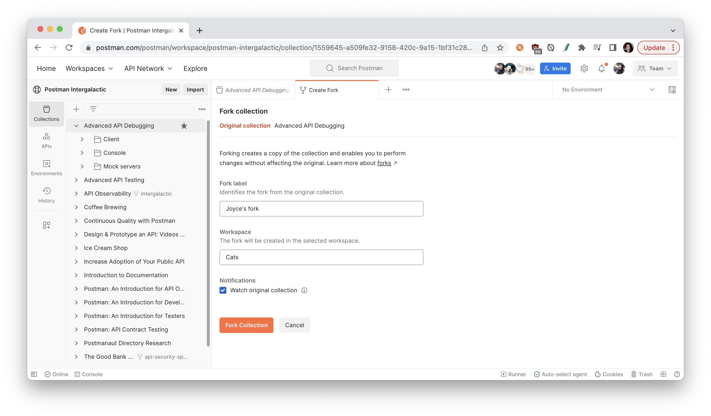

author: Joyce
id: debug
summary: Strategies and tactics for debugging more efficiently
categories: Intermediate
environments: web
status: Published
feedback link: https://github.com/postmanlabs/pmquickstarts
tags: Intermediate, Developer, Tester

# API Debugging

<!-- ------------------------ -->

## Overview

Duration: 1

In programming, debugging is the process of identifying and fixing an error in the code. For API consumers and producers, most of the effort is spent on locating the root cause of the issue based on what can be observed.

In an ideal scenario, there is rigorous testing and monitoring in place to alert you when something goes wrong. But even if you don’t have this level of observability, let’s learn about three ways to increase visibility when debugging APIs.

### Prerequisites

- Basic familiarity with Postman and APIs

### What You’ll Learn

- Explore methods for understanding API behavior, including updating user inputs to change the API response
- Debug and troubleshoot unexpected behavior
- Establish visibility for monitors, webhooks, and CLI
- Isolate dependencies with mock servers
- Set up notifications and alerts
- Explain recommended strategies for debugging

### What You'll Need

- a [Postman Account](https://identity.getpostman.com/signup)

### What You’ll Build

- A Postman Collection with working examples for debugging

> aside negative
> This content was originally presented in this webinar: [Advanced API Debugging](https://youtu.be/9xGp6d7VFgU).
> **Watch this video** to follow along:
> <video id="9xGp6d7VFgU"></video>

<!-- ------------------------ -->

## Fork the collection

Duration: 1

### Fork the collection

1. Click the orange **Run in Postman** button below to fork [this example collection](https://www.postman.com/postman/workspace/postman-intergalactic/collection/1559645-a509fe32-9158-420c-9a15-1bf31c289946) to your own Postman workspace.
    
   
1. Enter a label for your fork and select the workspace to fork the collection:
   
1. For the remainder of this tutorial, follow along in the example collection with [this video](https://youtu.be/9xGp6d7VFgU).

<!-- ------------------------ -->

## API Client

Duration: 2

### Inspect inputs and outputs for API calls

Postman is most commonly used as an [API client](https://youtu.be/mOxVsl5ZL2U) to explore APIs. Postman allows you to manipulate inputs and inspect the outputs to better understand the relationship between the two. Here are some ways that you can debug more easily using Postman as an [API client](https://www.postman.com/api-platform/api-client/).

1. Select the collection you just forked to your workspace, called "Advanced API Debugging", and expand the folder "Client".
1. Follow along with this video, [timestamped at API client](https://youtu.be/9xGp6d7VFgU?t=563), to learn more about the following topics.
   - Update parameters, headers, and bodies
   - See HTTP status codes and error messages
   - Parse responses
   - Inspect variables
   - Review test results
   - Replay calls in the History

### Knowledge check

<form>
  <name>Which of these inputs can NOT be updated in Postman?</name>
  <input type="radio" value="Request parameters, headers, and bodies">
  <input type="radio" value="Variables">
  <input type="radio" value="Test results">
  <input type="radio" value="Authorization credentials">
</form>

<!-- ------------------------ -->

## Postman Console

Duration: 2

### Postman console for visibility

The [Postman console](https://learning.postman.com/docs/sending-requests/troubleshooting-api-requests/) provides visibility into network calls and logs. It is a simple, yet powerful, way to spot bugs. Here are some ways to debug more efficiently using the Postman console.

1. Select the collection you just forked to your workspace, called "Advanced API Debugging", and expanding the folder "Console".
1. Follow along with the video, [timestamped at Console](https://youtu.be/9xGp6d7VFgU?t=1010), to learn more about the following topics.
   - View network calls and TLS encryption
   - Log statements, errors, and warnings
   - Inspect variables
   - Validate execution order of API calls
   - Verify conditional breakpoints set in scripts

### Knowledge check

<form>
  <name>Which log statements are accepted in the Postman console ?</name>
  <input type="radio" value="console.log()">
  <input type="radio" value="console.info()">
  <input type="radio" value="console.warn()">
  <input type="radio" value="console.error()">
  <input type="radio" value="All of the above">
</form>

<!-- ------------------------ -->

## Mock servers

Duration: 2

### Mock servers for debugging and testing

Mock servers allow you to simulate API behavior using Postman servers. Mocks are frequently used in debugging to simplify a problem or isolate a system under test. Here is how you can debug APIs using [Postman mock servers](https://learning.postman.com/docs/designing-and-developing-your-api/mocking-data/setting-up-mock/).

1. Select the collection you just forked to your workspace, called "Advanced API Debugging", and expand the folder "Mock servers".
1. Follow along with the video, [timestamped at Console](https://youtu.be/9xGp6d7VFgU?t=2036), to learn more about the following topics.
   - Simulate edge cases that may be difficult or costly to run in production (e.g., [429 Too Many Requests](https://developer.mozilla.org/en-US/docs/Web/HTTP/Status/429))
   - Stub out dependencies on third-party services or internal microservices
   - Establish a starting point for a scenario or inject a call within a scenario

### Knowledge check

<form>
  <name>Which of these is NOT required to set up a mock server in Postman?</name>
  <input type="radio" value="A Postman account">
  <input type="radio" value="A saved example in a Postman collection">
  <input type="radio" value="A Postman workspace">
  <input type="radio" value="A Kubernetes cluster">
</form>

<!-- ------------------------ -->

## Next Steps

Duration: 3

Follow along with the rest of the [Advanced API Debugging](https://youtu.be/9xGp6d7VFgU) video to learn about the following topics.

- General debugging strategies
- Tools and tactics for an API call
- Tools and tactics for a sequence of API calls
- Integrations for monitoring and observability

### Knowledge check

<form>
  <name>Which of these debugging strategies can you use in Postman?</name>
  <input type="radio" value="Brute force">
  <input type="radio" value="Backtracking">
  <input type="radio" value="Divide and Conquer">
  <input type="radio" value="All of the above">
</form>

### Additional resources

- [Debugging with the Console](https://youtu.be/YCsURct9wCk) video
- [Reverse engineering an API: using the Postman proxy](https://youtu.be/2VKVPB5USgU) video
- [Mock servers](https://youtu.be/n_7UUghLpco) video

### What we've covered

- Explore methods for understanding API behavior, including updating user inputs to change the API response
- Debug and troubleshoot unexpected behavior
- Establish visibility for monitors, webhooks, and CLI
- Isolate dependencies with mock servers
- Set up notifications and alerts
- Explain recommended strategies for debugging

If you want to stay in the loop with [Postman Intergalactic](https://www.postman.com/events/intergalactic/) webinars, register for upcoming sessions or sign up to get notified about upcoming sessions.
