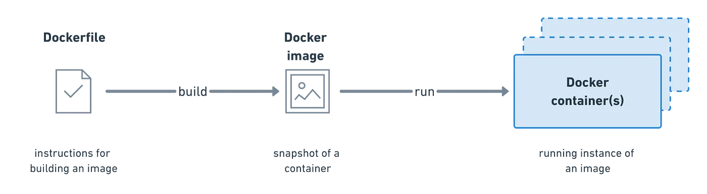
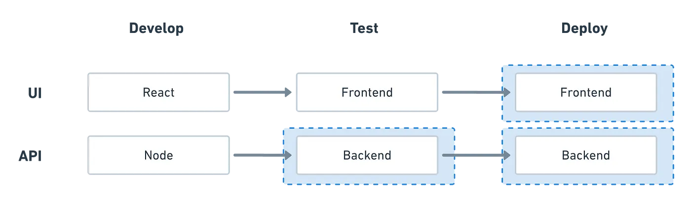
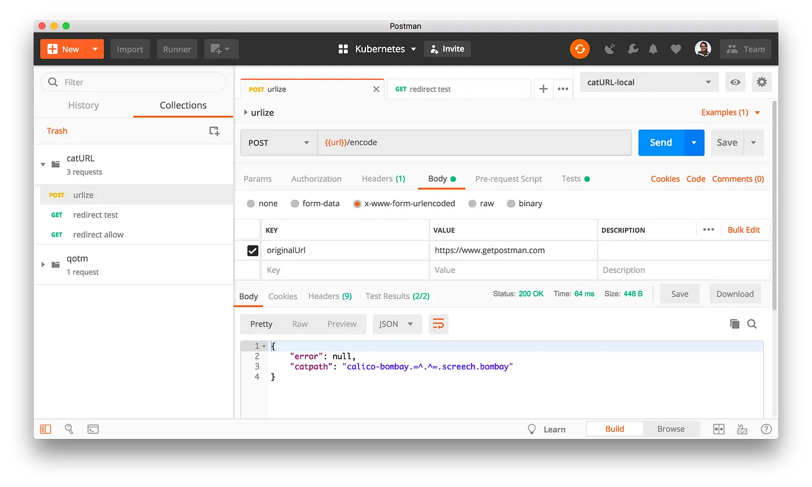
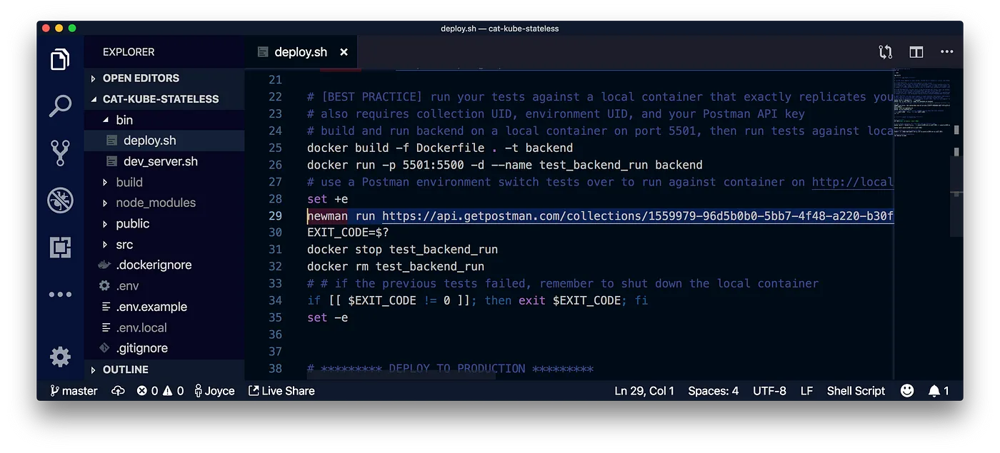
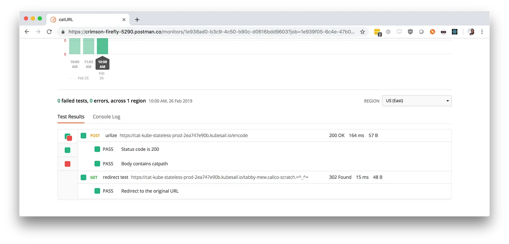

author: Joyce
id: docker-and-kubernetes
summary: Deploy a web app with Docker and Kubernetes
categories: Intermediate
environments: web
status: Published
feedback link: https://github.com/loopDelicious/pmquickstarts
tags: Intermediate, Developer, DevOps, Tester

# Deploy a web app with Docker and Kubernetes

<!-- ------------------------ -->

## Overview

Duration: 1

> aside negative
> This tutorial was originally published here: [Deploying a scalable web application with Docker and Kubernetes](https://medium.com/better-practices/deploying-a-scalable-web-application-with-docker-and-kubernetes-a5000a06c4e9) - Read the article to learn how to test and deploy a Node.js app using containers and an orchestration engine.

### Prerequisites

- Familiarity with web development, such as Node, React, and Express
- Familiarity with command line interface

### What You’ll Learn

- Set up a web application using React, Express, and Node
- Test the API using Newman and Docker
- Deploy the front-end and back-end using Kubernetes
- Various options for testing and automation in Postman

### What You’ll Need

- [NodeJS](https://nodejs.org/en/download/) Installed
- Sign in to [Postman](https://go.postman.co)
- Your preferred IDE, such as [VSCode](https://code.visualstudio.com/download), installed
- A Kubernetes cluster, such as running on a local machine or in the cloud

### What You’ll Build

- A URL shortener application deployed using Docker and Kubernetes

<!-- ------------------------ -->

## Introduction

Duration: 2

As cloud applications grow in complexity, sometimes teams reorganize into a distributed microservice architecture and software delivery cycles get faster. Throughout all of this, DevOps engineers keep looking for ways to streamline and automate the continuous deployment of code.

Some teams use containers, like [Docker](https://www.docker.com/), to simplify and automate the deployment process for their applications. This is an effective way of packaging software in a way that is predictable and consistent. You can expect the software to behave similarly whether you’re on a laptop or in the cloud.

Once you get to a point where you’re running multiple containers across multiple machines, spinning up more instances of your components doesn’t scale linearly and dealing with this growing complexity gets a little hairy. Many teams will address this complexity by also using an orchestration engine, like [Kubernetes](https://kubernetes.io/). Teams are using Kubernetes as a higher-level abstraction to manage Docker container technology and further simplify the pipeline to enable their teams to go faster.

> aside positive
> We’re already seeing tremendous benefits with Kubernetes — improved engineering productivity, faster delivery of applications and a simplified infrastructure.
>  
> Teams who were previously limited to 1–2 releases per academic year can now ship code multiple times per day!
>   > [Chris Jackson, Director for Cloud Platforms & SRE at Pearson](https://kubernetes.io/case-studies/pearson/)

You don’t need to have Google- or Facebook-level traffic to care about making your web applications scalable. You might have a varying number of users, need to accurately predict your infrastructure costs, or just want to manage your systems more efficiently.

To better understand software containers, let’s first talk about physical shipping containers.

### Knowledge check

<form>
  <name>Which of these statements is false?</name>
  <input type="radio" value="Containers package software in a way that is predictable and consistent">
  <input type="radio" value="Kubernetes is used to manage containers">
  <input type="radio" value="You can use Docker and Kubernetes together">
  <input type="radio" value="You cannot use Docker and Kubernetes at the same time">

</form>

<!-- ------------------------ -->

## Containers

Duration: 10

### Why use containers?

Before someone invented physical shipping containers, dock workers needed specialized skills to handle different types of precious cargo. Physical containers allow us to standardize how our cargo is shipped.

There’s many reasons to use a container to ship something like bundles of firewood, for example.

- **Portability** — your container can be loaded onto any ship, transported by any shipping provider, or even transferred to a truck to travel over the road
- **Modularity** — containers are all the same size and dimension, so the same crane that is used at any port to handle your container of firewood can also be used to load and unload a container of loose chickens 🐔
- **Security** — your container is isolated from other containers, so that someone shipping fish tanks won’t slosh fish water 🐟 onto your bundle of firewood
- **Scalability** — your firewood will only take up the space needed, so you can either occupy a small corner of one container or ramp up to reserve a bunch more containers across a fleet of ships

Similar to physical shipping containers, software containers are useful for standardization. In this case, software containers standardize IT infrastructure. Containers are a tidy way to package code with their dependencies into building blocks that can be deployed consistently and efficiently.

- **Portability** — a container is decoupled from the host operating system, so that it can run on anything from a laptop to your cloud of choice
- **Modularity** — containers give you the flexibility to create easily interchangeable application stack components, so you have a separation of concerns between components like your web server and your database
- **Security** — containers are immutable so updates are made by replacing the container in its entirety, making it easy to issue security patches or rollback an update quickly
- **Scalability** — containerized applications can scale up to handle additional load or ramp down to conserve resources during a lull

### How do containers work?

Let’s revisit our physical shipping containers analogy and imagine a busy seaport where ships are coming and going all day long. There’s a **container manifest** that lists the contents and the loading sequence of everything getting stuffed into the **container**. The container gets stuffed according to this manifest and then loaded onto a ship. The dock workers will **orchestrate** the logistics, keeping a schedule of when the containers get loaded and unloaded, managing the arrival and departure of the ships, and coordinating with the freight carriers. At a busy port like this, we’d have some pretty hefty tools to coordinate and govern all of these details.

Now, back to the world of software containers.

[Docker](https://www.docker.com/why-docker) is one of the most popular, open-source container technologies that allows you to build, run, test, and deploy distributed applications. There’s a lot of terminology, so let’s contain our excitement, and just tackle some of the basics.

**Container image**

This image will inform how a container is instantiated, determining which software components will run and how. You can also create an image from a container, and share these specifications with someone else, so that an app runs the same way on a developer’s laptop as it would in production.

**Container**

This describes a virtual environment that bundles the application code with all the binaries and libraries that are required to run an application. Since the container includes all of its dependencies, you don’t have to install anything on the host operating system, keeping it separate and pristine.

**Container orchestration**

This refers to coordinating behaviors for containers and between containers, such as scheduling, resource management, and load balancing. In complex or dynamic ecosystems, teams will use an orchestration engine to control, manage, and automate this activity.

After the Postman engineering team [reorganized into a microservice architecture](https://medium.com/postman-engineering/conquering-the-microservices-dependency-hell-at-postman-with-postman-part-1-introduction-a1ae019bb934), every service now uses Docker to configure their own environments. Every service owner defines their own Dockerfile from which an image is generated [when new code is deployed as part of the CI/CD pipeline](https://medium.com/postman-engineering/continuous-deployment-with-postman-collections-e2fb0b5d2235). The resulting image is pushed to the team’s container registry, and their Beanstalk environments are configured to pull the image from the registry to run the containers.

> aside positive
> Every service gets the flexibility of configuring how to run their services. So services engineers can focus on building the application while platform engineers can focus on how to build and deploy automatically.
>  
> Docker takes over the responsibility of configuring the environment and standardising the deployment pipeline. This gives us faster deployment and scaling time because the build happens only once during CI.
>   > [Saswat Das](https://medium.com/@saswatds), Platform engineer at Postman

### Knowledge check

<form>
  <name>Which of these is not a benefit to using containers?</name>
  <input type="radio" value="Scalability">
  <input type="radio" value="Security">
  <input type="radio" value="Readability">
  <input type="radio" value="Portability">
  <input type="radio" value="Modularity">
</form>

<!-- ------------------------ -->

## Container orchestration

Duration: 2

### Why use Kubernetes?

With a microservice architecture, a number of services can go into making a single application, and each of these services can live in its own container. Even a simple web application might not live in a single container. You might have one container for the web frontend, one for the backend APIs, and maybe another for data storage. If you start seeing some traffic, you can spin up more instances of your app’s components.

However, simply spinning up more instances doesn’t scale linearly. Containers allow you to scale, but managing these operations at scale can be complicated. When you’re operating at scale, you will be coordinating behavior for containers and between containers.

That’s when an orchestration engine like [Kubernetes](https://kubernetes.io/) comes into play. Kubernetes is an open-source, orchestration system for automating deployment, scaling, and management of containerized applications. As a higher-level abstraction to deal with container management, there’s a somewhat steep learning curve to get set up, but then it makes day-to-day life easier.

> aside positive
> Kubernetes simplifies the deployment process for your application, and provides tools to make your application super robust.
>  
> With Kubernetes, you get rolling deployments with no downtime, service discovery, and the flexibility to change cloud providers easily.
>  
> — [Dan Pastusek, Founder of Kubesail](https://kubesail.com/)

### Knowledge check

<form>
  <name>Which of these is not a reason to use Kubernetes?</name>
  <input type="radio" value="Making containerized applications immutable">
  <input type="radio" value="Scaling containerized applications">
  <input type="radio" value="Managing containerized applications">
  <input type="radio" value="Automating deployment">
  <input type="radio" value="Coordinating behavior for containers and between containers">
</form>

<!-- ------------------------ -->

## Let's try it out

Duration: 1

Let’s try it out! We’ll start with a simple Node app that functions like a URL shortener. In our case, we’ll transform one URL into a different one using cat verbs, cat adjectives, and cat emojis 🐱 — and when you input your custom URL into a browser, you’ll be redirected back to the original website.

The beauty of using containers is that even if I’m developing this app on a machine with my Operating System and a different version of Node, you can rely on my container image to prescribe the exact specifications you’ll need to run the same application seamlessly on your machine, or in the cloud, or wherever you choose to deploy.

If you want to follow along, go ahead and [clone this example](https://github.com/postmanlabs/node-doc-kube), and follow the README steps to spin up a local version of these APIs.

1. Develop
1. Test
1. Deploy

<!-- ------------------------ -->

## Develop the app

Duration: 3

Let’s start with a Node app using [React](https://reactjs.org/) for the frontend and [Express](https://expressjs.com/) for the backend. To simplify this demonstration, we won’t be implementing persistent data storage.

The backend boils down to 2 APIs.

1. Transform the original URL

2. Redirect the new URL back to the original URL

Even before you begin developing the frontend, you can use Postman as a client to send requests to our local server. It’ll save us time every time we update our payload and inspect the server response.

This is the quintessential use case most people know about when they think of Postman. You probably knew this already. Don’t worry. We’ll learn a few more ways to increase our efficiency with Postman.

> aside negative
> **💡POSTMAN TIP**: use a [Postman environment](https://learning.getpostman.com/docs/postman/environments_and_globals/intro_to_environments_and_globals) to save configuration parameters so you can switch quickly between server setups. For example, I used an environment variable called `url` in my collection and created separate templates for local development and production. Now, selecting the desired Postman environment allows me to toggle between `http://localhost:5500` to `https://cat-kube-stateless-prod-2ea747e90b.kubesail.io`, and other configuration options, more quickly.

Start these endpoints on your local server, and then let’s move over to the Postman app. Find the Postman collection called [catURL](https://www.postman.com/postman/workspace/published-postman-templates/collection/1559645-9f5aa83b-666d-41ef-9b91-6c3ec25ef789?ctx=documentation) in the Postman app, and then import the example collection and environment within the workspace.

We’ll use the `catURL` collection along with the `catURL-local` environment to debug and test our 2 APIs. Read through the collection documentation, and try it out for yourself.

<!-- ------------------------ -->

## Test the app

Duration: 5

In this recipe, we won’t cover the basics of [how to write tests in Postman](https://medium.com/postman-engineering/acing-your-apis-what-you-need-to-know-for-test-automation-e3fdba3519b9), or [how to run these tests in Postman](https://medium.com/postman-engineering/from-manual-to-automated-testing-the-roadblocks-and-the-journey-6333dfacc5ae). However, you can see a few tests already written under the **Tests** tab of the `catURL` collection. Feel free to add your own tests to validate the behavior of our APIs.

Make sure to update your general Postman settings to disallow redirects so that we can inspect our server’s response headers before the redirection. More on how to do that [here](https://documenter.getpostman.com/view/1559645/S11HvKXW#test-the-redirect).

Now that we’ve manually tested our APIs in Postman, or used the [collection runner](https://learning.getpostman.com/docs/postman/collection_runs/starting_a_collection_run) as our first step towards automation, let’s use Postman’s open source library [Newman](https://github.com/postmanlabs/newman) to run our collection at build time. We have 3 options:

- **Good practice**: test against your APIs running on a local server using static Postman collection and environment [JSON files](https://learning.getpostman.com/docs/postman/collections/data_formats/#exporting-and-importing-postman-data) located within the project directory
- **Better practice**: still testing against your local server, run these tests using the [Postman API](https://www.postman.com/postman/workspace/postman-public-workspace/documentation/12959542-c8142d51-e97c-46b6-bd77-52bb66712c9a) to dynamically pull the latest versions of your collection and environment
- **Even better practice**: still using the Postman API, test against your APIs running on a container hosted by your local server so that your test environment exactly replicates your production environment

Let’s try out the last scenario — the even better practice. Add a deployment script that builds and starts our APIs in a local container. If any Postman tests fail, Newman will return an error code to immediately terminate the remainder of the script before any deployment steps are executed.

> aside negative
> **💡POSTMAN TIP**: use the [Postman API](https://www.postman.com/postman/workspace/postman-public-workspace/documentation/12959542-c8142d51-e97c-46b6-bd77-52bb66712c9a) to pull the latest version of your collection or environment. Using a static JSON file doesn’t ensure you’re running the latest version of your tests.
>  
> Then, run the collection and environment using [Newman](https://github.com/postmanlabs/newman) as part of your Continuous Deployment / Continuous Integration (CI/CD) pipeline. The process is the same if you’re using Jenkins, Travis CI, or any similar build system. You will add a build time script telling Newman to run your Postman tests. If the tests don’t pass, your code doesn’t deploy.

<!-- ------------------------ -->

## Deploy the app

Duration: 5

In this example, we will be using Kubernetes to deploy our frontend and backend to separate containers. Consequently, we’ll be describing our deployment steps in separate YAML files. These files will include your container image, resource allocation, the desired number of replicas, and other important information.

In this example, I only designated a single replica of our APIs. However, if I wanted to have 3 replicas, Kubernetes would keep a steady eye on my app instances and replace them if any single one crashed for some reason.

For the deployment, I used a hosted Kubernetes provider called [Kubesail](https://kubesail.com/) that creates a free managed namespace. However, the underlying deployment utility [`npx deploy-to-kube`](https://github.com/kubesail/deploy-to-kube) supports any Kubernetes cluster. By running it inside your app’s directory, this utility will automatically generate a Dockerfile, build and push deployment images, generate Kubernetes configuration files, and trigger a deployment on your Kubernetes cluster.

Once our app is in production, we can continue testing our production APIs periodically to ensure they’re still functioning properly.

- **Good practice**: on an ad hoc basis, use the Postman [collection runner](https://learning.getpostman.com/docs/postman/collection_runs/starting_a_collection_run/) to run the same tests along with a Postman environment that is set up with your production configuration.
- **Better practice**: set up a [Postman monitor](https://learning.getpostman.com/docs/postman/monitors/setting_up_monitor) to schedule your tests on a recurring frequency, or set up a custom cron job using [Newman](https://github.com/postmanlabs/newman) to do the same thing.

In addition to basic monitoring, the Kubernetes community has developed a bunch of [open source resources](https://github.com/ramitsurana/awesome-kubernetes) for introspection. Tools like [Prometheus](https://prometheus.io/) and [Istio](https://istio.io/) provide more advanced features for logging and debugging for your Kubernetes clusters.

In summary, we used a local container to test our Node app, and then Kubernetes to deploy both the frontend and backend on containers in the cloud. Along the way, we used Postman to test our APIs locally, then before releasing our code, and finally once they were in production.

<!-- ------------------------ -->

## Next Steps

Duration: 5

In case you missed it, I wanted to highlight the importance of using containers during testing. Container images make it easier to reproduce and run an application that more closely replicates the production environment.

You can use your container images to reliably run your tests against an application in a test environment, like the Postman engineering team does. Containers also allow you to scale up more instances for [concurrent performance testing](https://medium.com/postman-engineering/dont-get-techcrunched-performance-testing-for-your-http-apis-3196e40f6b70). And in the event you’ve released a bug into production, containers make it really easy to quickly roll back an update to a previous version of the application.

There’s a bunch of ways that you can use containers in your development, testing, and deployment processes. The strategy you choose will be determined by your team’s current infrastructure, talent, and goals.

### What we've covered

- Set up a web application using React, Express, and Node
- Test the API using Newman and Docker
- Deploy the front-end and back-end using Kubernetes

### Additional resources

- [Running collections](https://youtu.be/7F3f4WOFs38) video
- [Acing your API tests — what you need to know for test automation](https://medium.com/better-practices/acing-your-apis-what-you-need-to-know-for-test-automation-e3fdba3519b9) blog
- [15 days of Postman - for testers](https://www.postman.com/postman/workspace/15-days-of-postman-for-testers/overview) badge
- Other hands-on [tutorials](https://quickstarts.postman.com/)
