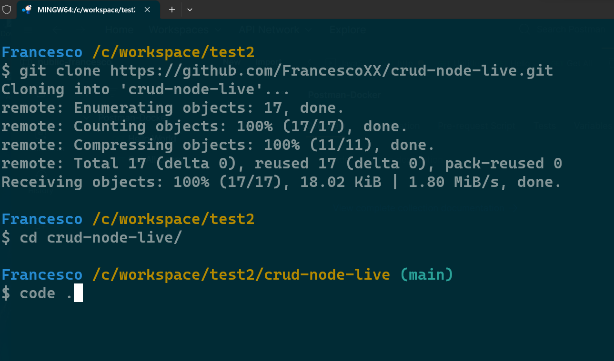
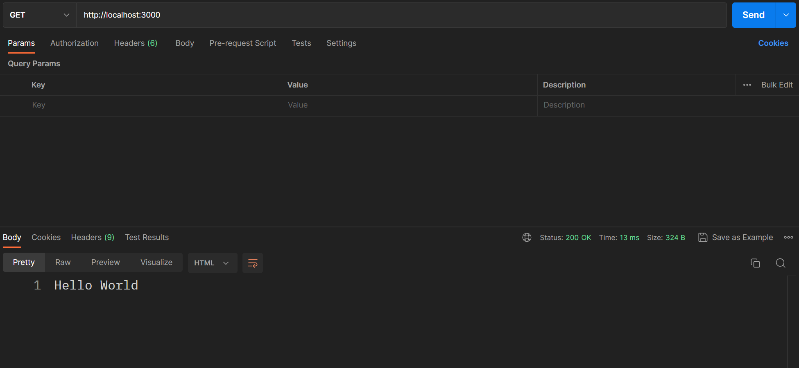
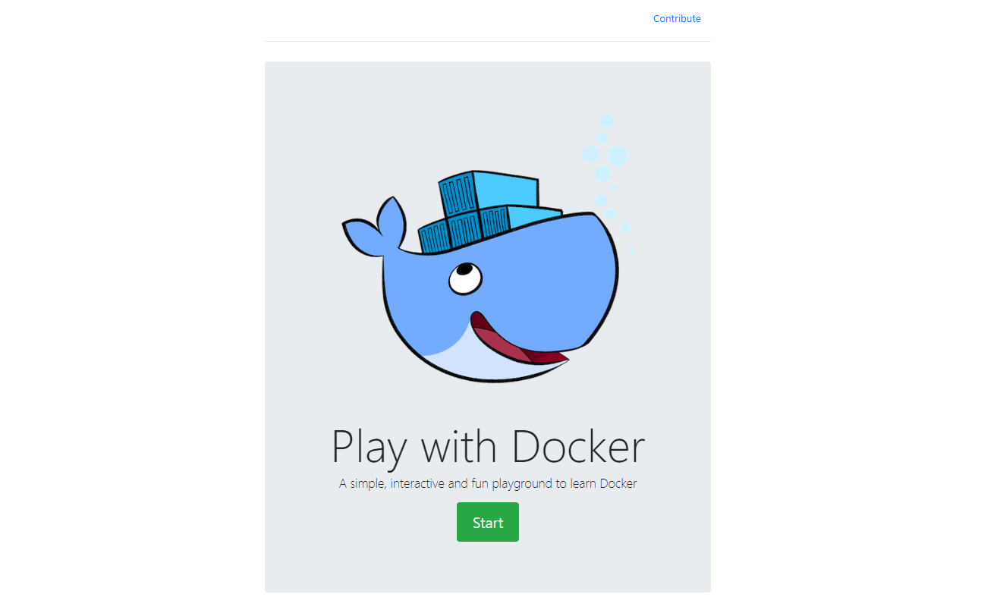
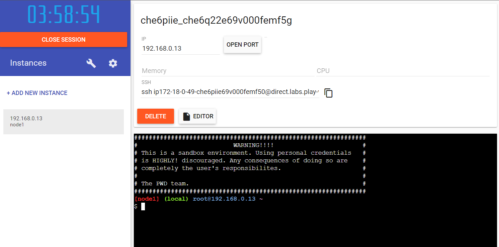
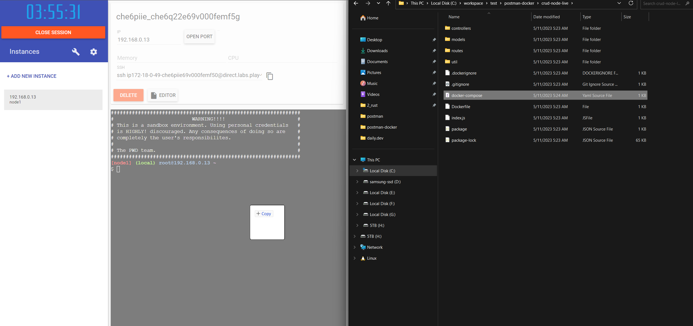
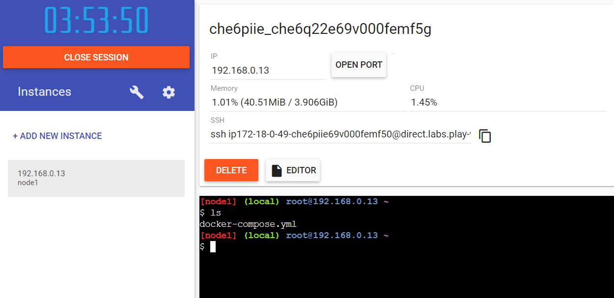
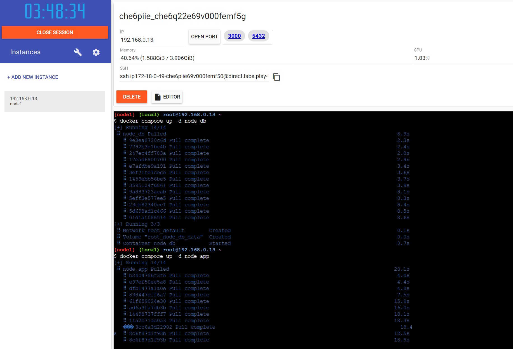
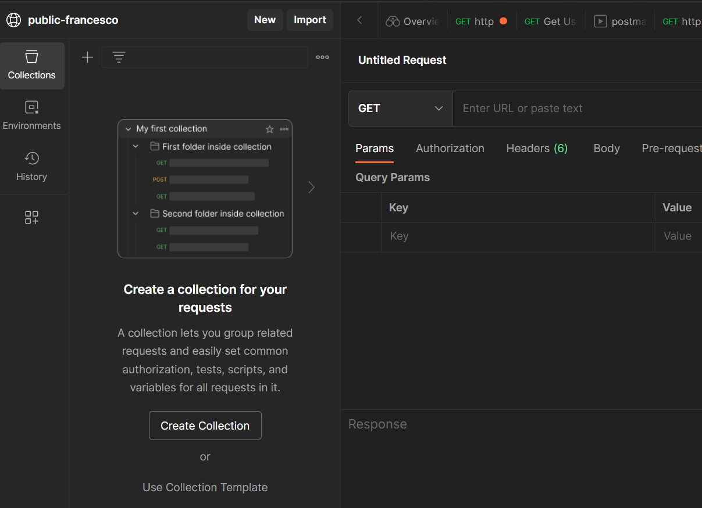
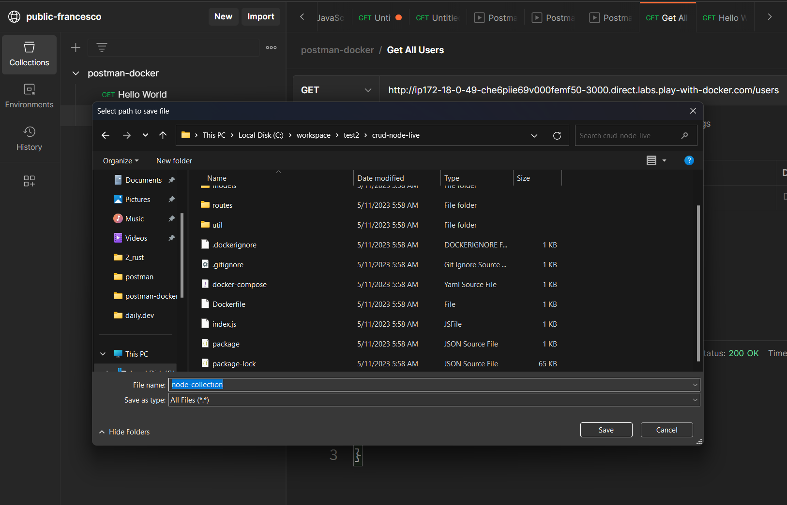
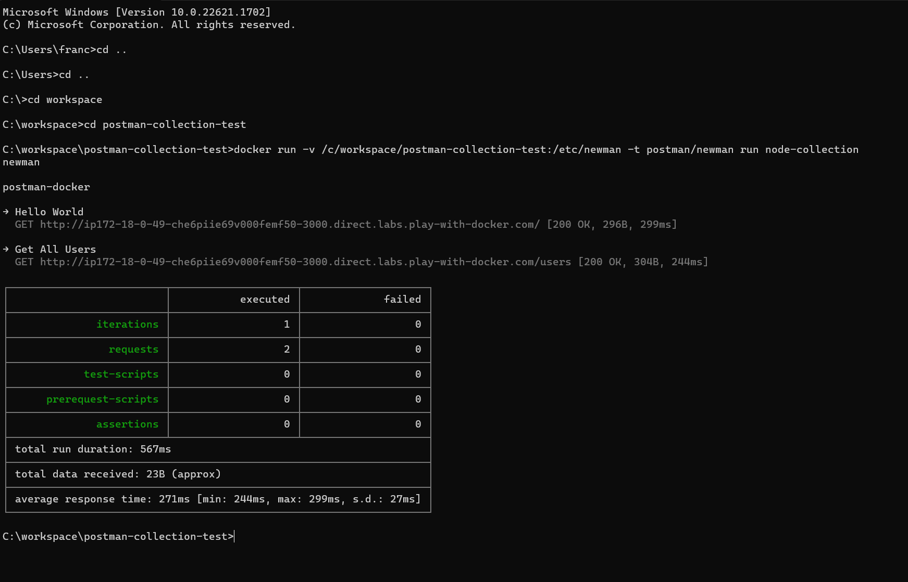

author: Francesco
id: docker
summary: Test APIs with Docker containers
categories: Getting-Started
environments: web
status: Published 
feedback link: https://github.com/loopDelicious/pmquickstarts
tags: Getting Started, Developer, Tester

# Test APIs with Docker containers
<!-- ------------------------ -->
## Overview 
Duration: 1

Let's test our API using Docker Containers and Postman.

We will test a simple CRUD application created using Node.js, Express, and Postgres.

In this example, we will use:

* Postman: to test our API.
    
* Newman: to run our Postman collection.
    
* Play with Docker: to deploy our application.
    
* Docker: to run our application.
    
If you prefer a video version:
https://youtu.be/1eeR0LoIs-M

Step-by-step procedure

1. Intro
    
2. Clone the repository and modify the docker-compose.yml file
    
3. Run and test the application locally
    
4. Deploy our application.
    
5. Create and export the Postman collection
    
6. test the app using containers
    
7. Conclusion
    

## 🎬 Intro

We will use Docker and Postman:

* Docker: to run our application.
    
* Postman: to test it.
    

### 🧑‍🚀 Postman

Postman is a popular collaboration platform and API (Application Programming Interface) client that allows developers to design, test, and document APIs. It provides a user-friendly interface that enables users to request an API and inspect the response and create and manage automated tests for APIs.

Additionally, Postman allows teams to share collections of requests and collaborate on API development and testing.

Postman is very cool, but we will make it even more incredible in this article by using it with Docker.

### 🐳 Docker

Docker is a containerization platform that allows developers to package applications and their dependencies into self-contained units called containers.

Containers are isolated from each other and the underlying host system, making them portable and easy to deploy across different environments. Docker provides a simple and consistent way to build, distribute, and run applications, which helps to streamline the development process and reduce the time and effort required to set up and manage complex application architectures.

In this article, we will use docker both to run our application and to test the application using Postman.

## 🧬 Clone the repository

We will use a JavaScript project I created in another video. It is a simple CRUD application using Node.js, Express, and Postgres.

```plaintext
git clone https://github.com/FrancescoXX/crud-node-live.git
```

now step into the repository

```plaintext
cd crud-node-live
```

And open this folder with your favorite IDE. I am using VSCode.

```plaintext
code .
```

[](https://youtu.be/1eeR0LoIs-M)

We will not go into the details of this application. If you want to know how this was built, check this link: [https://youtu.be/1eeR0LoIs-M](https://youtu.be/1eeR0LoIs-M)

### Modify the docker-compose.yml file.

To test this application, you can build your own image or use the image I created and pushed to Dockerhub.

To use mine, remove the `build` instruction on line 6, as we will use an existing image from Dockerhub

This is the final docker-compose.yml file (note that there is no `build` instruction)

```yml
version: "3.9"

services:
  node_app:
    container_name: node_app
    image: francescoxx/node_live_app
    ports:
      - "3000:3000"
    environment:
      - PG_DB=node_live_db
      - PG_USER=francesco
      - PG_PASSWORD=12345
      - PG_HOST=node_db
    depends_on:
      - node_db
  
  node_db:
    container_name: node_db
    image: postgres:12
    ports:
      - "5432:5432"
    environment:
      - POSTGRES_DB=node_live_db
      - POSTGRES_USER=francesco
      - POSTGRES_PASSWORD=12345
    volumes:
      - node_db_data:/var/lib/postgresql/data

volumes:
  node_db_data: {}
```

## 👟 Run and Test the application locally

### Run the application locally

Let's run both the Docker services (containers) locally.

Run the Postgres container:

```plaintext
docker compose up -d node_db
```

Run the node app:

```plaintext
docker compose up -d node_app
```

And check if both of them are up and running:

```plaintext
docker ps -a
```

The output should be similar to this:

[](https://youtu.be/1eeR0LoIs-M)

### Test the application locally

In this example, we will test just two endpoints:

Using Postman, we can make a `GET` request to [`http://localhost:3000`](http://localhost:3000)

[](https://youtu.be/1eeR0LoIs-M)

And we can make a `GET` request to [`http://localhost:3000/users`](http://localhost:3000/users)

[](https://youtu.be/1eeR0LoIs-M)

We don't have any users, so we get an empty array.

Now we are ready to deploy this service and test it using containers.

## 🚢 Deploy the application

You can use any Container service, such as AWS, Azure, or Google Cloud platform.

The important part is to have a final public IP address to test it using Postman.

I will use Play with Docker, which is free and easy to use.

### Play with Docker

Visit this link: [https://labs.play-with-docker.com/](https://labs.play-with-docker.com/) and click `Start`

[](https://youtu.be/1eeR0LoIs-M)

This will create a 4-hour session where you can create and test your containers.

Click on `+ Add new instance`

[](https://youtu.be/1eeR0LoIs-M)

And on the right, you should see a terminal and the instance. This instance has a public address.

[](https://youtu.be/1eeR0LoIs-M)

### Deploy the application

Deploying the application is very easy.

We need to copy the docker-compose.yml file and paste it on the playground.

You can do it using ssh, or you can drag and drop the file on the playground.

[](https://youtu.be/1eeR0LoIs-M)

Check if the docker-compose file is there by typing

```plaintext
ls
```

[](https://youtu.be/1eeR0LoIs-M)

Now let's run the same two commands we ran before locally:

```plaintext
docker compose up -d node_db
docker compose up -d node_app
```

And let's check it

```plaintext
docker ps -a
```

Note that now there are 2 ports open: `3000` and `5432`

[](https://youtu.be/1eeR0LoIs-M)

If you click on the `3000` next to `OPEN PORT`, you should see the application running on a public IP (If you use any a cloud provider, check the public IP)

[](https://youtu.be/1eeR0LoIs-M)

let's get an example

## 🗃️ Postman Collection

Open Postman, and if you don't have it already create a New public space named whatever you want.

In my case, I created a workspace named `public-francesco`

Now create a new collection by clicking `Create Collection`

[](https://youtu.be/1eeR0LoIs-M)

Rename it as `postman-docker`

[](https://youtu.be/1eeR0LoIs-M)

Add a new `GET request` at the public IP address of the application, and `SAVE` it (top-right corner)

[](https://youtu.be/1eeR0LoIs-M)

Duplicate it (right-click on the first request) and name the new one `Get All Users`

This request will be a `GET request to <public-server-ip>:/users`

[](https://youtu.be/1eeR0LoIs-M)

⚠️Remember to SAVE the requests

You can test this Collection by running it directly in Postman:

[](https://youtu.be/1eeR0LoIs-M)

[](https://youtu.be/1eeR0LoIs-M)

We are now ready to export this collection and test it using containers

## 🧪 Test the app using containers

We will use Newman, a command-line collection runner for Postman. It allows you to run and test a Postman Collection directly from the command line. It is built with extensibility in mind so that you can easily integrate it with your continuous integration servers and build systems.

### Export the Postman Collection

Now export this collection as a JSON file. You can do it by clicking on the three dots on the right of the collection name and then clicking on `Export`

[](https://youtu.be/1eeR0LoIs-M)

Save it as `node-collection` (no extension)

[](https://youtu.be/1eeR0LoIs-M)

Now it's time to run this collection.

### run the Postman Collection using Newman

⚠️ For Windows users: use the Command Prompt or Powershell

navigate to the folder where the file `node-collection` is located

[](https://youtu.be/1eeR0LoIs-M)

And run this command:

```plaintext
docker run -v <postman-collection-path>:/etc/newman -t postman/newman run node-collection
```

Replace `<postman-collection-path>` with the path of the folder where the file `node-collection` is located.

In my case, it's `/c/workspace/postman-collection-test`

[](https://youtu.be/1eeR0LoIs-M)

and you will get a list of the requests.

## 🏁 Conclusion

We made it! We tested the application using the following:

* Postman collection
    
* Newman
    
* Docker
    

Video version: [https://youtu.be/1eeR0LoIs-M](https://youtu.be/1eeR0LoIs-M)