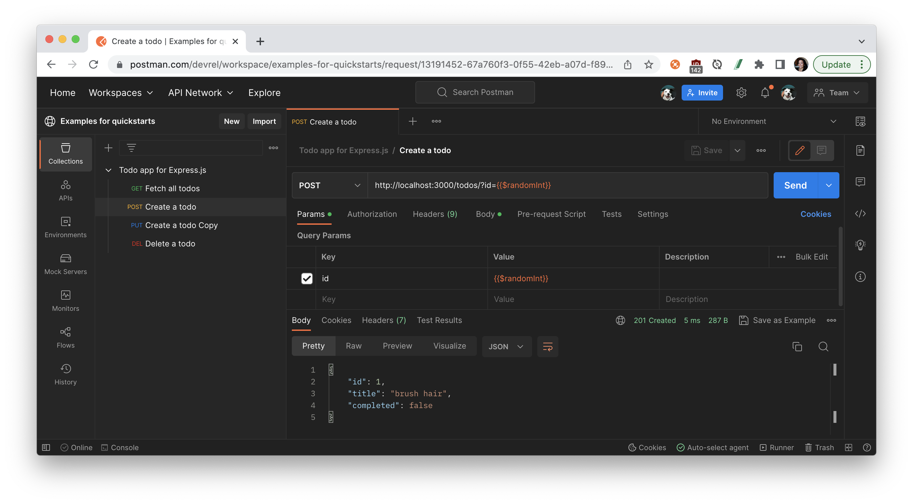

author: Joyce
id: express
summary: Create a Todo application with Express.js
categories: Getting-Started
environments: web
status: Published
feedback link: https://github.com/postmanlabs/pmquickstarts
tags: Getting Started, Developer

# Create a Todo application with Express.js

<!-- ------------------------ -->

## Overview

Duration: 1

Let's build an [Express.js](https://expressjs.com/) Todo application with API endpoints for creating, retrieving, updating, and deleting todos. We'll use an in-memory storage instead of a database for simplicity.

### Prerequisites

- A basic familiarity with JavaScript
- Ability to use the built-in terminal in your operating system

### What You’ll Learn

- how to set up a local server using Express.js
- how to create REST endpoints for a todo application
- how to build a front-end web interface
- how to set up middleware to serve static files

### What You’ll Need

- Your preferred IDE, such as [VSCode](https://code.visualstudio.com/download), installed
- [NodeJS](https://nodejs.org/en/download/) installed
- **Sign in to Postman:** Create a Postman account if you don't have one already, and log into [Postman for the web](https://go.postman.co) in your browser. To use Postman in a web browser, download and run the [Postman agent](https://www.postman.com/downloads/) on your local machine to overcome cross-origin resource sharing (CORS) limitations. The agent is not the same as the app. On a Mac, you will see an icon for the Postman agent running in the status menu at the top right of your computer screen. On a Windows machine, the Postman agent icon displays in the system tray at the bottom right of your computer screen.

> aside negative
> If you don't want to use Postman in a web browser with the agent, you can instead download and install the Postman app for Mac, Windows, or Linux.

### What You’ll Build

- An Express.js Todo application with API endpoints for creating, retrieving, updating, and deleting todos

<!-- ------------------------ -->

## Set up your project

Duration: 2

In the terminal, create a new directory called `simple-express-todo` for your project, and then navigate into the new directory. Enter each command following the `$` symbol and press enter, before running the next command.

```bash
$ mkdir simple-express-todo
$ cd simple-express-todo
```

Initialize a new Node.js project. You can accept the default prompts by including the `-y` option. Or manually step through each prompt by hitting **Enter** or providing a custom response.

```bash
$ npm init -y
```


Doing this also creates a new file in your directory called `package.json` to store important details and metadata about your project.

Install the `express` and `body-parser` dependencies.

```bash
$ npm install express body-parser
```

Use your preferred IDE to view the `package.json` file. The dependencies you just installed should be listed inside.


<!-- ------------------------ -->

## Create and run the application

Duration: 3

### Create the Express.js application

In the root folder of your project, create a file called `app.js` and add the following code. Review the comments throughout this code following the symbols `//` to read more about each section of code.

```js
// require dependencies so they can be used throughout this code
const express = require("express");
const bodyParser = require("body-parser");

// initialize Express.js server and save as a variable
// so it can be referred to as `app`
const app = express();

app.use(bodyParser.json());
let todos = []; // In-memory storage for todos

// GET endpoint to fetch all todo items
app.get("/todos", (req, res) => {
  res.json(todos);
});

// POST endpoint to create a new todo item
// provide `title` and optionally `completed` in the request body as JSON
app.post("/todos", (req, res) => {
  const todo = {
    id: todos.length + 1,
    title: req.body.title,
    completed: req.body.completed || false,
  };
  todos.push(todo);
  res.status(201).json(todo);
});

// PUT endpiont to update an existing todo item with the specified `id`
// provide updated `title` and/or `completed` in the request body as JSON
app.put("/todos/:id", (req, res) => {
  const id = parseInt(req.params.id);
  const todo = todos.find((t) => t.id === id);
  if (!todo) {
    return res.status(404).json({ error: "Todo not found" });
  }
  todo.title = req.body.title || todo.title;
  todo.completed = req.body.completed || todo.completed;
  res.json(todo);
});

// DELETE endpoint to remove an existing todo item with the specified `id`
app.delete("/todos/:id", (req, res) => {
  const id = parseInt(req.params.id);
  const index = todos.findIndex((t) => t.id === id);
  if (index === -1) {
    return res.status(404).json({ error: "Todo not found" });
  }
  todos.splice(index, 1);
  res.status(204).send();
});

// run the server on port 3000
// for example the app can run locally at this URL: http://localhost:3000
const PORT = process.env.PORT || 3000;
app.listen(PORT, () => {
  console.log(`Server is running on port ${PORT}`);
});
```

### Run the application

In your terminal, run the following command:

```bash
$ node app.js
```

Your server should now be running on `http://localhost:3000`.

### Try the API endpoints

Use Postman to make calls to your API and ensure each endpoint functions as expected.



Build a collection, or fork the sample collection to your own workspace by clicking the **Run in Postman** button below.

[](https://god.gw.postman.com/run-collection/13191452-15e8baab-98f4-4a71-a69d-ecbf4233ad98?action=collection%2Ffork&collection-url=entityId%3D13191452-15e8baab-98f4-4a71-a69d-ecbf4233ad98%26entityType%3Dcollection%26workspaceId%3D3450c70d-7bad-4e93-87f7-a4a3457f27ef)

Next, let's build a front-end website that uses these API calls so that users of this Todo application can use either Postman or this website to update the Todo application.

<!-- ------------------------ -->

## Create a front-end implementation

Duration: 5

Let's build a front-end implementation for the Todo application using HTML, CSS, and JavaScript (using the Fetch API for interacting with the API endpoints).

Create a new file called `index.html` in your project's root folder, and add the following code:

```html
<!DOCTYPE html>
<html lang="en">
  <head>
    <meta charset="UTF-8" />
    <meta name="viewport" content="width=device-width, initial-scale=1.0" />
    <title>Todo App</title>
    <style>
      body {
        font-family: Arial, sans-serif;
        max-width: 800px;
        margin: auto;
      }
      .todo {
        display: flex;
        justify-content: space-between;
        margin-bottom: 10px;
      }
      .completed {
        text-decoration: line-through;
      }
    </style>
  </head>
  <body>
    <h1>Todo App</h1>
    <form id="todo-form">
      <input type="text" id="todo-input" placeholder="Enter a new todo" />
      <button type="submit">Add</button>
    </form>
    <div id="todo-list"></div>

    <script>
      const API_URL = "http://localhost:3000/todos";

      const todoForm = document.getElementById("todo-form");
      const todoInput = document.getElementById("todo-input");
      const todoList = document.getElementById("todo-list");

      todoForm.addEventListener("submit", async (e) => {
        e.preventDefault();
        const title = todoInput.value.trim();
        if (title) {
          const todo = { title };
          await createTodo(todo);
          todoInput.value = "";
          loadTodos();
        }
      });

      async function loadTodos() {
        const todos = await fetchTodos();
        renderTodos(todos);
      }

      async function fetchTodos() {
        const response = await fetch(API_URL);
        const todos = await response.json();
        return todos;
      }

      function renderTodos(todos) {
        todoList.innerHTML = "";
        todos.forEach((todo) => {
          const todoElement = createTodoElement(todo);
          todoList.appendChild(todoElement);
        });
      }

      function createTodoElement(todo) {
        const div = document.createElement("div");
        div.classList.add("todo");
        div.innerHTML = `
                <span class="${todo.completed ? "completed" : ""}">${
          todo.title
        }</span>
                <div>
                    <button onclick="toggleCompleted(${todo.id})">${
          todo.completed ? "Uncomplete" : "Complete"
        }</button>
                    <button onclick="deleteTodo(${todo.id})">Delete</button>
                </div>
            `;
        return div;
      }

      async function createTodo(todo) {
        await fetch(API_URL, {
          method: "POST",
          body: JSON.stringify(todo),
          headers: { "Content-Type": "application/json" },
        });
      }

      async function toggleCompleted(id) {
        const todo = await getTodo(id);
        const updatedTodo = { ...todo, completed: !todo.completed };
        await updateTodo(updatedTodo);
        loadTodos();
      }

      async function deleteTodo(id) {
        await fetch(`${API_URL}/${id}`, { method: "DELETE" });
        loadTodos();
      }

      async function getTodo(id) {
        const response = await fetch(`${API_URL}/${id}`);
        const todo = await response.json();
        return todo;
      }

      async function updateTodo(todo) {
        await fetch(`${API_URL}/${todo.id}`, {
          method: "PUT",
          body: JSON.stringify(todo),
          headers: { "Content-Type": "application/json" },
        });
      }

      loadTodos;
    </script>
  </body>
</html>
```

To serve the `index.html` file using our Express app, let's make some modifications to `app.js`.

Install the `express.static` middleware to serve static files like `index.html`, CSS, and JavaScript files. In the terminal, run the following command:

```bash
$ npm install serve-static
```

Modify the `app.js` file to use the `express.static` middleware.

```javascript
// Add this line near the top of your file, under the existing imports
const serveStatic = require("serve-static");

// Add this line after `app.use(bodyParser.json());`
app.use(serveStatic("public"));
```

Create a `public` folder in your project's root folder, and move `index.html` into the `public` folder. Your project structure should now look like this:

```bash
simple-express-todo
├── public
│   └── index.html
├── app.js
└── package.json
```

In your terminal, stop the application if you haven't already with the keyboard shortcut **CMD / Ctrl + C**. And re-start the application.

```bash
$ node app.js
```

In your web browser, go to `http://localhost:3000` to see your frontend website being served by the Express app. The JavaScript code in `index.html` will interact with the API endpoints you've set up in `app.js`.


<!-- ------------------------ -->

## Next Steps

Duration: 2

Duration: 2

### What we've covered

- Set up a local server using Express.js
- Create REST endpoints for a todo application
- Build a front-end web interface
- Set up middleware to serve static files

The Express app shows a basic implementation that uses in-memory storage, so your data will be lost when the server is restarted. For persistent storage, use a database like MongoDB or PostgreSQL.

The website shows a basic implementation using vanilla JavaScript. You can add CSS to style the user experience and appearance of the website, or explore themes and templates like Bootstrap. You can also explore frontend frameworks like React and Vue for more functionality.

### Additional resources

To continue your journey with web development and other technical topics, check out more tutorials at [Postman Quickstarts](https://quickstarts.postman.com/).

Here are some additional resources.

- [TodoMVC](https://github.com/tastejs/todomvc) - Helping you select an MV\* framework - Todo apps for React.js, Ember.js, Angular, and many more
- [Express.js](https://expressjs.com/) - Fast, unopinionated, minimalist web framework for Node.js
