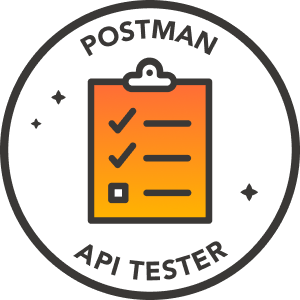

author: Joyce
id: galaxy-testing-and-automation
summary: This is a tutorial for testing and automation in Postman
categories: Getting-Started, Tester
environments: web
status: Published
feedback link: https://github.com/loopDelicious/pmquickstarts
tags: Getting-Started, Developer, Tester, Automation, Badge

# Galaxy Testing and Automation

<!-- ------------------------ -->

## Overview

Duration: 1

> aside negative
> This course was originally created by [Sue Smith](https://github.com/SueSmith) and has been modified to suit the Quickstart format.

This is an introduction to testing and automation in Postman. Complete this entire course to claim a badge to display on your social media profiles.



### Prerequisites

- A Postman account

### What You’ll Learn

- Writing scripts to test your response data
- Passing data between requests using variables
- Validating responses against schema
- Defining control flow
- Automating your testing using dynamic faker data and the collection runner
- Running collections with scheduled runs and monitors

### What You’ll Build

- A Postman Collection consisting of requests, variables, and tests.
- Badge for [Postman API Tester](https://badgr.com/public/badges/Q10KBL_YQXSW0lCQgYWx6Q).

<!-- ------------------------ -->

## Fork the collection

Duration: 1

### Welcome to Testing and Automation training! 🕵️🔍

FORK the following collection to create a copy in your own workspace.

[](https://god.gw.postman.com/run-collection/9065401-7450715a-4607-4648-9fe9-9f0a481072c5?action=collection%2Ffork&collection-url=entityId%3D9065401-7450715a-4607-4648-9fe9-9f0a481072c5%26entityType%3Dcollection%26workspaceId%3D13009b3b-31e2-4048-b3c5-de29cf9a0270)

> aside negative
> Once you fork the collection to your own workspace, you can complete the rest of the course solely in Postman. The collection contains this documentation as well as other details in the code comments. Or you can optionally refer to this quickstart throughout the remainder of this lesson as you continue working in Postman.

The collection will walk you through writing scripts to test your response data in Postman, passing data between requests using variables, validating responses against schema, as well as automating your testing using dynamic faker data and the collection runner, defining control flow, and running collections on the command line with Newman.

This collection uses a mock API with a few demo endpoints that return order data. We will use these endpoints to model a typical workflow so that you can go on to apply what you've learned when you're working with real-world APIs.

In the next section, we'll send our first request.

<!-- ------------------------ -->

## Send the first request!

Duration: 5

Open the first request, check out the docs on the right, and **Send**! The first request returns a JSON response structured like this:

```json
{
  "orderReference": "773a6237-d84f-45e6-bc30-67206345a8a4"
}
```

### Writing scripts & tests

Open the **Tests** for this request. We are primarily going to be working in this tab for each request. The **Tests** script is where you write JavaScript to execute _when your request response is received_.

> aside negative
> ✏️ When you have the docs view open Postman will condense the UI for the request builder in the center, so you may need to use the drop-down lists to select **Tests** and **Test Results** in the request and response areas.

You can also write **Pre-request Scripts** to execute before a request is sent, and can add scripts to collections and folders–these will execute for every request contained inside.

> aside negative
> ✏️ Notice that the address for this request starts with a base URL which is stored in a variable that you imported as part of the collection. Hover over the var (surrounded by curly braces) in the address to see the value. We set this mock server up in advance–you can create your own mocks and they will return whatever you have defined in the **examples** for a request.

### Step 1: Parse the response JSON

The **Tests** tab contains some comments indicating the different tests and other processing we're going to add during the session. Let's handle the first one–we're going to need the response JSON data pulled into the script in a way that we can process, so save it as a variable:

```js
const response = pm.response.json();
```

Let's write this out to the console to verify we have it (you can also use `console.log`, `console.warn`, and `console.error`):

```js
console.info(response);
```

Try sending the request and checking the console!

### Step 2: Set a variable with a response value

Before we move on let's save data from the response to a variable so that we can use it in another request. We'll use the response JSON variable we created in JS and store the `orderReference` property as a global Postman variable (which is scoped to the workspace you're in):

```js
pm.globals.set("orderRef", response.orderReference);
```

You can retrieve the global variables in your code using `pm.globals.get`.

**Send** the request again and check the global variables via the little eye button at the top right–the `orderRef` var should now have a value (and we can access it in other requests).

### Step 3: Add a test

Now let's add a basic test to check we have a success status code of `200 OK`–the test name string will be output with the test result, so make sure yours are meaningful enough to be useful when you're testing (you can either copy this or grab it from the snippets to the right of the **Tests** input):

```js
pm.test("Status code is 200", () => {
  //test syntax uses chai.js
  pm.response.to.have.status(200);
});
```

With your test code added, **Send** and check out the **Test Results**. Then try making the test fail by changing the `200` to `400`–notice that the result includes extra info indicating why the test failed.

### Step 4: Test a response property

Let's do a test that digs into a bit more detail next–we'll check that the response contains a particular property, and that it is a string. We can add both assertions to the same test and if any one fails the whole test will fail.

```js
pm.test("orderReference exists", () => {
  //property is in the response received
  pm.expect(response).to.have.property("orderReference");
  //property is a string
  pm.expect(response.orderReference).to.be.a("string");
});
```

**Send** and check out the **Test Results**.

> aside negative
> ✏️ Try changing `string` to `number` to see the test fail.

**Save** this request, then open the next request `Get product code`, open its docs to the right, and **Send** it.

<!-- ------------------------ -->

## Retrieve all products! 📱🛒

Duration: 5

**Send the request and read on here.**

This request returns an array of products–we're going to script some processing on the array, filtering to find a particular item, and saving the `sku` (a product code) data to the global variables.

The request you sent to the API received a JSON response that looked something like this (depending on the parameter you sent):

```json
results": [
    {
        "name": "iPhone 12 Pro Blue",
        "sku": "2020/Iph/12/Blu",
        "color": "blue"
    },
    {
        "name": "iPhone 12 Pro Red",
        "sku": "2020/Iph/12/Red",
        "color": "red"
    },
    {
        "name": "Samsung Galaxy S",
        "sku": "2020/Sam/GS/Blu",
        "color": "gray"
    },
    {
        "name": "Samsung Galaxy Note20 Ultra",
        "sku": "2020/Sam/GN20/Red",
        "color": "red"
    },
    {
        "name": "Samsung Galaxy S20+",
        "sku": "2020/Sam/SGS20P/Magenta",
        "color": "red"
    }
]
```

> aside negative
> ✏️ The request accepts a query parameter indicating the product name–you can experiment by checking and unchecking it to see the difference in what it returns.

### Step 1: Get the array

In the **Tests** tab you'll see comments again for each step. First get the response array in a variable and write the length out to the console–**Send** and check the console:

```js
const phones = pm.response.json().results;
console.info("Phones returned: " + phones.length);
```

### Step 2: Find a product

Let's filter the array to find a product with a particular property. We'll filter based on the `color` property and just use the first valid result (feel free to also add a console statement to see what's in the variable):

```js
const redPhone = phones.filter((phone) => phone.color === "red")[0];
```

### ✅ Assignment 1

> aside negative
> Throughout the session you will encounter assignments to complete independently, and so these will not include full instructions–if you need help pop a question in the Q&A or use the Postman forum if the session has ended.

Save the `sku` property of the first red iPhone you can find to a global Postman variable.

You will be able to use the SKU in the request body of the `3. Send order` request instead of the hardcoded value.

### Step 3: Test the filtered object

Let's have a look at a basic structure of a test:

```js
pm.test("Some test", () => {
  pm.expect(1).to.eql(2);
});
```

Now that you have a single item from the response filtered, add a test to check that it is a JSON object, and that it contains property with a particular value ('red'):

```js
pm.test("Phone found", () => {
  pm.expect(redPhone.color).to.eql("red");
  pm.expect(redPhone).to.be.an("object");
});
```

**Send** and check out the **Test Results**. Try making it fail too, e.g. by changing the color text value from `red` to `blue`.

**Save** this request. Open the next request `3. Send order`, check out the docs, and **Send**.

<!-- ------------------------ -->

## Create a new order! 💳📦

Duration: 5

**Send the request and read on here.**

This request sends an object representing the new order to create, and returns an order confirmation. We are going to use dynamic data in the request body, carry out some preprocessing before the request runs, and test the response.

The request returns JSON with the following structure:

```json
{
    "created": true,
    "orderId": {{$timestamp}}
}
```

Take a look in the request **Body** to see the JSON data we're sending to create an order. It should look something like this:

```json
{
  "orderRef": "f7032ebd-9ed2-4010-aab2-d7672f68e070",
  "customer": "Acme Inc",
  "sku": "2020/Iph/12/Blu",
  "deliveryDate": "2021-01-15"
}
```

Remember that in your assignment for the last request, you saved an SKU to a variable–now you can set the **Body** `sku` in this request to use the variable instead of the hardcoded value.

> Tip: You can enter a variable reference between the quotes in the body just like you do in the Postman request UI fields.

### ✅ Assignment 2

Your next assignment is to parse the response body of this request.

Set a global variable with the value of the property `orderId` from the response, so that we can reference it in another request.

**Send** the request and check the global variable values using the eye button–**Save** this request.

You will be able to use the variable in the next request `4. Get order`, as a path parameter instead of the hardcoded value.

### Step 1: Send dynamic data

When you send data to an API in Postman, you can generate values when the request runs using dynamic variables. Edit the value of the **Body** data `customer` property to send a random company name–inside the quotes, start typing `{{$` to see the available dynamic variables. Choose `randomCompanyName`–the reference is exactly like any other variable but with the `$` character at the start, like this: `{{$randomThing}}`

**Send** the request a few times, checking the **Console** to see what Postman sent each time (open the `POST` request entry &gt; **Request Body** to see the JSON).

### Step 2: Preset a value

For the `deliveryDate`, we're going to calculate a date before the request sends, and set it to the var so that the request sends it. In **Pre-request Script**, add the following processing to calculate a date, setting it for two weeks from today, then saving it to a variable:

```js
const deliveryDate = new Date();
deliveryDate.setDate(deliveryDate.getDate() + 14);
console.log(deliveryDate.toISOString().substr(0, 10));
pm.globals.set("deliveryDate", deliveryDate.toISOString().substr(0, 10));
```

**Send** the request, then check out the **Request Body** in the **Console** again, and take a look at the variable values via the eye button.

### ✅ Assignment 3

For this request we're expecting a `201 Created` status code. For your next assignment, add a test that verifies the status code of the response.

### ✅ Assignment 4

For your final assignment, test that the response includes confirmation of the order success–in the `created` and `orderId` properties (one should be true, and the other should be a number).

**Send** and check the **Test Results**–_as always, make your test fail also!_ ⚠️

**Save** your request and open the next one `4. Get order`.

<!-- ------------------------ -->

## Retrieve the order! 🛍️🎁

Duration: 5

**Send the request and read on here.**

This request retrieves the order sent by the `POST` request. This time we're going to test that the response validates against a schema, then automate our tests using the collection runner.

The request returns JSON with the following structure:

```json
{
    "orderId": {{orderId}},
    "customer": "Acme Inc",
    "sku": "2020/Iph/12/Red"
}
```

We're going to specify a schema to validate the response JSON against. The schema will be defined as a JSON object inside the script, and will match the response structure above–we will write a script to check that the response has the same structure and properties.

> aside negative
> ✏️ You can also validate your responses against an API specification, for example, defined as an OpenAPI spec in **APIs** on the left of Postman.

✅ Remember that one of your assignments in the previous request was to save the order variable from the response–**now alter the value you're sending to the path parameter here to use the variable instead of the hard-coded value**.

### Step 1: Define the schema

In **Tests**, create an object to represent the schema we expect the order data to match:

```js
const schema = {
  type: "object",
  properties: {
    orderId: {
      type: "number",
    },
    customer: {
      type: "string",
    },
    sku: {
      type: "string",
    },
  },
  required: ["orderId", "customer", "sku"],
};
```

### Step 2: Validate response against schema

Now add code to check the response against the schema (we use `expect` again but this time with `jsonSchema`):

```js
const response = pm.response.json();
pm.test("Schema is valid", () => {
  pm.expect(response).to.have.jsonSchema(schema);
});
```

**Send** the request and check the **Test Results**–_remember to also make sure it fails e.g. if you change one of the schema `type` values_.

Finally let's check what happens if no order ID is passed to the request. Click the eye button and edit, then delete the value of the `orderId` variable so that it's empty, and **Send** again before reading on.

### No order specified 🙈⛔

Since you didn't pass an order ID, you got a `404` response containing an error message.

The request returns the following **Body** structure when no order is specified:

```json
{
  "message": "Not found!"
}
```

We already specified a schema to test successful responses against, but now let's test the error response against a different schema.

### Step 3: Define the schema

In **Tests**, create an object to represent the schema we expect the order data to match:

```js
const errorSchema = {
  properties: {
    message: {
      type: "string",
    },
  },
};
if (pm.response.code === 404)
  pm.test("Error response is valid", () => {
    pm.expect(response).to.have.jsonSchema(errorSchema);
  });
```

**Send** the request and check out the **Test Results**–_and you know the drill by now, edit your test code to make sure it fails!_

This isn't the most efficient test code we could use because we've just tacked on the error schema test at the end–you could restructure the code in a more sensible way, but for now add a conditional before the test on the successful schema:

```js
if(pm.response.code===200)
```

### Step 4: Automate your test runs

We've carried out processing on individual requests and saved data so that we can pass values between requests–but we can do much more to automate our testing.

When you use the Postman Collection Runner, you can run the requests in a sequence and add logic to your scripts to control the flow of execution.

In the **Tests** for the `4. Get order` request, add this code to end execution after this request, which will mean that the runner stops here.

```js
postman.setNextRequest(null);
```

You can create loops and conditional workflows by passing the request name as a string to the `setNextRequest` method.

**Save** the request, then open the collection overview by selecting it on the left–hit **Run**. Run the collection with the default options to see the requests execute in sequence.

Take a look at the runner output and remember how the requests are saving response data that subsequent requests use–this way we can pass data between requests. Click the requests in the runner output display to drill down into detail about what was sent.

### Step 5: Monitor your collections

You can set collection runs up to happen on a schedule using **Monitors**. Open **Monitors** on the left, and create a new one. Give your monitor a name, select the collection, and choose a frequency. You will receive automated updates on any fails in your monitoring runs and can also access them inside Postman. _Note that it may take some time for results to appear._

**Open the final request "Complete training" and check out the docs for instructions!**

<!-- ------------------------ -->

## Complete training

Duration: 5

### Check your collection for completeness before submitting it to get your badge!🤓

This request is going to check your collection to make sure you've completed the requirements to receive the Postman **API Tester** badge.

### Get your collection link

You can generate a public link to share JSON representing your collection. **First make sure all of your requests are saved.**

1. Open the collection and navigate to **Share** (click it on the left or use the right-click menu on it).
2. Choose **Via API** and generate a new token if needed.
3. Copy your collection link to the clipboard.
4. Replace `{{your-collection-url}}` with your collection link in the `Complete training`  
   request (you can save it as a variable using this name or just paste it straight into the address).
5. Check out the **Test Results** to see if your collection is complete!

> aside negative
> Note that if you change your collection, you need to go back through the **Share** flow and update the link.

### Submitting your collection

Hopefully everything is good with your collection (if not plz try going back through the steps, referring to the request docs in each case, and remember to save your collection before sending this request after making changes to your scripts).

If you need support figuring out how to complete your collection please ask in the session chat or in the [Postman community forum using the "training" category](https://community.postman.com/c/training).

_**When your collection is complete, fill out the form**_ [**go.pstmn.io/submit-badge**](https://go.pstmn.io/submit-badge) _**including the export of your collection (**_[_see how here_](https://learning.postman.com/docs/getting-started/importing-and-exporting-data/#exporting-collections)_**) and we will process your submission for the API Tester badge!**_

On successful submission you will receive the [Postman API Tester](https://badgr.com/public/badges/Q10KBL_YQXSW0lCQgYWx6Q) badge! 🎉🏆🚀

<!-- ------------------------ -->

## Next Steps

Duration: 1

### What we've covered

- Writing scripts to test your response data
- Passing data between requests using variables
- Validating responses against schema
- Defining control flow
- Automating your testing using dynamic faker data and the collection runner
- Running collections with scheduled runs and monitors

If you've completed all the steps, you should have a Postman Collection consisting of requests, variables, and tests in your workspace. And you have earned the [Postman API Tester](https://badgr.com/public/badges/Q10KBL_YQXSW0lCQgYWx6Q) badge!


If you want to learn more about testing and automation in Postman, check out the following resources. The sky is the limit!

### Additional Resources

- Postman Webinar: [Continuous Testing with Postman](https://youtu.be/sB2HHrezQOo) video recording
- Postman Webinar: [Continuous Quality with Postman](https://youtu.be/zrmQAgixMpU) video recording
- [Test examples in Postman](https://www.postman.com/postman/workspace/test-examples-in-postman/overview) workspace
