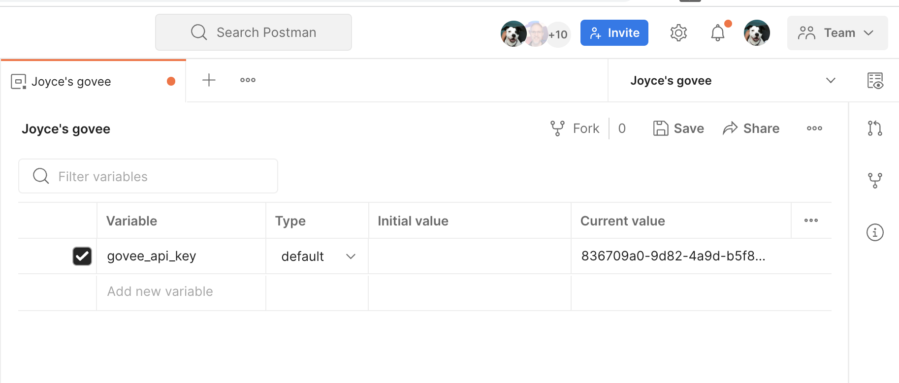
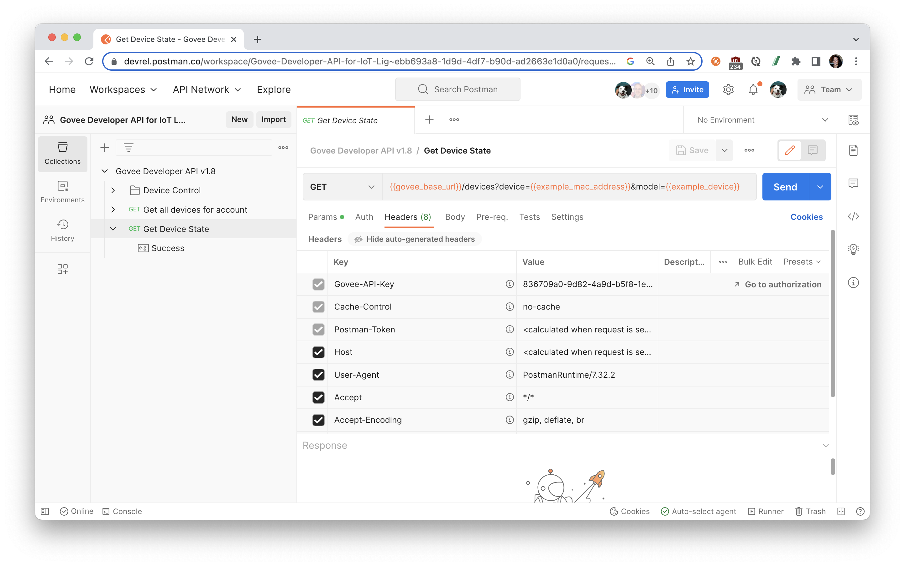
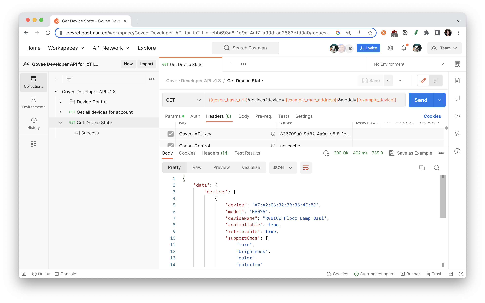
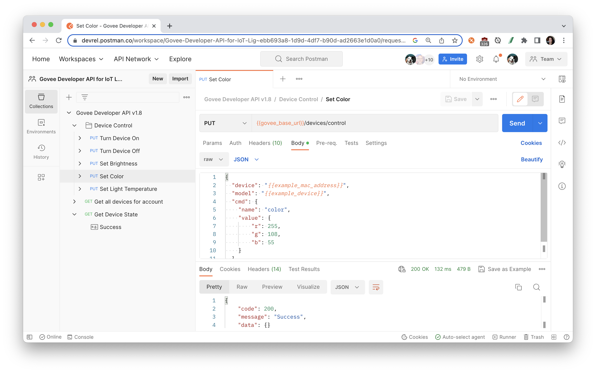
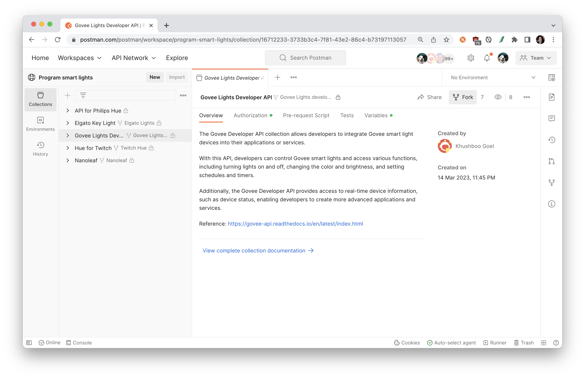

author: Joyce
id: govee
summary: Get started with the Govee API
categories: Getting-Started
environments: web
status: Published
feedback link: https://github.com/postmanlabs/pmquickstarts
tags: Getting Started, Developer

# Get started with the Govee API

<!-- ------------------------ -->

## Overview

Duration: 1

This tutorial is based on the official Govee Developer API v2.0 as documented at this URL:
[https://govee-public.s3.amazonaws.com/developer-docs/GoveeDeveloperAPIReference.pdf](https://govee-public.s3.amazonaws.com/developer-docs/GoveeDeveloperAPIReference.pdf)

### Prerequisites

- a [Postman Account](https://identity.getpostman.com/signup)
- a Govee smart device

### What You’ll Learn

- Authorize the Govee API using variables
- Start making API calls with Postman
- Control your smart devices using the Govee API

### What You'll Need

- a [Govee API key](https://govee-public.s3.amazonaws.com/developer-docs/GoveeDeveloperAPIReference.pdf)

### What You’ll Build

- A Postman Collection with authorized API requests

<!-- ------------------------ -->

## Fork the collection

Duration: 2

To get started, let's fork the [Govee Lights Developer API](https://www.postman.com/postman/workspace/program-smart-lights/collection/16712233-3733b3c4-7f81-43e2-86c4-b73197113057) collection in the [Program smart lights public workspace](https://www.postman.com/postman/workspace/program-smart-lights/overview) to our own workspace in Postman to work on it.

Fork the following collection.

Enter a label for your fork and select the workspace to fork the collection:

In the next step, we will collect the required Govee information and work in our newly forked collection.

<!-- ------------------------ -->

## Authentication

Duration: 3

### Govee API key

You will need a Govee Developer API key to authenticate your API requests.

1. Download and open the Govee Home mobile app
1. Go to the account **Settings**, and select "Apply for API key"
1. Fill out your name and your reason (e.g. "to demo home automation") and submit
1. Within a few minutes, you should receive an email with your API key to the email address you entered when registering a Govee account.

Select the Postman collection that you forked to your workspace. Find the **Variables** tab, and paste your API key as the `govee_api_key` variable value.

If you are working in a public or team workspace, you may want to create [a Postman environment](https://learning.postman.com/docs/sending-requests/managing-environments/) and use ["Current value"](https://learning.postman.com/docs/sending-requests/managing-environments/) to prevent unintentional disclosure of sensitive data.

### Authentication

In the previous step, you entered your Govee API key as a variable. Select the collection, and find the **Authorization** tab. Notice that this collection is using a collection-level authorization helper, so every request within this collection can use the same authorization method. Hover over the referenced variable to see how Postman is resolving the variable value. If you're using an environment, make sure to select it as an active environment.

Postman has been configured to add a header containing your Govee API key to each request within this collection, unless otherwise indicated. Select the request "Get Device State", and find the **Headers** tab. You may need to expand the auto-generated headers to verify that Postman has indeed added the properly configured header.

### Make an API call

Hit **Send** to make your first API call and to "Get Device State". Make a note of the `device` and `model` properties returned in the successful API response.

Save that data as Postman variables respectively called `example_mac_address` and `example_device` in your collection or environment

<!-- ------------------------ -->

## Update the smart light

Duration: 1

Find a different request called "Set Color", and update the RGB values to your preference. Hit **Send**, and watch the color of your smart light change.

Now that you made your first few calls with the Govee API, continue exploring the other endpoints in the `Govee Lights Developer API` collection. You can string together multiple API calls to create a custom theme or effect, or coordinate a schedule to turn on and off the lights.

<!-- ------------------------ -->

## Next Steps

Duration: 1

### What we've covered

- Authorize the Govee API using variables
- Start making API calls with Postman
- Control your smart devices using the Govee API

### Additional resources

To continue your journey with smart lights, here are some additional resources to check out.

- Review other public APIs in the [Program smart lights](https://www.postman.com/postman/workspace/program-smart-lights/overview) public workspace and explore more home automation APIs in the [Postman Network](https://www.postman.com/explore)
- Combine multiple APIs within the same collection to automate workflows with [collection scripts](https://learning.postman.com/docs/writing-scripts/intro-to-scripts/) or [Postman Flows](https://learning.postman.com/docs/postman-flows/gs/flows-overview/)
- Learn about other protocols used with Internet of Things (IoT) automation, such as [WebSockets](https://learning.postman.com/docs/sending-requests/websocket/websocket/)
