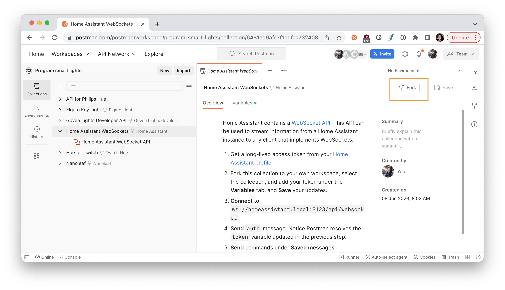
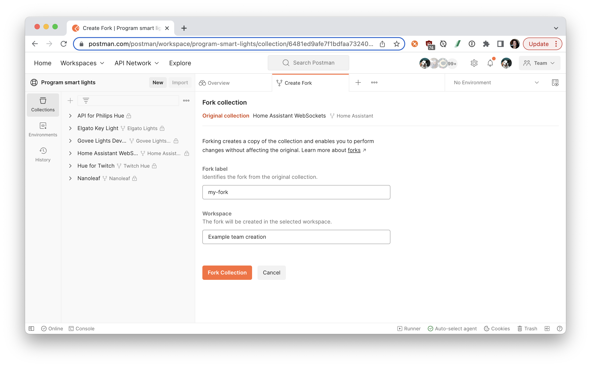
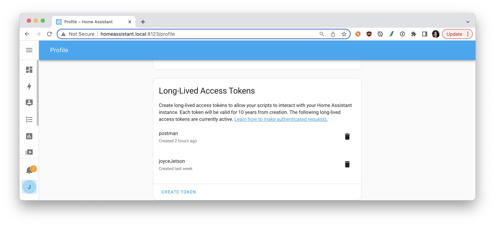
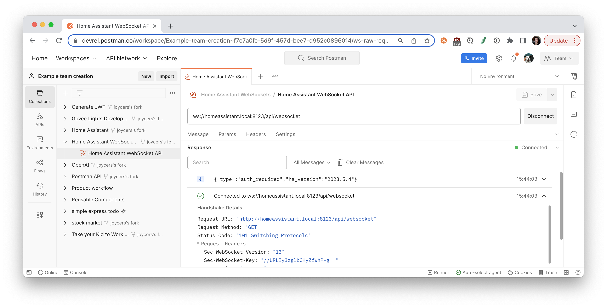
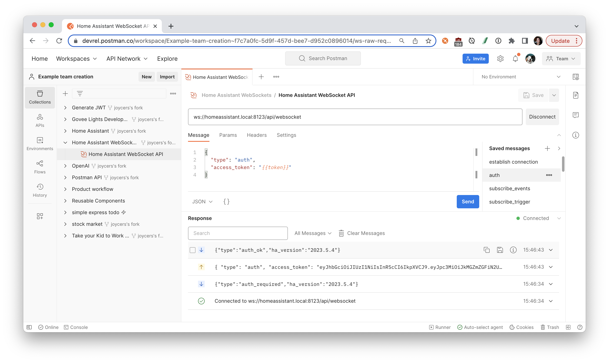
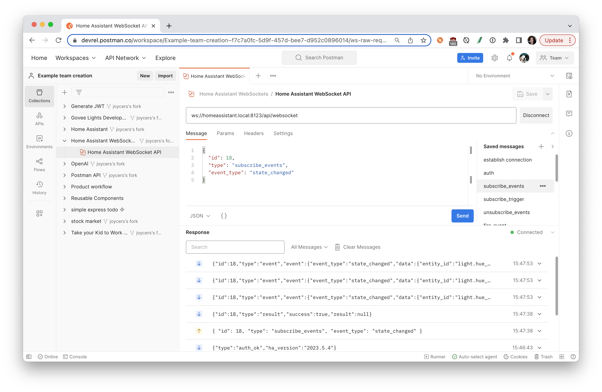
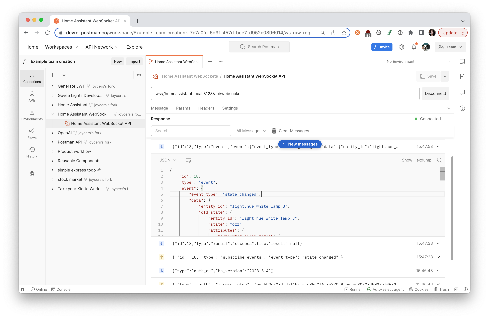
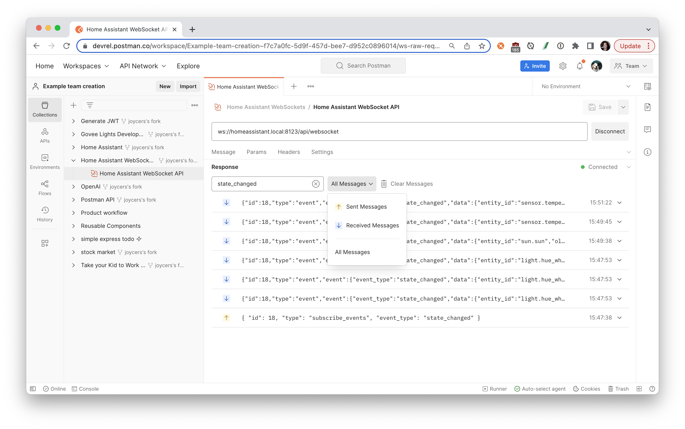

author: Joyce
id: home-assistant
summary: Home Assistant with WebSocket APIs
categories: Developer, Tester, Intermediate
environments: web
status: Published 
feedback link: https://github.com/loopDelicious/pmquickstarts
tags: Developer, Tester, Intermediate

# Home Assistant with WebSocket APIs
<!-- ------------------------ -->
## Overview 
Duration: 1

### Prerequisites

- Familiarity with DIY home automation and Home Assistant
- Some connected device, such as smart lights, smart speakers, or digital assistant

### What You’ll Learn

- how to establish a WebSockets connection
- how to authorize Home Assistant APIs
- how to send and receive WebSocket messages

### What You’ll Need

- a [Home Assistant Account](https://www.home-assistant.io/)
  - Home Assistant deployed and running on local server, such as Raspberry Pi
- a [Postman Account](https://identity.getpostman.com/signup)

### What You’ll Build

- A Postman collection with WebSocket messages

<!-- ------------------------ -->

## Create Home Assistant long-lived token

Duration: 2

Home Assistant contains a WebSocket API. This API can be used to stream information from a Home Assistant instance to any client that implements WebSockets. 

### Fork the Postman collection

1. Find the sample collection, [Home Assistant WebSockets](https://www.postman.com/postman/workspace/program-smart-lights/collection/6481ed9afe7f1bdfaa732408), and fork the collection to your own Postman workspace.
  
1. Enter a label for your fork and select the workspace to fork the collection:
  

### Create Home Assistant long-lived token

1. Log in to [Home Assistant](http://homeassistant.local:8123)
1. Create a long-lived access token from the [Home Assistant profile page](http://homeassistant.local:8123/profile).
  
1. Let's save our token as a Postman variable, so that we can use it in our API requests. Select the Postman collection that you forked to your workspace. Find the **Variables** tab, and paste your long-lived access token as the `token` variable value. 
  
> aside negative
> If you are working in a public or team workspace, you may want to create [a Postman environment](https://learning.postman.com/docs/sending-requests/managing-environments/) and use ["Current value"](https://learning.postman.com/docs/sending-requests/managing-environments/) to prevent unintentional disclosure of sensitive data, such as authorization credentials.

<!-- ------------------------ -->

## Establish a WebSockets connection

Duration: 3

### Authenticate the WebSockets connection

1. Select the Postman collection that you forked to your workspace. Open the "Home Assistant WebSocket API" request, and click the **Connect** button.
1. When a client connects to the server, the server sends out `auth_required`.In the **Response** pane, you can inspect the message returned from the WebSockets server. You can further inspect the connection details by clicking on "Connected to ws://homeassistant.local:8123/api/websocket". The connection established between the Postman client and local server is bidirectional. In addition to receiving messages, Postman can also send them. 
  
1. The first message from the client should be an auth message that includes an access token. Under the **Message** tab, under **Saved messages**, select a message called `auth` to display a JSON message that includes your `token`. If you were busy inspecting, the server may have disconnected from Postman. **Connect** once again, and then **Send** the `auth` message.
  

### Send and receive messages

Once the connection is authenticated, you can send and receive messages. Select from **Saved messages** to initiate commands.

> aside negative
> During the command phase, the client attaches a unique identifier to each message. The server will add this identifier to each message so that the client can link each message to its origin.

1. The command `subscribe_events` will subscribe your client to the event bus. You can either listen to all events or to a specific event type. Find a **Saved message** called `subscribe_events` that contains the following message, and **Send**.
  ```json
  {
    "id": 18,
    "type": "subscribe_events",
    "event_type": "state_changed"
  }
  ```
1. Once you subscribe to listen to all events, you will receive a message when the state changes on any device connected to Home Assistant.
  
1. For each message that you send or receive, you can expand the message details.
  
1. If the **Response** pane becomes too busy, you can **Clear messages**, and filter the messages by text or sent or received.
  

Continue exploring the other **Saved messages** within this collection. Once you learn how to work with Home Assistant WebSockets APIs, you can build your own custom integrations and notifications.

<!-- ------------------------ -->
## Next Steps

Duration: 1

### What we've covered
- how to establish a WebSockets connection
- how to authorize Home Assistant APIs
- how to send and receive WebSocket messages

For more hands-on tutorials, check out these resources.
- [Set up a WebSockets server in Node.js](https://quickstarts.postman.com/guide/websockets-node/index.html?index=..%2F..index#4) quickstart
- [Set up a WebSockets server in Python](https://quickstarts.postman.com/guide/websockets-python/index.html?index=..%2F..index#0) quickstart
- Contribute your own tutorials [here](https://github.com/loopDelicious/pmquickstarts)

### Additional resources
- [Home Assistant WebSocket API documentation](https://developers.home-assistant.io/docs/api/websocket)
- [Home Assistant REST API documentation](https://developers.home-assistant.io/docs/api/rest)
- [Home Assistant REST API](https://www.postman.com/aaroncarson/workspace/aaroncarson-public/collection/16392798-e28a007f-b4ac-4849-9ba0-b2dd5a7970b9): Postman collection
- [Program smart lights](https://www.postman.com/postman/workspace/program-smart-lights/overview): Postman public workspace