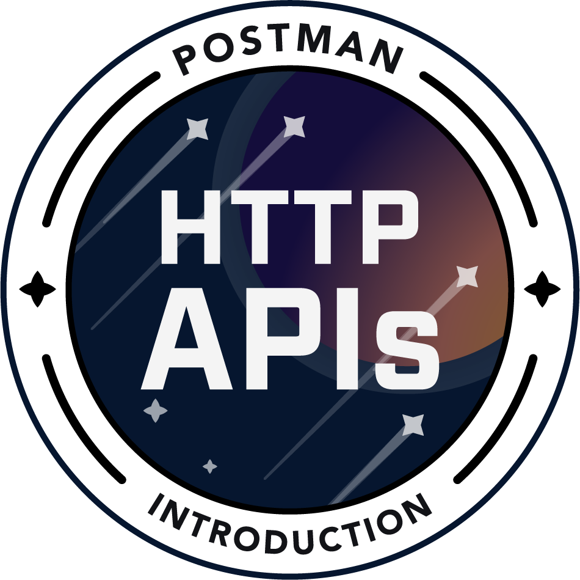
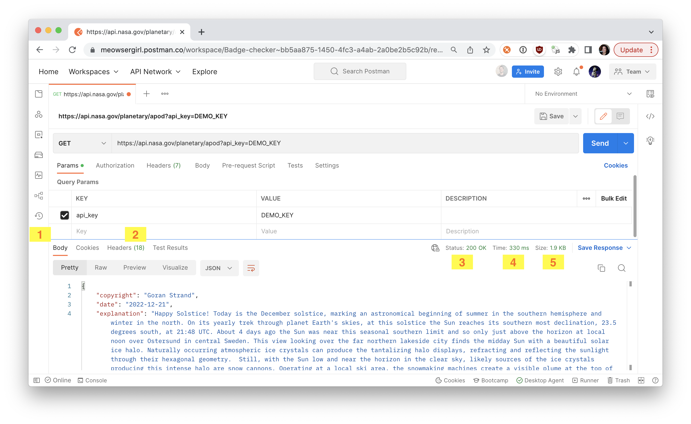
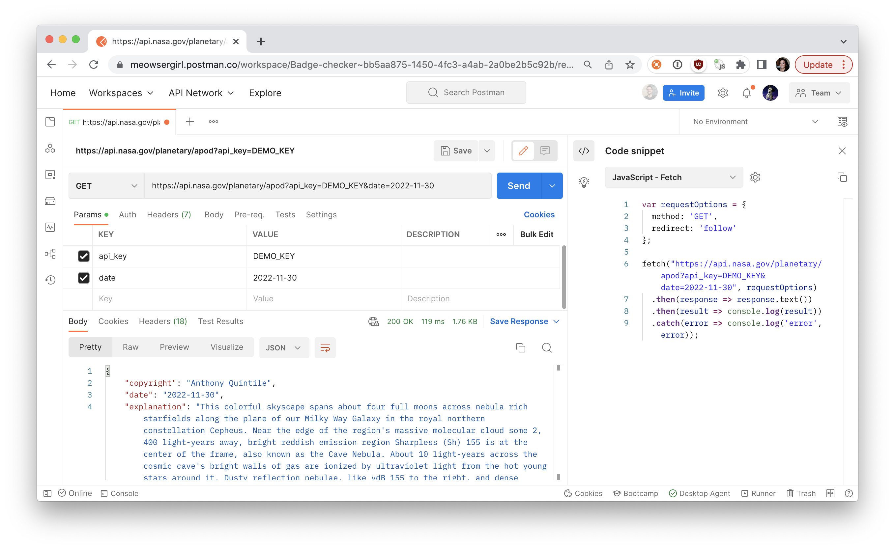
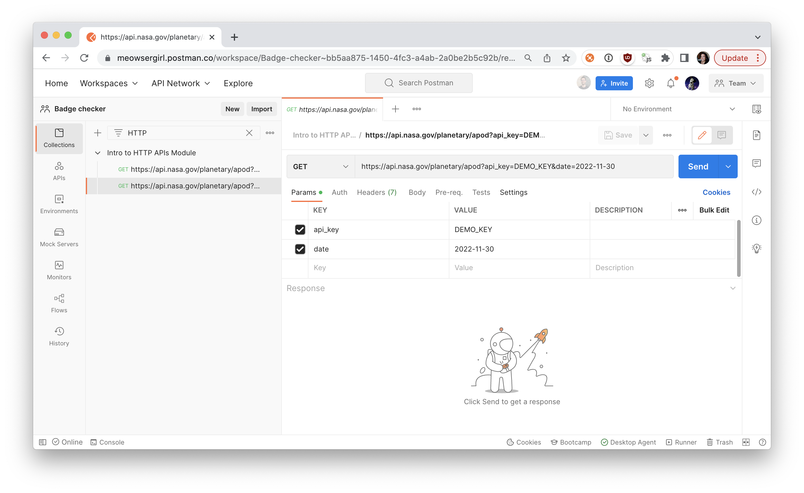
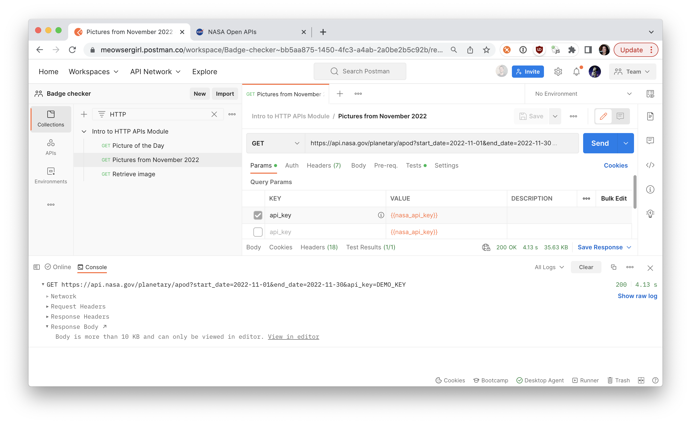

author: Joyce
id: introduction-to-postman
summary: This is a beginner's introduction to HTTP APIs in Postman
categories: Getting-Started
environments: web
status: Published
feedback link: https://github.com/postmanlabs/pmquickstarts
tags: Getting-Started, Badge

# Introduction to HTTP APIs in Postman

<!-- ------------------------ -->

## Overview

Duration: 1

This is a beginner's introduction to HTTP APIs in Postman. Complete this entire course to get started on your API journey with Postman, and claim your [Introduction to Postman - HTTP APIs](https://badgr.com/public/badges/RAhpkJyBReKgLWVLx-Z7GA) badge. Spelling and capitalization matter, so make sure to follow the instructions precisely.



### Prerequisites

- A Postman account

### What You’ll Learn

- Explain what an API client is
- Authorize and send HTTP API requests
- Write tests to assert the behavior of APIs is as expected
- Use variables to store and reuse information
- Debug and troubleshoot unexpected behavior

### What You’ll Build

- A Postman Collection consisting of requests, variables, and tests.

<!-- ------------------------ -->

## Get Started with Postman

Duration: 3

### What Is an API Client?

People communicate with each other through natural language. Software communicates via [application programming interfaces](https://en.wikipedia.org/wiki/API) (APIs). Web APIs operate behind the scenes, enabling you to browse your favorite social network’s updates or turn on a smartlight. This is done through an API client, which does the sending, retrieving, or rendering of data.

A web browser is an example of an API client. When you log in to an online store, the browser passes along your login credentials to a server, and upon confirmation that you’re an authorized user, displays a history of your orders. Other examples of API clients include mobile applications, developer terminals, and tools like Postman.

### What Is Postman?

Postman is an API platform used by over 20 million people. While Postman does much more, it’s most frequently used as an API client. Developers use Postman to send API calls and inspect what comes back. Nowadays people in nontechnical roles are using APIs too, and they’re discovering that a graphical user interface allows them to very easily interact with APIs.

### Create Your Postman Account

In this module, you explore HTTP APIs using Postman as an API client. To save your work, sign up for a free Postman account and log in. If you already have an account, just ensure that your profile is set to public, then move to the next section.

1. Go to `https://identity.getpostman.com/signup` to create a new Postman account.
1. Fill in the form with your email, username, and password and click **Create free account**.
1. Add your name, role, and how you plan to use Postman; add your profile photo if you wish.
1. Click **Continue**.
1. If you’re prompted to join a team, click **Continue Without a Team**.
1. You receive an email to confirm your email address, click **Confirm My Email**.

### Knowledge check

<form>
  <name>Which of these are API clients?</name>
  <input type="radio" value="Web browser">
  <input type="radio" value="Mobile application">
  <input type="radio" value="Database">
  <input type="radio" value="A and B">
  <input type="radio" value="B and C">
</form>

<form>
  <name>What is Postman?</name>
  <input type="radio" value="An email client">
  <input type="radio" value="An API platform">
  <input type="radio" value="A database">
  <input type="radio" value="A popular song from 1970">
</form>

In the next unit, you navigate the essentials of the Postman API client, including setting up a workspace and sending API calls.

### Additional resources

- _Postman website_: [API Client](https://www.postman.com/product/api-client/)
- _Postman app_: [Postman for web](https://go.postman.co/) (Sign-in required)

<!-- ------------------------ -->

## Send API Calls

Duration: 8

### Learning Objectives

After completing this unit, you’ll be able to:

- Set up a workspace
- Import data into Postman
- Send and retrieve data from an API
- Update parameters and request methods
- Inspect API responses
- Generate code to replicate the API call

### Set Up a Public Workspace

You can set up workspaces to organize your work in Postman, at various levels of privacy. Personal workspaces are visible only to you. Team workspaces can be used to collaborate with others on a project.

For this module, set up a [public workspace](https://learning.postman.com/docs/collaborating-in-postman/public-workspaces/), which enables you to collaborate with anyone around the world.

1. At the top of the Home page, select the **Workspaces** dropdown menu.
1. Click **Create Workspace**.
1. Give your workspace a name. In this example, it’s `My First Workspace`.
1. Set visibility to **Public**. Ensure your public profile is also enabled. Doing this allows you to collaborate with anyone publicly. This is useful if you’re asking for validation on a project, for example. If you are part of a team, your public workspace displays under your team profile.
1. Then click **Create Workspace**.

### Set Up Your Machine with the Postman Desktop Agent

To use Postman in a web browser, as we do in this module, you’re prompted to download and run the Postman desktop agent on your local machine to overcome [cross-origin resource sharing (CORS)](https://developer.mozilla.org/en-US/docs/Web/HTTP/CORS) limitations. Follow the prompts to set up the Postman desktop agent. Check out [the documentation](https://learning.postman.com/docs/getting-started/installation-and-updates/#using-postman-on-the-web) for more information about the agent.

1. When you first enter your workspace, you’re prompted to download the desktop agent. Click Download desktop agent.
1. Once you’ve downloaded the agent, run it on your machine.
   The agent is not the same as the Postman app. On a Mac, the icon for the Postman agent running in the status menu is located on the top right of your computer screen. On a Windows machine, the Postman agent icon displays in the system tray at the bottom right of your computer screen.

> aside negative
> If you don’t want to use Postman in a web browser with the agent, you can instead download and install the Postman app for Mac, Windows, or Linux.

### Import Data into Postman

In this unit, let’s use Postman as an API client to send and retrieve data from NASA. You can manually build an API call in Postman. But for this module, let’s import some data.

1. In the upper-left corner of your workspace, click the **Import** button.
1. Click the **Raw** text tab.
1. Copy and paste the following cURL command into Postman.
   `curl --location --request GET 'https://api.nasa.gov/planetary/apod?api_key=DEMO_KEY'`
1. Click **Continue**.
1. Confirm your cURL and click **Import** to transform this cURL command into an API request.

### Navigate the API client

Now that you’ve imported a request into your Postman workspace, take a look at the various parts, including your HTTP method and request, as well as query parameters.

Click the Send button and inspect the response received from the server. In one place, you’ll find the response Body (1), Headers (2), Status (3), Time (4), and Size (5).



Let’s update your parameters.

1. Ensure you are in the **Params** tab.
1. Add another query parameter

```
KEY: date
VALUE: 2022-11-30
```

1. Click **Send**.
1. Inspect the response received from the server. You see that the image comes from November 30 as you’ve set out in the parameters.

Review the [NASA Astronomy Picture of the Day](https://api.nasa.gov/#apod) API documentation to see what other parameters are supported by the API.

### Generate Code

Once your API call is working the way you want it, you can [generate code](https://learning.postman.com/docs/sending-requests/generate-code-snippets/) to copy and paste into your own client codebase. The code snippet generated by Postman allows you to make the same API call in the language of your choice.

Highlight the request.
Expand the context bar on the right, and click the **Code** icon.
In the dropdown, select a programming language and framework like JavaScript - Fetch.



If the generated code isn’t formatted the way you like, additional settings can be tweaked under the gear icon. You can also make inline edits to the code snippet. When you’re ready, this is code that can be copied and pasted into your own applications.

### Knowledge check

<form>
  <name>Which of these are part of an HTTP request?</name>
  <input type="radio" value="Method">
  <input type="radio" value="Streaming">
  <input type="radio" value="Params">
  <input type="radio" value="A and B">
  <input type="radio" value="A and C">
</form>

<form>
  <name>Which of these languages are supported by Postman for generated code snippets?</name>
  <input type="radio" value="cURL">
  <input type="radio" value="Rust">
  <input type="radio" value="JavaScript">
  <input type="radio" value="A and B">
  <input type="radio" value="A and C">
</form>

In the next unit, let’s test in Postman to assert what we’re getting back from the server is what we expect.

### Additional resources

- _Postman Docs_: [Public workspaces](https://learning.postman.com/docs/collaborating-in-postman/public-workspaces/)
- _Postman Docs_: [Using Postman on the web](https://blog.postman.com/introducing-the-postman-agent-send-api-requests-from-your-browser-without-limits/)
- _Postman Docs_: [Importing and exporting data](https://learning.postman.com/docs/getting-started/importing-and-exporting-data/)
- _Postman Docs_: [Sending requests](https://learning.postman.com/docs/sending-requests/requests/)
- _Postman Docs_: [Generating client code](https://learning.postman.com/docs/sending-requests/generate-code-snippets/)

<!-- ------------------------ -->

## Test a Response

Duration: 5

### Learning Objectives

After completing this unit, you’ll be able to:

- Insert a test snippet to assert a response
- Save request to a collection

### Insert a Test Snippet

You can write Postman tests in JavaScript to ensure an API is functioning as expected. Under the **Tests** tab of your request, you can input JavaScript manually or use the Snippets to the right of the code editor. Clicking one of these popular use cases automatically inserts a bit of code into the editor for you to modify.

1. With your request open, click **Tests**.
1. In the Snippets list, find and click **Status code: Code is 200** to insert the snippet into the code editor.

A Postman test consists of the `pm.test()` function, which accepts:

- The name of the test used to identify it in the **Test Results** output
- A function that returns a Boolean (`true` or `false`) value to indicate whether the test passes or fails

In our example, the name of our test is "Status code is 200". The function contains an assertion about our response, that we will receive an HTTP status code of `200`, formatted using [Chai BDD](https://www.chaijs.com/api/bdd/) syntax.

```javascript
pm.test("Status code is 200", function () {
  pm.response.to.have.status(200);
});
```

### Run a Test

Since tests are assertions about a server response, tests execute after you run the request and receive a response from the API.

1. With your test added to the request, click **Send** to run the request.
1. Open **Test Results** in the response section at the bottom.
   If the call returns a `200` HTTP status code, the test will pass, otherwise it will fail. Try changing the expected status code in your test script to `404`, and run the request again. You’ll see that the Test Result gives you a fail and error message. Revert your test to be `200` for it to pass.

### Save the Request to a Collection

The History tab on the left sidebar maintains a record of the most recent requests you send from Postman. Combing through your history to find and reuse requests can be time-consuming. Instead, you can save a collection of requests to organize your work. Besides improving productivity, [collections](https://learning.postman.com/docs/sending-requests/intro-to-collections/) are the foundation of more advanced features in Postman, like automation, monitoring, and mock servers.

1. Click **History** in the left sidebar.
1. Hover over the first request you made and click `+`. This should be the request you made before adding a date parameter.
1. Click **Create a collection**.
1. Name your collection `Intro to HTTP APIs Module`.
1. Click **Create**.
1. Click **Save**. Your request is saved to your new collection.
1. Add your second call to the same collection. Hover over the call and click `+`.
   The destination should already be `Intro to HTTP APIs Module`. Go ahead and click **Save**.



Update the name of the first call to Picture of the Day and the name of the second call to Pictures from November 2022.

1. Click **Collections** in the left sidebar.
1. Click the disclosure arrow next to `Intro to HTTP APIs Module`.
1. Hover over the top request and click the more actions icon.
1. Click **rename**.
1. Enter `Picture of the Day`.
1. Rename the second request in your collection `Pictures from November 2022`. Ensure that the request retrieves all pictures from that month.

Edit the second call to retrieve all the images from the month of November in 2022.

1. Click **Pictures from November 2022**.
1. Hover over the date key you created and click **X** to remove it.
1. Enter a new key to start your retrieval array on the first day of November.

```
KEY: start_date
VALUE : 2022-11-01
```

1. Enter another key to conclude the retrieval array on the last day.

```
KEY: end_date
VALUE : 2022-11-30
```

1. **Save** your work.

Check out the [NASA Astronomy Picture of the Day](https://api.nasa.gov/#apod) API documentation for more information about its query parameters.

### Keep It DRY

DRY stands for don’t repeat yourself. Imagine you always expect JSON objects to be returned from all your endpoints. Instead of adding the same test to every request individually, you can add the test assertion at the collection level to run after every request in the collection. With Postman, you can add tests to individual requests, folders, or collections.

1. Click `Intro to HTTP APIs Module`.
1. Click the **Tests** tab.
1. Select **Status Code: Code is 200** to add the test at the collection level.
1. Click **Save**.
1. Hover over `Intro to HTTP APIs Module` and click the more actions icon.
1. Select **Run collection**.
1. Click **Run Intro to HTTP APIs Module**. You see that both requests in the collection pass the test when you review your tests in the All Tests tab.

### Knowledge check

<form>
  <name>Which of these are standard test snippets in Postman?</name>
  <input type="radio" value="Response body: Contains string">
  <input type="radio" value="Status code: Code is 200">
  <input type="radio" value="Status: Successful PATCH request">
  <input type="radio" value="A and B">
  <input type="radio" value="B and C">
</form>

<form>
  <name>In what language can you write tests in Postman?</name>
  <input type="radio" value="JavaScript">
  <input type="radio" value="C++">
  <input type="radio" value="Apex">
  <input type="radio" value="JSON">
</form>

In the next unit, let’s learn about another way to stay DRY, using variables to reduce redundant code.

### Additional resources

- _Postman Docs_: [Writing tests](https://learning.postman.com/docs/writing-scripts/test-scripts/)
- _Chai.js Docs_: [BDD syntax](https://www.chaijs.com/api/bdd/)
- _Postman Docs_: [Grouping requests in collections](https://learning.postman.com/docs/sending-requests/intro-to-collections/)

<!-- ------------------------ -->

## Get and Set Variables

Duration: 10

### Learning Objectives

After completing this unit, you’ll be able to:

- Explain when to use different types of variables
- Get and set variables in text areas of Postman
- Get and set variables in JavaScript areas of Postman
- Chain requests

### Use Variables in Postman

In programming, variables allow you to store and reuse values throughout your code. Doing this allows you to reference the value throughout your collections, environments, and requests in Postman. And if you need to update the value, you only have to change it in one place.

### Explore Variable Scopes

There are a variety of [variable scopes](https://learning.postman.com/docs/sending-requests/variables/#variable-scopes) suited to different tasks in Postman.

<table>
    <thead>
        <tr style="bold">
            <th colspan="1"> <b>Variable</b> </th>
            <th colspan="1"> <b>Scope</b> </th>
            <th colspan="1"> <b>When they're used</b> </th>
        </tr>
    </thead>
    <tbody>
        <tr>
            <td>Global variables</td>
            <td>Access data between Postman requests, collections, scripts, and environments—all within a single workspace</td>
            <td>Used commonly, but may not change frequently, like a <code>username</code> or <code>country</code></td>
        </tr>
        <tr>
            <td>Collection variables</td>
            <td>Access data throughout requests within a collection</td>
            <td>Limited to a specific collection</td>
        </tr>
        <tr>
            <td>Environment variables</td>
            <td>Access data to be used in a single collection at a time, but can be used portably with other collections</td>
            <td>Configuration data for server environments like a URL; for example, <code>https://login.example.com</code> for a production environment and <code>https://test.example.com</code> for a sandbox environment</td>
        </tr>
        <tr>
            <td>Local variables</td>
            <td>Access within a single request or collection run</td>
            <td>Temporary values that do not persist once execution has ended</td>
        </tr>
        <tr>
            <td>Data variables</td>
            <td>Access from external CSV or JSON file during a collection run via <a href="https://learning.postman.com/docs/running-collections/using-newman-cli/command-line-integration-with-newman/">Newman</a> or the <a href="https://learning.postman.com/docs/running-collections/intro-to-collection-runs/">Collection Runner</a></td>
            <td>Loop through hundreds of test scenarios</td>
        </tr>
    </tbody>
</table>

If a variable with the same name is declared in two different scopes, the value stored in the variable with the narrowest scope will be used. For example, if there is a global and a local variable both called `username`, the local value will be used when the request runs.

### Use Variables in Text Fields

In text areas of the Postman request builder, like the request URL or parameters, you can use double curly braces to reference variables. Let’s learn a shortcut for creating new variables at any scope.

1. Select **Pictures from November 2022**.
1. In the request URL field, highlight the data you want to make a variable. In this example, it’s `DEMO_KEY`.
1. This opens an interactive tooltip. Click **Set as variable**.
1. Click **Set as a new variable**.
1. Name the variable `nasa_api_key`.
1. Select the Collection scope from the dropdown list, **Collection: Intro to HTTP APIs Module**.
1. Click **Set variable**.
1. Hover over the new variable to confirm the variable details.
1. Then do the same for the other request. Notice that the new variable is available to save you some steps.

You can also define and edit variables by navigating directly to the variable editors.

1. Select the collection in the Collections sidebar on the left of Postman.
1. Click **Variables** in the Overview panel.
1. Click in a blank cell under VARIABLE.
1. Enter `new_variable`.
1. Give it an INITIAL VALUE of `NEW_KEY`. You see that the CURRENT VALUE cell populates automatically.

### Use Variables in Code Editors

Instead of manually editing variables, you can also define and reference variables programmatically using JavaScript in request scripts under the **Pre-request Script** and **Tests** tabs.

1. While you’re in the `Intro to HTTP APIs Module` collection, click the **Pre-request Script** tab.
1. Select **Get a collection variable**.
1. Then select **Set a collection variable**.

​​Postman stores variables as strings. If you’re storing objects or arrays, remember to `JSON.stringify()` the value before storing, and `JSON.parse()` when you retrieve it.

### Chain Requests

Now that you know how to define and reference variables programmatically in Postman, you can chain requests. In other words, extract data from one response to use in other requests by using variables.

Add a third request to your collection called “Retrieve image” to make a GET request to a request URL of `{{nasa_image_url}}`.

1. Hover over your collection **Intro to HTTP APIs Module** and click the more options icon.
1. Click **Add request**.
1. Rename the new request `Retrieve image`.
1. In the request URL field, enter `{{nasa_image_url}}`. This variable doesn’t mean anything at the moment. You’ll change that in a few steps.
1. Click **Save**.
1. Now click back into `Pictures from November 2022`.
1. Click the **Tests** tab.
1. Enter `pm.collectionVariables.set("nasa_image_url", pm.response.json()[0].url)` in the editor. This script defines the variable `nasa_image_url` once you get a response from the NASA server.
1. Click **Send**.

We are using the [`pm.collectionVariables.set()`](https://learning.postman.com/docs/writing-scripts/script-references/postman-sandbox-api-reference/#using-collection-variables-in-scripts) function to set a collection variable. The function accepts two parameters. The first parameter is the variable key as a string, like nasa_image_url. The second parameter is the variable value. In this example, we are accessing the response data with the [`pm.response`](https://learning.postman.com/docs/writing-scripts/script-references/postman-sandbox-api-reference/#scripting-with-response-data) object.

Take a look at the collection variable editor to see that Postman has set the new variable. In this case, it’s the first image URL from the array of `Pictures from November 2022`.

1. Navigate back to `Retrieve image`.
1. Hover over `{{nasa_image_url}}` and see that your new variable now works.
1. Click **Send** on your new request to retrieve the image.

There was a lot of information in this unit, but working with variables is an important skill. Using variables increases your ability to work efficiently and minimizes the likelihood of error. You just learned that!

### Knowledge check

<form>
  <name>Which variable scope can be used in a single collection at a time, but used portably with other collections?</name>
  <input type="radio" value="Local">
  <input type="radio" value="Global">
  <input type="radio" value="Collection">
  <input type="radio" value="Environment">
</form>

<form>
  <name>Where can you get and set variables in Postman?</name>
  <input type="radio" value="Text fields">
  <input type="radio" value="Code editors">
  <input type="radio" value="In the block chain">
  <input type="radio" value="A and B">
  <input type="radio" value="B and C">
</form>

In the next unit, let’s dig deeper into authorizing our API calls.

### Additional resources

- _Postman Docs_: [Using variables](https://learning.postman.com/docs/sending-requests/variables/)
- _Postman Docs_: [Scripting with response data](https://learning.postman.com/docs/writing-scripts/script-references/postman-sandbox-api-reference/#scripting-with-response-data)

<!-- ------------------------ -->

## Provide Authorization Credentials

Duration: 3

### Learning Objectives

After completing this unit, you’ll be able to:

- Configure authorization details
- Use an Authorization helper

### Securely Access APIs

APIs may require authorization to ensure that client requests access data securely. This can involve authenticating the sender of a request and verifying that they have permission to access relevant data. The authorization model is specified by the API provider.

### Configure Auth Details

You can pass auth details along with any request you send from Postman. Auth data can be included in a request header, body, or as parameters to a request.

The [NASA Astronomy Picture of the Day API](https://api.nasa.gov/#apod) requires an API key be included with each request as a query parameter. Let’s see this in action.

1. Select **Picture of the Day**.
1. Deselect the `api_key` query parameter.
1. **Save** your update.
1. Then click **Send**. You see an error response.


Go ahead and deselect the `api_key` query parameter in `Pictures from November 2022` as well.

Make sure you **Save** your update.

Let’s learn a new way to handle authorization in Postman.

### Use Authorization Helpers

Under the **Authorization** tab of the request builder, you can enter and configure your auth details for Postman to automatically populate the relevant parts of the request. You can use an authorization helper for a request, folder, or collection.

Since all of the requests in the **Intro to HTTP APIs module** collection require the same authorization type, let’s add an authorization helper to the collection.

1. Select **Intro to HTTP APIs module**.
1. Click **Auth** to open the **Authorization** tab.
1. Select **API Key** from the Type dropdown.
1. Fill in the key value pairs.

```
Key: api_key
Value: {{nasa_api_key}}
```

1. Then update the `Add to` settings to **Query Params**.
1. **Save** your changes.
1. Click into any request you have saved. You see that Postman automatically adds the proper credentials under the **Params** tab.

Remember to use variables and collections to define authorization details more safely and efficiently, letting you reuse the same information in multiple places. If you group your requests in collections and folders, you can specify auth details to [reuse throughout a group](https://learning.postman.com/docs/sending-requests/authorization/#inheriting-auth).

### Knowledge check

<form>
  <name>True or false: It’s best practice to add an authorization helper at the collection level so you can reuse it for multiple requests automatically.</name>
  <input type="radio" value="True">
  <input type="radio" value="False">
</form>

<form>
  <name>Which authorization type is supported by Postman as a helper?</name>
  <input type="radio" value="Basic Auth">
  <input type="radio" value="OAuth 2.0">
  <input type="radio" value="So Auth">
  <input type="radio" value="A and B">
  <input type="radio" value="B and C">
</form>

In the next unit, let’s learn some ways to debug and troubleshoot when things aren’t going as expected.

### Additional resources

- _Postman Docs_: [Authorizing requests](https://learning.postman.com/docs/sending-requests/authorization/)
- _Postman Blog_: [Securely Using API Keys in Postman](https://blog.postman.com/how-to-use-api-keys/)

<!-- ------------------------ -->

## Debug and Troubleshoot Unexpected Behavior

Duration: 3

### Learning Objectives

After completing this unit, you’ll be able to:

- Reference console logs
- Read error messages

### Debug Unexpected Behavior

The Postman console can help with debugging when an API is not behaving as you expect.

Open the console from the icon on the bottom left of Postman [alt: Console]. Every request sent from Postman is logged in the console in both its raw and pretty form. In the console, you can inspect headers, certificates, requests, and responses from these network calls. Let’s see it in action. Send the second request in your collection and inspect the console output.

1. Open **Pictures from November 2022**.
1. Click **Send**.
1. Then click the Console icon at the bottom left of Postman.
1. Click the disclosure arrow of your latest request to explore the log.
1. Click **X** to close the console.



### Insert Console Statements

Using log statements at appropriate locations in your scripts helps identify the source of any issues. You can verify code is executing in the right order and inspect the values of variables at a certain moment in time.

For example, we previously extracted data from a response to pass along information to another request as a collection variable. We can log response data to inspect the data type and ensure that we are parsing an object properly.

1. With **Pictures from November 2022** still open, insert the following code on the first line of the **Tests** tab.

```
console.log(`From the Tests tab, number of pictures is: ${pm.response.json().length}`)
```

Send the request and inspect the console output. You’ll see the statement response.


### Knowledge check

<form>
  <name>What can you do in the Postman console?</name>
  <input type="radio" value="Verify code is executing in the right order">
  <input type="radio" value="Inspect values of variables at a certain moment in time">
  <input type="radio" value="Automate a test suite">
  <input type="radio" value="A and B">
  <input type="radio" value="B and C">
</form>

<form>
  <name>What information displays in the Postman console?</name>
  <input type="radio" value="Request headers">
  <input type="radio" value="Response headers">
  <input type="radio" value="Test results">
  <input type="radio" value="A and B">
  <input type="radio" value="B and C">
</form>

You’ve gone through a lot in this module, from setting up your Postman workspace to testing, variables, and debugging. Congratulations!

### Additional resources

- _Postman Docs_: [Debugging and logs](https://learning.postman.com/docs/sending-requests/troubleshooting-api-requests/#debugging-and-logs)
- _Video_: [Debugging with the console](https://youtu.be/YCsURct9wCk)

<!-- ------------------------ -->

## Next Steps

Duration: 1

### Claim your badge

To submit your solution for validation, your collection must be located in a public workspace. You will need your collection URL (see [instructions to "Share using the Postman API" here](https://learning.postman.com/docs/collaborating-in-postman/sharing/#sharing-using-the-postman-api)).

Go to [this page](http://go.pstmn.io/submit-badge) to claim your `Postman Introduction - HTTP API` badge using the "Share via API" link previously created.


### Next Steps

To continue your journey with Postman, here are some additional resources to check out.

- [Postman community forum](https://community.postman.com/): Postman has a large and active community, and someone might be willing to help if you ask nicely.
- [Hands-on learning courses](): additional quickstarts like this one by Postman.
- [Earn badges from Postman](https://badgr.com/public/issuers/BC0x4AQaQPC7lFilsBP_tQ/badges): complete other learning courses to earn badges you can proudly display on your social media profiles.
- [Webinars](https://www.postman.com/events/intergalactic/): register to attend virtual learning sessions with some of your favorite Postmanauts.
