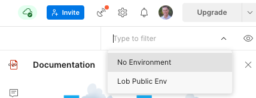

author: Joyce
id: lob
summary: Get Started with the Lob API
categories: Getting-Started
environments: web
status: Published
feedback link: https://github.com/loopDelicious/pmquickstarts
tags: Getting Started, Developer

# Get Started with the Lob API

<!-- ------------------------ -->

## Overview

Duration: 1

Negative:
_This tutorial was originally published [here](https://www.postman.com/lobteam/workspace/lob-public-workspace/documentation/16169677-975ecb9f-ea22-4d8f-a4f9-53a42f2aee03?entity=&branch=&version=)._

Let's make the world programmable.

Lob helps creators extend their applications into the physical world with automated direct mail and address verification APIs.

We've created a 10 min walkthrough showing how to get started with Lob API collections.

<video id="JDrxdzqghuQ"></video>

### Prerequisites

- Sign up for a [free Lob account](https://dashboard.lob.com/#/register)
- [Sign up](https://identity.getpostman.com/signup) for a free Postman account, and then [sign in](https://go.postman.co/).
- [Download and install](https://www.postman.com/downloads/postman-agent/) the Postman desktop agent, which will enable you to use the web version of Postman

### What You’ll Learn

- Authorize the Lob API
- Start making API calls with Postman

### What You’ll Build

- A Postman Collection with authorized API requests

<!-- ------------------------ -->

## Fork the collection

Duration: 1

In order to use the collections in [this public workspace](https://www.postman.com/lobteam/workspace/lob-public-workspace/overview), you'll select the Lob API collection and fork it into your personal workspace.

- [Fork the collection](https://www.postman.com/lobteam/workspace/lob-public-workspace/collection/16169677-975ecb9f-ea22-4d8f-a4f9-53a42f2aee03/fork)

<!-- ------------------------ -->

## Set up environment variables

Duration: 2

You'll also want to setup environment variables. A short cut is to fork Lob Public Env from Lob's public workspace. You also have the option to create them yourself.

- [Fork the environment](https://www.postman.com/lobteam/workspace/lob-public-workspace/environment/16169677-366827ee-d369-4332-b2ed-feccf5941f95/fork)

Your API keys are located under [Settings](https://dashboard.lob.com/#/settings/account). You'll use the SECRET API KEYS that begin with test*. for your Test API key and live*. for your Live API key.

Set the **Current Value** for `LIVE_API_KEY` and `TEST_API_KEY` to your Lob "live" and "test" API keys and click **Save**.

Make sure **Lob Public Env** is selected in the environment menu.

Start exploring Lob's API collection.

<!-- ------------------------ -->

## Next Steps

Duration: 1

The Test API key is used for all print & mail related endpoints while the Live API key is used for the address verification endpoint.

- For our full documentation visit `docs.lob.com`
- Need more help? Contact us at `support@lob.com`
