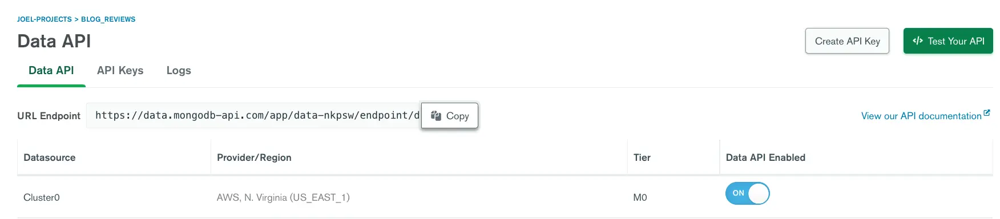
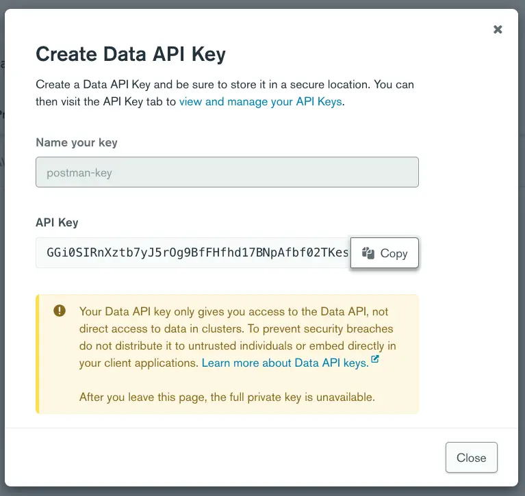

author: Joyce
id: mongodb_atlas_data
summary: Get Started with the MongoDB Atlas Data API
categories: Getting-Started
environments: web
status: Published
feedback link: https://github.com/loopDelicious/pmquickstarts
tags: Getting Started, Developer

# Get Started with the MongoDB Atlas Data API

<!-- ------------------------ -->

## Overview

Duration: 1

Negative:
_This tutorial was originally published [here](https://www.mongodb.com/developer/products/atlas/data-api-postman/)._

MongoDB's
[Data API](https://www.mongodb.com/data-api/lp)
is a way to access your MongoDB Atlas data using a REST-like interface. When enabled, the API creates a series of serverless endpoints that can be accessed without using [native drivers](https://docs.mongodb.com/drivers/). This API can be helpful when you need to access your data from an application that doesn't use those drivers, such as a bash script, a Google Sheet document, or even another database.

To explore the new MongoDB Data API, you can use the
[public Postman workspace](https://www.postman.com/mongodb-devrel/workspace/mongodb-public/documentation/17898583-25682080-e247-4d25-8e5c-1798461c7db4)
provided by the MongoDB developer relations team.

In this article, we will show you how to use Postman to read and write to your MongoDB Atlas cluster. You will need to set up your Altas cluster and fork the Postman collection to start using it.

### Prerequisites

- Set up an Atlas cluster
- [Sign up](https://identity.getpostman.com/signup) for a free Postman account, and then [sign in](https://go.postman.co/).
- [Download and install](https://www.postman.com/downloads/postman-agent/) the Postman desktop agent, which will enable you to use the web version of Postman

### What You’ll Learn

- Authorize the MongoDB Data API
- Insert, Find, Update, and Delete a document
- Perform operations on multiple documents

### What You’ll Build

- A Postman Collection with authorized API requests

<!-- ------------------------ -->

## Set up your MongoDB Atlas cluster

Duration: 4

### Set up your MongoDB Atlas cluster

The first step to using the Data API is to create your own MongoDB Atlas cluster. If you don't have a cluster available already, you can [get one for free](https://www.mongodb.com/cloud/atlas/register). Follow the instructions from the [documentation](https://docs.atlas.mongodb.com/tutorial/deploy-free-tier-cluster/) for the detailed directions on setting up your MongoDB Atlas instance.

### Enable the Data API

Enabling the Data API on your MongoDB Atlas data collections is done with a few clicks. Once you have a cluster up and running, you can enable the Data API by following
[these instructions](https://docs.atlas.mongodb.com/api/data-api/#1.-enable-the-data-api).

<!-- ------------------------ -->

## Fork the Postman collection

Duration: 1

You can use the button below to open the fork in your Postman workspace or follow the instructions provided in this section.

[](https://god.gw.postman.com/run-collection/17898583-25682080-e247-4d25-8e5c-1798461c7db4?action=collection%2Ffork&collection-url=entityId%3D17898583-25682080-e247-4d25-8e5c-1798461c7db4%26entityType%3Dcollection%26workspaceId%3D8355a86e-dec2-425c-9db0-cb5e0c3cec02)

From the [public MongoDB workspace](https://www.postman.com/mongodb-devrel/workspace/mongodb-public/overview) on Postman, you will find two collections. The second one from the list, the _MongoDB Data API_, is the one you are interested in. Click on the three dots next to the collection name and select _Create a fork_ from the popup menu.


Then follow the instructions on the screen to add this collection to your workspace. By forking this collection, you will be able to pull the changes from the official collection as the API evolves.

<!-- ------------------------ -->

## Fill in the required variables

Duration: 2

You will now need to configure your Postman collections to be ready to use your MongoDB collection. Start by opening the _Variables_ tab in the Postman collection.


You will need to fill in the values for each variable. If you don't want the variables to be saved in your collection, use the _Current value_ column. If you're going to reuse those same values next time you log in, use the _Initial value_ column.

For the `URL_ENDPOINT` variable, go to the Data API screen on your Atlas cluster. The URL endpoint should be right there at the top. Click on the _Copy_ button and paste the value in Postman.



Next, for the `API_KEY`, click on _Create API Key_. This will open up a modal window. Give your key a unique name and click on _Generate Key_. Again, click on the _Copy_ button and paste it into Postman.



Now fill in the `CLUSTER_NAME` with the name of your cluster. If you've used the default values when creating the cluster, it should be _Cluster0_. For `DATABASE` and `COLLECTION`, you can use an existing database if you have one ready. If the database and collection you specify do not exist, they will be created upon inserting the first document.

Once you've filled in those variables, click on _Save_ to persist your data in Postman.

<!-- ------------------------ -->

## Using the Data API

Duration: 5

You are now ready to use the Data API from your Postman collection.

### Insert a document

Start with the first request in the collection, the one called "Insert Document."

Start by selecting the request from the left menu. If you click on the _Body_ tab, you will see what will be sent to the Data API.

```json
{
  "dataSource": "{{CLUSTER_NAME}}",
  "database": "{{DATABASE}}",
  "collection": "{{COLLECTION}}",
  "document": {
    "name": "John Sample",
    "age": 42
  }
}
```

Here, you can see that we are using the workspace variables for the cluster, database, and collection names. The `document` property contains the document we want to insert into the collection.

Now hit the blue _Send_ button to trigger the request. In the bottom part of the screen, you will see the response from the server. You should see something similar to:

```json
{ "insertedId": "61e07acf63093e54f3c6098c" }
```

This `insertedId` is the _id_ value of the newly created document. If you go to the Atlas UI, you will see the newly created document in the collection in the data explorer. Since you already have access to the Data API, why not use the API to see the inserted value?

### Find a document

Select the following request in the list, the one called "Find Document." Again, you can look at the body of the request by selecting the matching tab. In addition to the cluster, database, and collection names, you will see a `filter` property.

```json
{
  "dataSource": "{{CLUSTER_NAME}}",
  "database": "{{DATABASE}}",
  "collection": "{{COLLECTION}}",
  "filter": { "name": "John Sample" }
}
```

The filter is the criteria that will be used for the query. In this case, you are searching for a person named "John Sample."

Click the Send button again to trigger the request. This time, you should see the document itself.

```json
{
  "document": {
    "_id": "61e07acf63093e54f3c6098c",
    "name": "John Sample",
    "age": 42
  }
}
```

You can use any [MongoDB query operators](https://docs.mongodb.com/manual/reference/operator/query/) to filter the records you want. For example, if you wanted the first document for a person older than 40, you could use the $gt operator.

```json
{
  "dataSource": "{{CLUSTER_NAME}}",
  "database": "{{DATABASE}}",
  "collection": "{{COLLECTION}}",
  "filter": { "age": { "$gt": 40 } }
}
```

This last query should return you the same document again.

### Update a document

Say you made a typo when you entered John's information. He is not 42 years old, but rather 24. You can use the Data API to perform an update. Select the "Update Document" request from the list on the left, and click on the _Body_ tab. You will see the body for an update request.

```json
{
  "dataSource": "{{CLUSTER_NAME}}",
  "database": "{{DATABASE}}",
  "collection": "{{COLLECTION}}",
  "filter": { "name": "John Sample" },
  "update": { "$set": { "age": 24 } }
}
```

In this case, you can see a `filter` to find a document for a person with the name John Sample. The `update` field specifies what to update. You can use any [update operator](https://docs.mongodb.com/manual/reference/operator/update-field/) here. We've used `$set` for this specific example to change the value of the age field to `24`. Running this query should give you the following result.

```json
{ "matchedCount": 1, "modifiedCount": 1 }
```

This response tells us that the operation succeeded and that one document has been modified. If you go back to the "Find Document" request and run it for a person older than 40 again, this time, you should get the following response.

```json
{ "document": null }
```

The `null` value is returned because no items match the criteria passed in the `filter` field.

### Delete a document

The process to delete a document is very similar. Select the "Delete Document" request from the left navigation bar, and click on the _Body_ tab to see the request's body.

```json
{
  "dataSource": "{{CLUSTER_NAME}}",
  "database": "{{DATABASE}}",
  "collection": "{{COLLECTION}}",
  "filter": { "name": "John Sample" }
}
```

Just as in the "Find Document" endpoint, there is a filter field to select the document to delete. If you click on Send, this request will delete the person with the name "John Sample" from the collection. The response from the server is:

```json
{ "deletedCount": 1 }
```

So you can see how many matching records were deleted from the database.

<!-- ------------------------ -->

## Operations on multiple documents

Duration: 3

So far, we have done each operation on single documents. The endpoints `/insertOne`, `/findOne`, `/updateOne`, and `/deleteOne` were used for that purpose. Each endpoint has a matching endpoint to perform operations on multiple documents in your collection.
You can find examples, along with the usage instructions for each endpoint, in the Postman collection.

Some of those endpoints can be very helpful. The `/find` endpoint can return all the documents in a collection, which can be helpful for importing data into another database. You can also use the `/insertMany` endpoint to import large chunks of data into your collections.

However, use extreme care with `/updateMany` and `/deleteMany` since a small error could potentially destroy all the data in your collection.

### Aggregation Pipelines

One of the most powerful features of MongoDB is the ability to create
[aggregation pipelines](https://docs.mongodb.com/manual/core/aggregation-pipeline/). These pipelines let you create complex queries using an array of JSON objects. You can also perform those queries on your collection with the Data API.

In the left menu, pick the "Run Aggregation Pipeline" item. You can use this request for running those pipelines. In the _Body_ tab, you should see the following JSON object.

```json
{
  "dataSource": "{{CLUSTER_NAME}}",
  "database": "{{DATABASE}}",
  "collection": "{{COLLECTION}}",
  "pipeline": [
    {
      "$sort": { "age": 1 }
    },
    {
      "$limit": 1
    }
  ]
}
```

Here, we have a pipeline that will take all of the objects in the collection, sort them by ascending age using the `$sort` stage, and only return the first return using the `$limit` stage. This pipeline will return the youngest person in the collection.

If you want to test it out, you can first run the "Insert Multiple Documents" request to populate the collection with multiple records.

<!-- ------------------------ -->

## Next Steps

Duration: 1

There you have it! A fast and easy way to test out the Data API or explore your MongoDB Atlas data using Postman. If you want to learn more about the Data API, check out the
[Atlas Data API Introduction](https://www.mongodb.com/developer/quickstart/atlas_data_api_introduction/) blog post. If you are more interested in automating operations on your Atlas cluster, there is another API called the Management API. You can learn more about the latter on the [Automate Automation on MongoDB Atlas](https://www.mongodb.com/developer/article/automate-automation-mongodb-atlas/) blog post.

> This tutorial discusses the preview version of the Atlas Data API which is now generally available with more features and functionality. Learn more about the GA version [here](https://www.mongodb.com/developer/products/atlas/atlas-data-api-introduction/).
