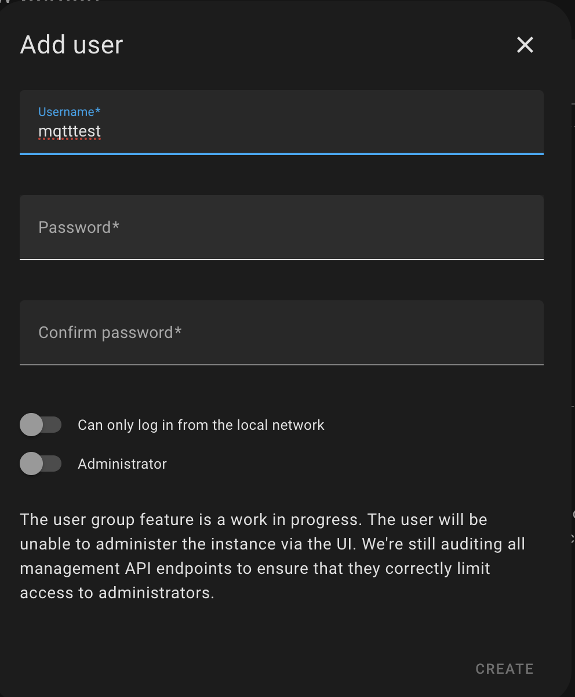
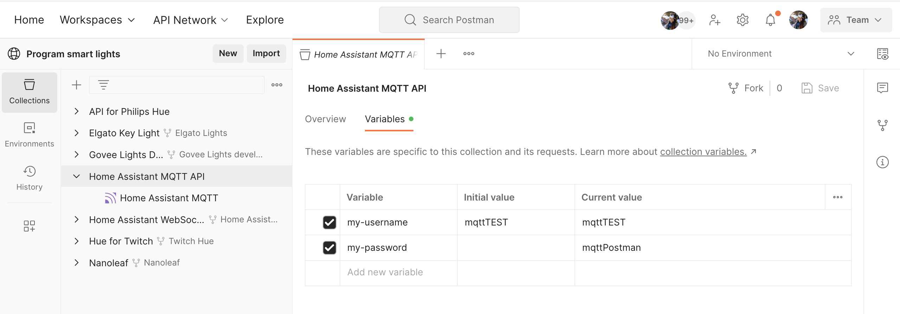
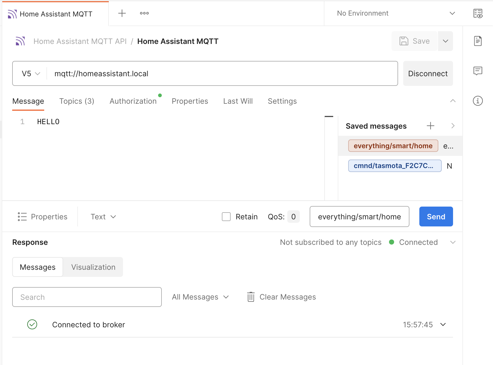
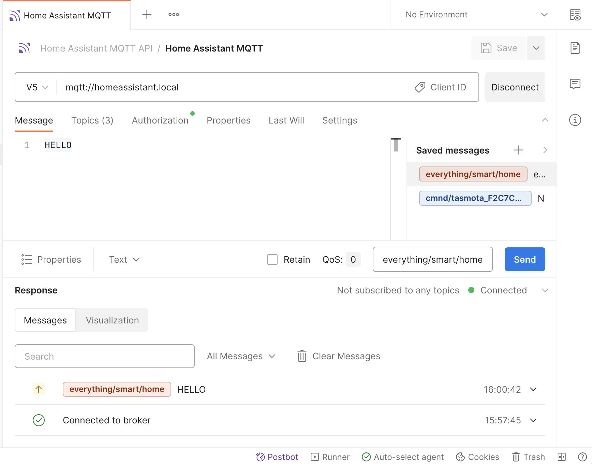
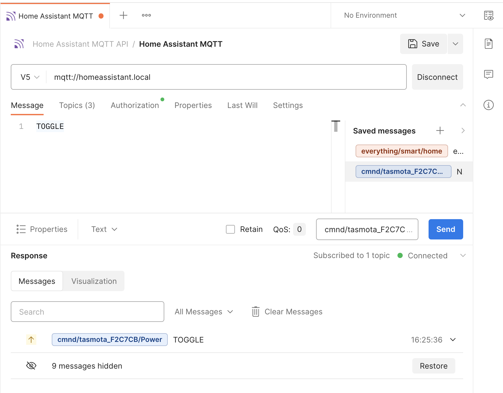
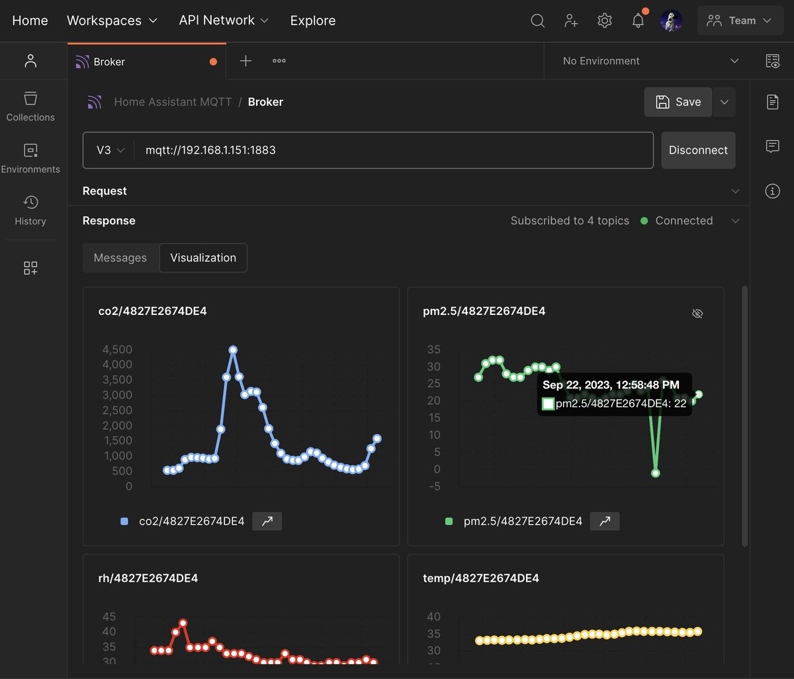

author: Joyce
id: mqtt
summary: Home Assistant with MQTT
categories: Intermediate
environments: web
status: Published 
feedback link: https://github.com/postmanlabs/pmquickstarts
tags: Intermediate, Developer, Tester

# Home Assistant with the MQTT integration

<!-- ------------------------ -->

## Overview 

Duration: 1

### Prerequisites

- Familiarity with DIY home automation and Home Assistant
- Some connected device, such as smart lights, smart speakers, or digital assistant

### What You’ll Learn

- how to establish an MQTT connection
- how to authorize Home Assistant APIs
- how to send and receive MQTT messages

### What You’ll Need

- a [Home Assistant Account](https://www.home-assistant.io/)
- Home Assistant instance running on local server, [such as Raspberry Pi](https://www.home-assistant.io/installation/raspberrypi)
- a [Postman Account](https://identity.getpostman.com/signup)

### What You’ll Build

- A Postman collection with saved MQTT messages

**Watch this video** to follow along at each step:
<video id="tZjW1IHZ3Lc"></video>

<!-- ------------------------ -->

## Introduction to Home Assistant

Duration: 2

Home Assistant is a popular open-source home automation platform that provides a unified interface to control and monitor different smart devices. Instead of juggling separate apps for different brands, you can manage everything through a single Home Assistant web dashboard on a local server like Raspberry Pi. 

We’ve previously explored [Home Assistant’s WebSocket API](https://quickstarts.postman.com/guide/home-assistant/index.html?index=..%2F..index#0) using Postman. Now let’s delve into [Home Assistant's MQTT integration](https://www.home-assistant.io/integrations/mqtt), used by [44%](https://analytics.home-assistant.io/integrations) of all active installations, to access smart devices across your connected home.

### REST, WebSockets, and MQTT for connected home

When it comes to transmitting data in a connected home environment, REST, WebSockets, and MQTT are commonly used protocols, but for different use cases.

- **With REST**, you have a request-response pattern, where a client sends a request to a server, and the server responds with the requested data. This is good for turning on a light or retrieving information about a set of devices.
- **With WebSockets**, you have bidirectional streaming between a client and server with real-time messages being relayed. This is helpful for ongoing updates, such as for a live dashboard displaying the status of all the connected devices in your home.
- **With MQTT**, you have real-time data transmission, similar to WebSockets, but optimized for low-power and low-bandwidth devices. Clients publish data to a centralized broker or hub, who then relays this data to other clients who have subscribed to receive notifications about a particular topic. This publish-subscribe messaging pattern is good for smart home devices that might lose and then resume a connection. 

In the next section, let’s try using MQTT with Home Assistant for home automation. 

<!-- ------------------------ -->

## Add the MQTT integration to Home Assistant

Duration: 3

1. **Create a new user**: In the Home Assistant dashboard, under **Settings** > **People**, [create a new user (or Person)](http://homeassistant.local:8123/config/person) to log in and access Home Assistant. Make a note of the `username` and `password` for the new user, since we will use those credentials to configure our MQTT devices and authorize our MQTT messages.
    > aside negative
    > - This name cannot be `homeassistant` or `addons`, those are reserved usernames. 
    > - If you do not see the option to create a new user, ensure that Advanced Mode is enabled in your Home Assistant profile.

    
1. **Choose an MQTT broker**: In this tutorial, we will set up the [Mosquitto MQTT broker add-on](https://github.com/home-assistant/addons/blob/master/mosquitto/DOCS.md). Under **Settings** > **Add-ons** > **Add-on store**, find, install, and start ["Mosquitto broker"](http://homeassistant.local:8123/hassio/addon/core_mosquitto/info). This might take a few minutes. Once the add-on is started, make a note of the `Hostname` for the next step.
   
1. **Add the MQTT integration**: On the [Integrations page](http://homeassistant.local:8123/config/integrations/dashboard) of your Home Assistance dashboard, you might already see an MQTT integration under "Discovery" that you can add. Otherwise, find and add the "MQTT" integration or using [this link](https://my.home-assistant.io/redirect/config_flow_start?domain=mqtt). You will need `Hostname` of the broker from Step 2, and `username` and `password` from the user created in Step 1.
    > aside negative
    > If you have old MQTT settings available, remove this old integration and restart Home Assistant to see the new one.

    

<!-- ------------------------ -->

## Connect to the broker using Postman

Duration: 2

### Fork the Postman collection

1. Find the sample collection in Postman, [Home Assistant MQTT](https://www.postman.com/postman/workspace/program-smart-lights/collection/6553ec7cf22df0654f277729), and fork the collection to your own Postman workspace.
   
1. Enter a label for your fork and select the workspace to fork the collection:
   

### Authorize API requests

1. **Add variables**: Select the collection you just forked into your own Postman workspace, and add your new Home Assistant user credentials under the **Variables** tab, and **Save** your updates. 
   
   > aside negative
   > If you are working in a public or team workspace, you may want to create [a Postman environment](https://learning.postman.com/docs/sending-requests/managing-environments/) and use ["Current value"](https://learning.postman.com/docs/sending-requests/managing-environments/) to prevent unintentional disclosure of sensitive data, such as authorization credentials.
1. **Review authorization details**: Notice the variables are used under the **Authorization** tab of each request in the collection.
   

### Connect to the broker

1. **Establish a connection**: Connect to `mqtt://homeassistant.local` and observe the connection details reflected on the bottom. This is also where you will see inbound and outbound messages displayed.
   
1. **Send a message**: Under the **Message** tab, publish data to a specified topic. For example, try inputting text like "Hello" to the topic `everything/smart/home` and hit **Send**. You can also save messages to re-use later on.
   
1. **Subscribe to a topic**: Under the **Topics** tab, subscribe to a topic such as `everything/smart/home` by switching the toggle on. This means the Postman client is subscribed to receive any data published to that topic.
   
1. **Send a second message**: Now try sending a different message to the same topic `everything/smart/home` to see what happens. Postman can send messages, and also receive messages published to the topic that it is subscribed to. This messaging pattern is called publish-subscribe. Notice outbound messages are displayed next to an up arrow, and inbound messages are displayed next to a down arrow.
   

<!-- ------------------------ -->

## Device configuration example with Tasmota

Duration: 1

If you have a device that communicates over MQTT, you may need to configure the device [to enable Home Assistant discovery](https://www.home-assistant.io/integrations/mqtt#mqtt-discovery). Every device and manufacturer is likely to follow a different process, so the following steps are just one example.

1. **Configure Tasmota device**: MQTT is the main protocol for controlling Tasmota devices. After you have a working MQTT broker you need [to configure Tasmota](https://tasmota.github.io/docs/MQTT/) to communicate with it.
   
1. **Control Tasmota device**: The Tasmota documentation provides [examples of commands](https://tasmota.github.io/docs/MQTT/#commands-over-mqtt) we can send over MQTT to control our Tasmota device. We can also save messages to re-use later on.
   

> aside negative
> For reading all messages sent on the topic `homeassistant` to a broker running on `localhost`, subscribe to topic `homeassistant/#`.

<!-- ------------------------ -->

## Data visualization example

Duration: 1

Depending on the response format, you can also select the **Visualization** tab of the response to show a message stream in a graphical format, a more comprehensible way to view telemetry data. Learn more about [the MQTT response](https://learning.postman.com/docs/sending-requests/mqtt-client/mqtt-request-interface/#the-mqtt-response).

  

<!-- ------------------------ -->

## Next Steps

Duration: 1

**Watch this video** to recap the steps:
<video id="tZjW1IHZ3Lc"></video>

### What we've covered

- how to establish an MQTT connection
- how to authorize Home Assistant APIs
- how to send and receive MQTT messages

For more hands-on tutorials, check out these resources.

- [Home Assistant with WebSocket APIs](https://quickstarts.postman.com/guide/home-assistant/index.html?index=..%2F..index#0) quickstart
- Contribute your own tutorials [here](https://github.com/postmanlabs/pmquickstarts)

### Additional resources for Home Assistant

- [Home Assistant MQTT integration](https://www.home-assistant.io/integrations/mqtt)
- [Home Assistant WebSocket API documentation](https://developers.home-assistant.io/docs/api/websocket)
- [Home Assistant REST API documentation](https://developers.home-assistant.io/docs/api/rest)

### Additional Postman resources
- [Home Assistant REST API](https://www.postman.com/aaroncarson/workspace/aaroncarson-public/collection/16392798-e28a007f-b4ac-4849-9ba0-b2dd5a7970b9): Postman collection
- [Program smart lights](https://www.postman.com/postman/workspace/program-smart-lights/overview): Postman public workspace
- [MQTT overview](https://learning.postman.com/docs/sending-requests/mqtt-client/mqtt-client-overview/): Postman documentation
