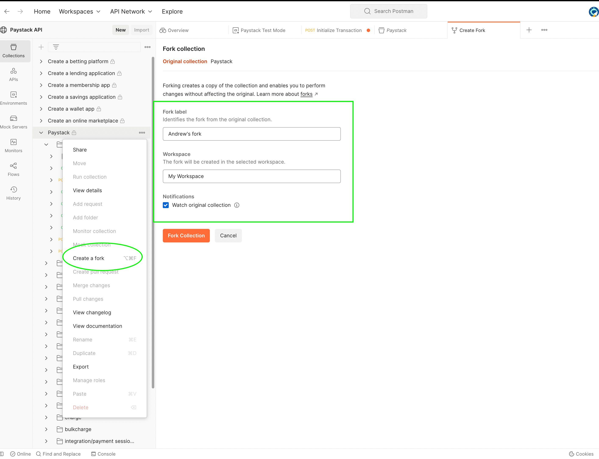
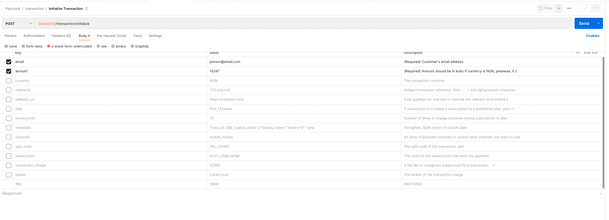
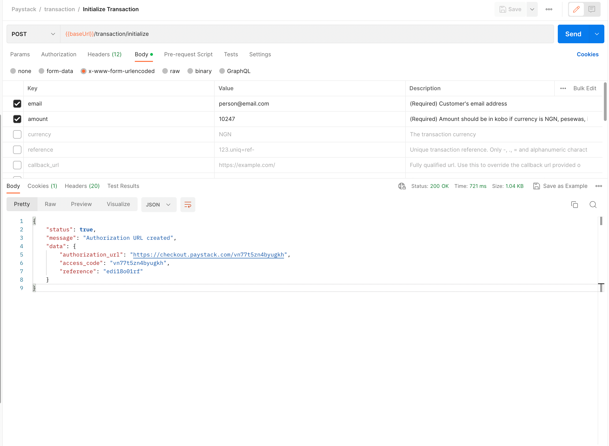
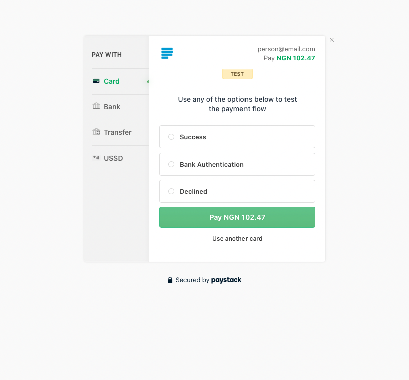

author: Andrew Nduati
id: paystack
summary: An introduction to Paystack's Postman Workspace
categories: Getting-Started
environments: web
status: Draft
feedback link: https://github.com/PaystackOSS
tags: Getting Started, Developer

# Get Started with the Paystack API

<!-- ------------------------ -->

## Overview

Duration: 2

Paystack (acquired by Stripe) is an online payment processor for merchants in Africa. Founded in Nigeria in 2016 we’ve expanded to several markets including Ghana, South Africa and Kenya. Developers and startups in these markets can get paid from anyone, anywhere in the world. Coupled with our comprehensive [Developer Docs](https://paystack.com/docs) and [API Reference](https://paystack.com/docs/api/), you can explore the various Paystack APIs, from Transactions to Transfers and Account Verification to Subscriptions.

At the end of this guide, you'll have setup Paystack Collection and made your first test payment on Paystack.

### Prerequisites
1. [Sign up](https://paystack.com/signup) on Paystack and retrieve your **Test Secret API Key**. (See [guide for more](https://support.paystack.com/hc/en-us/articles/360009881600-Paystack-Test-Keys-Live-Keys-and-Webhooks))
2. Visit the [Paystack Postman Workspace](https://www.postman.com/paystack-developers/workspace/paystack-api/overview)
3. Open our [Developer Docs](https://paystack.com/docs) and [API Reference](https://paystack.com/docs/api/) to get more detailed explanations on the APIs we’ll cover

### What You’ll Learn

+ Fork the Paystack collection on your Postman
+ Authorize Paystack requests using environment variables
+ Initialize a test transaction with Postman
+ Complete a test transaction on Paystack

<!-- ------------------------ -->

## Setup the collection and environment

Duration: 2

To get started, fork the collection from [Paystack Postman Workspace](https://www.postman.com/paystack-developers/workspace/paystack-api/overview) add it to our workspace. 
Forking a collection makes a copy of the collection in your workspace that you can modify. Checkout [this guide from Postman](https://learning.postman.com/docs/collaborating-in-postman/using-version-control/forking-entities/) that explores the topic more.

Click on the three dots next to the Paystack collection and select the “Create a fork” option. On the next page, you can set a label for the fork, and specify what workspace it should be created in. Set the values and click on “Fork Collection”.

<!-- ------------------------ -->

## Set your API key

Duration: 2

In your newly forked collection, go to the Authorization tab and replace the value of the Token input with your Test Secret Key from the Paystack Dashboard. You can use [environment variables](https://learning.postman.com/docs/sending-requests/variables/) on Postman to set up secret keys for different integrations. This way, you only switch the environment and your API keys change.

<!-- ------------------------ -->

## Make your first API call

Duration: 1

You're now ready to make yoru first call to [Initialize Transaction endpoint](https://paystack.com/docs/api/transaction#initialize). This is the endpoint used to create a transaction on Paystack. It returns a url where you redirect the customer to pay and complete the transaction. There are only two required parameters in here, a valid `email` and  `amount` to charge.

> aside positive
> Amounts on the API are in the lowest currency unit i.e. Kobo for Naira, Pesewas for Cedi and Cents for Rand, Shillings and Dollars. For example, if you want to charge 100 Rand, you’ll set the amount to 10000 Cents (100*100). 

In this example we're only passing the `email` and `amount`, so deselect the other parameters in the body tab. You can set your own custom transaction using the `reference` parameter. 

Once setup go ahead and hit the **Send** button to make the request.

<!-- ------------------------ -->

## Completing the Transaction

Duration: 2

Congratulations! You’ve made your first call to the Paystack API. You’ve initialized a transaction and now, you just need to complete it. To do that, we’ll look at the JSON payload returned from Paystack.

Let’s look at what each of the parameters mean:

- `status`: A boolean value that tells you whether the request to initialize the transaction was successful or not
- `message` : A string with a more human readable explanation of the API response and its status. If an error had occurred, this is where we would get information about what went wrong.
- `data`: An object or array with the contents of your request.
    - `authorization_url`: A URL to the Paystack hosted Checkout page for your customer to complete the transaction
    - `access_code`: A unique code for this transaction. The code can be used with the Paystack Inline library.
    - `reference`: A unique transaction identifier that you can supply with each transaction you create. If you don’t supply one, Paystack creates one for you.

Let’s complete the transaction by opening the `authorization_url` in a browser. This will load the Paystack Checkout with the details provided during the initialization step above.

<!-- ------------------------ -->

## Conclusion 

Duration: 1

The Checkout loads with available payment channels based on the country the business is registered and the channels set on the dashboard.

Now that you’ve setup and made your first API call, go ahead and try the other APIs and the use cases on the [Paystack Developer Workspace](https://www.postman.com/paystack-developers/workspace). You can also checkout our [Developer Docs](https://paystack.com/docs). For starters, you can try using the [Verify Transaction endpoint](https://paystack.com/docs/payments/verify-payments) to see the details of the transaction you completed above.

If you have any questions, comments or suggestions please feel free to reach us at [techsupport@paystack.com](mailto:techsupport@paystack.com). Also you can stay up to date with Paystack by subscribing to our [monthly developer newsletter here](https://paystack.com/subscribe).

Happy exploring!