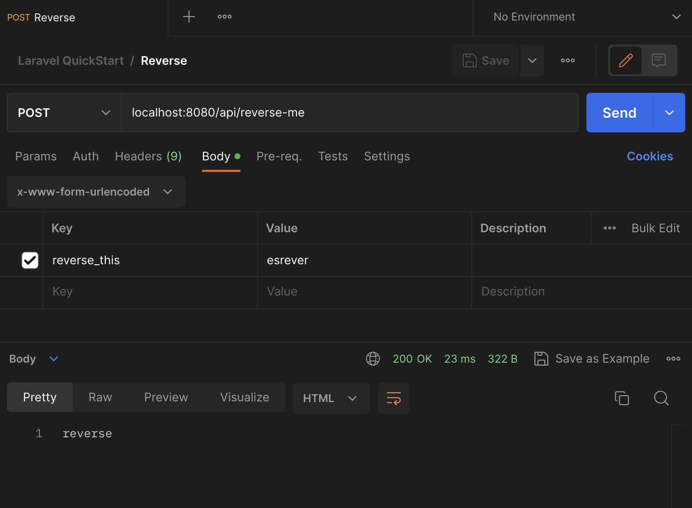

author: Greg Bulmash
id: php-laravel-API
summary: Create A REST API with PHP And Laravel 
categories: Getting-Started
environments: web
status: Published 
feedback link: https://github.com/loopDelicious/pmquickstarts
tags: Getting Started, Developer, Tester, Automation, PHP 

# Create A REST API with PHP And Laravel
<!-- ------------------------ -->
## Overview 
Duration: 1

PHP is the programming language behind major web applications like WordPress (blog), Drupal ([CMS](https://en.wikipedia.org/wiki/Content_management_system)), and Magento (e-commerce). It first appeared in 1995, less than 3 weeks after the Java programming language.

It remains one of the top 10 programming languages in the world, according to many lists, and is the "P" in the famous LAMP stack (Linux, Apache, MySQL, and PHP).

In this tutorial, let's create a simple API using one of PHP's most popular frameworks, [Laravel](https://laravel.com/), and then access it with Postman. 

### Prerequisites
- A basic familiarity with the PHP programming language.
- Ability to use the built-in terminal in your operating system.

### What You’ll Learn 
- How to create a simple PHP-based API with the [Laravel](https://laravel.com/) framework.
- How to create GET and POST API endpoints for it. 
- How to send requests to those endpoints with Postman. 

### What You’ll Need 
- [Git](https://git-scm.com/downloads) Installed (Required) 
- [PHP](https://www.php.net/manual/en/install.php) Installed (Required)
- [Composer](https://getcomposer.org/download/) Installed (Required)
- [Homebrew](https://brew.sh/) Installed (**only for Mac**)
- [VSCode](https://code.visualstudio.com/download) Installed (Optional)
  - Or a code editor of your choice

**You will not need Apache or NGINX for this guide as we'll use PHP's built-in serving functions.**

### What You’ll Build 
- A simple API with PHP and Laravel

Let's get started in the next step.

<!-- ------------------------ -->
## Installing The Prerequisites
Duration: 10

### Installing PHP

The methods below install PHP with all the module dependencies for running Laravel locally. If you have already installed PHP locally, ensure you have the modules in the [Laravel server requirements](https://laravel.com/docs/7.x#server-requirements) installed and enabled.

#### MacOS

PHP is most easily installed with [Homebrew](https://brew.sh).  
```bash
brew install php
```

After installation, confirm PHP is installed with `php -v` in the terminal.

#### Windows 

The basic installation of PHP on Windows from the installer provided by [the PHP project](https://php.org) lacks module dependencies Laravel requires.

The PHP 8.2 version of [XAMPP](https://www.apachefriends.org/download.html) installs a version of PHP with the necessary dependencies. It will also install the Apache web server, MYSQL, and other software you don't necessarily need, but it isolates all of it in a unique directory so they're easy to remove.

1. [Download XAMPP](https://www.apachefriends.org/download.html) for your architecture. The version with PHP 8.2 (or later) is recommended.
2. Install it. It will warn against installing it to your regular program files location. That's fine. When it suggests `C:\xampp` as an installation directory, accept it.
3. Accept the default set of items being installed or deselect options you don't need (like Filezilla and Tomcat).
4. When it's complete, open a terminal/command window and issue the command: `setx PATH "%PATH%;C:\xampp\php"`. This adds your PHP executable to your path and makes it easy to call from the command line.
5. Close the terminal/command window and open a new one to start a session with the updated path information. 
6. Test your installation with `php -v` and you should get some information on the version of PHP you installed.

This was tested and worked with Windows 11 on both X86-64 and ARM architectures in March 2023.

#### Linux

Using the default installation of PHP may create dependency issues when you try to start a Laravel project. We suggest the following:

1. [Download XAMPP](https://www.apachefriends.org/download.html) for your Linux distribution and Intel/AMD architecture. At the time of writing, XAMPP doesn't support Linux on ARM.
2. Follow the directions to install it for your Linux distribution.
3. By default on Ubuntu, it will install to the `/opt/lampp/` folder. Open the `~/.bashrc` file in your favorite text editor, add the following line to the end of the file, and save:
```bash
EXPORT PATH="/opt/lampp/bin:$PATH"
```
4. Open a new terminal for a session using the updated `.bashrc`. In that terminal try `php -v` to ensure it is installed and is in your path.

This was tested and worked with Ubuntu 22.04 LTS in March 2023. 

### Installing Composer

The [Composer download and installation instructions](https://getcomposer.org/doc/00-intro.md#system-requirements) are a little dense. Let's simplify them.

#### MacOS

[Homebrew](https://brew.sh) makes it simple. 
```bash
brew install composer
```

If you don't have Homebrew, get it or use the Linux instructions below.

#### Windows

Use the [Composer installer for Windows](https://getcomposer.org/doc/00-intro.md#installation-windows). This will automatically put Composer in your path as well, so it will be accessible from the command line.

#### Linux

Use the [Composer installation instructions for Linux/Unix](https://getcomposer.org/doc/00-intro.md#installation-linux-unix-macos).

**IMPORTANT** follow the step on that page to move the installed copy into a directory that's already in your path so it's easy to call from the terminal.

### Verifying Composer

Open a new terminal or command prompt and type `composer -h`.


If you get an error or nothing, check your installation.

Once this is complete, let's scaffold a Laravel project.

<!-- ------------------------ -->
## Starting A Laravel Project
Duration: 3

### Scaffold your Laravel project

Before we can write any code, we need to scaffold a [Laravel](https://laravel.com/) project. Thanks to Composer, this is relatively simple. Open a terminal and navigate to the directory where this project will live. Enter the following command in the terminal:

```bash
composer create-project laravel/laravel laravel_project
```

This could take some time. There are tens of megabytes to download and install. 

When it's finished, you will have a project folder named `laravel_project`.

### Give it a test

Navigate into the `laravel_project` folder and enter the following command in the terminal:

```bash
php artisan serve --port=8080
```

This will launch your project at `http://localhost:8080`. Change the port to something else if you already have a process using the port. When it's running, visit the URL. It will return this homepage.


Note down in the bottom right, you'll see the Laravel and PHP version numbers. If you're looking for tutorials, finding ones for Laravel and PHP that are as close to those versions as possible will help minimize problems.

Let's move on to adding an API.

<!-- ------------------------ -->
## Build Your First Endpoint
Duration: 3

### Create the route

This will create a public API with no authentication. 

Open `routes/api.php` in your Laravel project directory in your editor. Add the following code at the end:

```php
Route::get('/hello', function () {
  return "Hello World!";
});
```

This adds the `/api/hello` endpoint and returns "Hello World" in plain text to a GET request. 

Note how the endpoint was prefixed with `/api` by Laravel.

Next, let's call this endpoint in Postman.


<!-- ------------------------ -->
## Try Your First Endpoint
Duration: 3

To test this in Postman, open your personal workspace and start a collection. Name it **Laravel QuickStart** or something else you prefer.

Once it's created, select **Add a request** to get started.


Set the request **URL** to `localhost:8080/api/hello` and make sure your Postman Desktop Agent app is running on your machine to prevent any CORS issues while testing locally.

Select **Send** and the response section below the request section will show a response of `Hello World!` in plain text with a `200 OK` response code.  

Congratulations. You created your first API endpoint in Laravel and successfully called it with Postman.

Next, let's make a simple POST endpoint for fun.

<!-- ------------------------ -->
## Add A POST Endpoint
Duration: 2

Go back to your `routes/api.php` file and add the following:

```php
Route::post('/reverse-me', function (Request $request) {
  $reversed = strrev($request->input('reverse_this'));
  return $reversed;
});
```

This adds a POST route for the endpoint `api/reverse-me`. It will reverse a string you pass in the body of the post with the parameter name `reverse_this`.

Let's try this in the next section.

<!-- ------------------------ -->
## Try Your POST Endpoint
Duration: 4

Return to your **Laravel QuickStart** collection in Postman and **add a request**. Name it "Reverse" and follow these steps:

- Set the request type to **POST**.
- Set the endpoint to `localhost:8080/api/reverse-me`.
- Select the **Body** tab.
- In the top dropdown menu in the tab, select **x-www-form-urlencoded**.
- Add a parameter of `reverse_this` with the value of `esrever`. That's "reverse" already reversed so the return value will be easy to read.
- Select **Send**



The API will return the string `reverse` in plain text.

<!-- ------------------------ -->
## Next Steps

Congratulations on creating an API in Laravel and accessing it with Postman.

You can deepen your knowledge of Laravel or Postman by trying the following.

- Dive into the [Laravel 10.x documentation](https://laravel.com/docs/10.x/) to add a controller for handling more complex requests and/or add a model to connect a database.

- Review the [Laravel 10.x error handling documentation](https://laravel.com/docs/10.x/errors) to learn best practices for error-handling in Laravel, such as what might happen if someone submitted a binary file instead of a string to your string-reversing endpoint.

- Explore the [Postman testing documentation](https://learning.postman.com/docs/writing-scripts/test-scripts/) and write a test on the POST request to make sure the `reverse_this` string is being reversed properly.

