author: Joyce
id: postman_flows_tutorials
summary: Get started with different types of Postman Flows
categories: Getting-Started
environments: web
status: Published
feedback link: https://github.com/loopDelicious/pmquickstarts
tags: Getting Started

# Postman Flows Tutorials

<!-- ------------------------ -->

## Overview

Duration: 1

> aside negative
> These tutorials were originally published [here](https://learning.postman.com/docs/postman-flows/tutorials/building-your-first-flow/).

[Postman Flows](https://learning.postman.com/docs/postman-flows/gs/flows-overview/) is a visual tool for creating API workflows. You can use flows to chain requests, handle data, and create real-world workflows in your Postman workspace.

### Prerequisites

- a [Postman Account](https://identity.getpostman.com/signup)
- an [OpenAI API key](https://beta.openai.com/account/api-keys)

### What You’ll Learn

- how to build your first flow
- how to pass data between blocks
- how to run requests in sequence
- how to use authorization with Postman Flows
- how to use response data in a request
- how to use webhooks with Postman Flows

### What You’ll Build

- A group of Postman collections and flows

<!-- ------------------------ -->

## Build your first flow

Duration: 5

This page walks you through your first flow, calling the Pokémon API and printing out the list to the console. The Pokémon API returns over 1,000 results, but this flow will print two hundred at a time to the console until it reaches the end of the list.

### Creating a request and a collection

Begin by creating a new collection and adding a GET request. You'll use this collection with the flow you'll create later.

1. In your workspace, select **New** > **Collection**. Name the collection `Pokemon API`.
1. [Add a GET request](https://learning.postman.com/docs/getting-started/sending-the-first-request/) with this URL: `https://pokeapi.co/api/v2/pokemon?limit=200`.
   
1. Select **Send**, then select **Save Response** > **Save as example**.
   > aside negative
   > Saving the response as an example enables Postman Flows to automatically detect the structure for easier access later.
1. Select the GET request and replace the URL `https://pokeapi.co/api/v2/pokemon?limit=200` with the variable `{{URL}}`.
   
1. Select **Save**.

### Making your first send request in Postman Flows

1. Select **New** > **Flows**. Your new flow appears with a **Start** block already in place.
   > aside negative
   > You can select and drag the canvas to reposition your flow.
   > 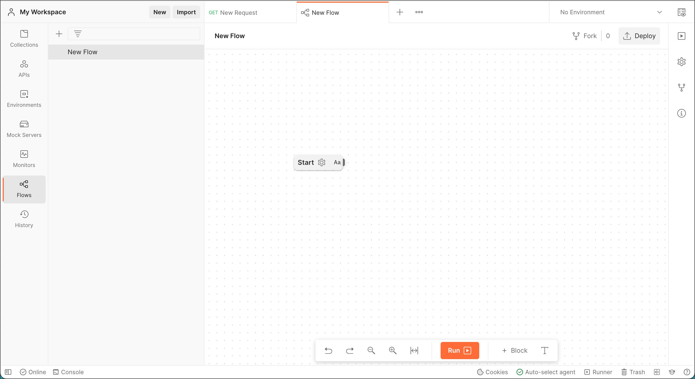
1. Right-click the canvas to the right of the **Start** block. From the list of blocks that opens, select **Send Request**.
   > aside negative
   > You can type the block's name in the **Search** field to find it faster.
1. Connect the Start block to the Send Request block.
   
1. In the **Send Request** block, select **Add request** and select `Pokemon API`. Then select the GET request you created earlier.
   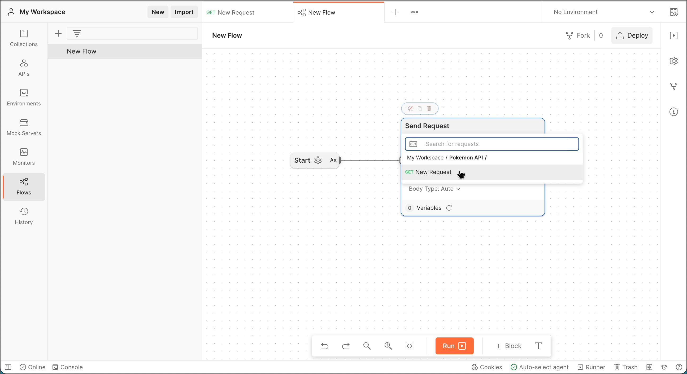
1. Create a **String** block below the **Start** block and enter the URL `https://pokeapi.co/api/v2/pokemon?limit=200`.
1. Connect the **String** block to the port next to `{{URL}}` on the **Send Request** block.
   

### Logging the output to the console

1. Create a **Select** block to the right of the **Send Request** block.
1. Connect the **Select** block to the port next to **Success** on the **Send Request** block.
   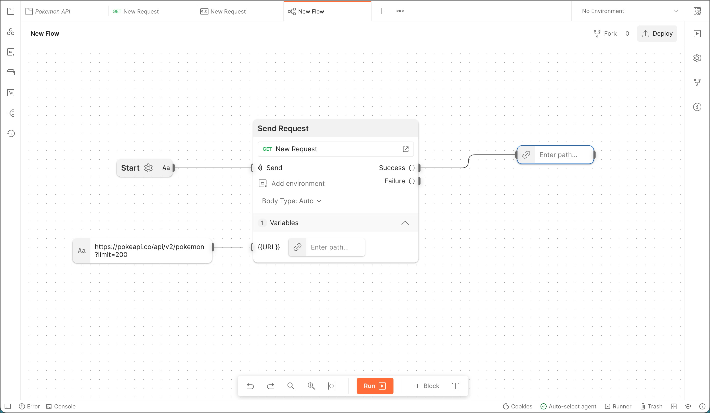
1. In the **Select** block, select **Enter path...** and select `/body/results`.
   > aside negative
   > Because you saved an example earlier, the returned data's structure auto-populates in the block.
   > 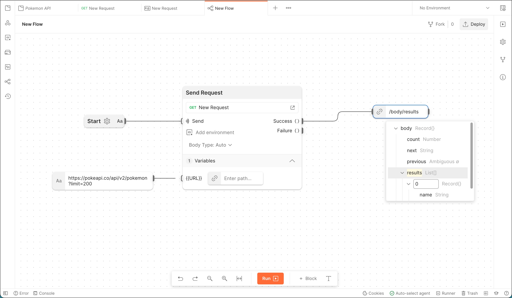
1. Create a **Log** block and connect it to the right side of the **Select** block, then select **Run**.
1. Select **Console** to view the results.
   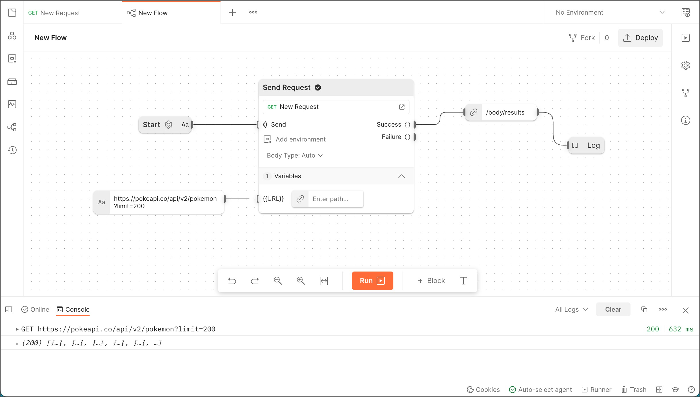

### Checking for the next page of results

1. Create another **Select** block and connect it to the **Success** port on the **Send Request** block.
   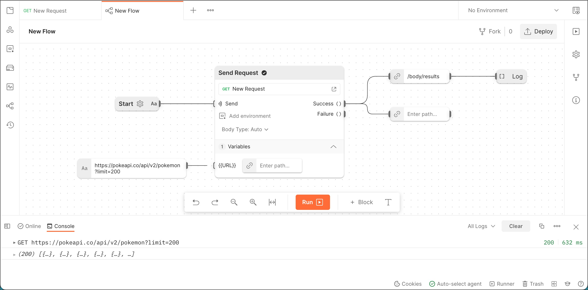
1. In the **Select** block you created, select **Enter path...** and select `/body/next` to get the link to the next set of 200 results.
1. Create an **Evaluate** block to the right of the `/body/next` **Select** block and connect it to right port on the **Select** block.
   
1. In the **Evaluate** block, select `key` below **Variables** and replace `key` with `has_next`. This assigns the `/body/next` value from the **Select** block to the `has_next` variable in the **Evaluate** block.
1. At the top of the **Evaluate** block, enter `has_next != null`.
   > aside negative
   > If `has_next` is null, then the flow has reached the last set of 200 results.
   > 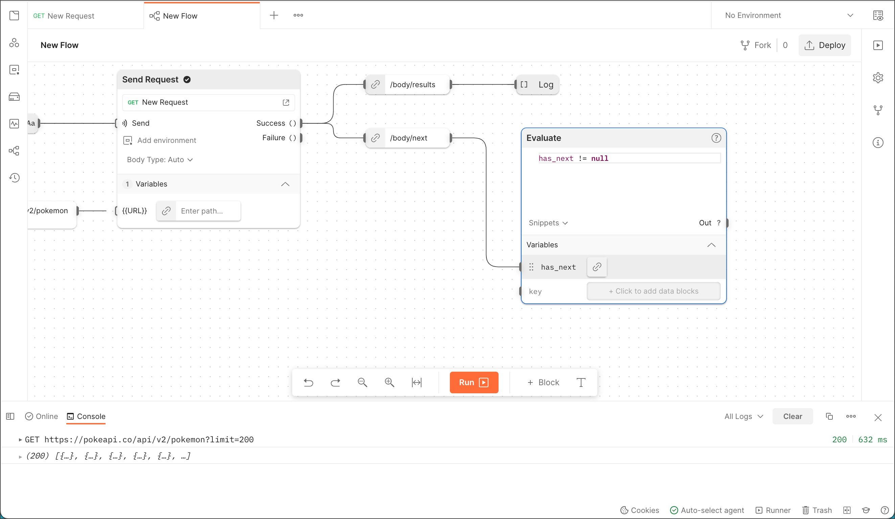

### Using an If block to branch based on response data

In this example, the **Evaluate** block outputs `true` if `has_next` isn't null, or `false` if `has_next` is null.

1. Create an **If** block and connect its **True/False** port to the **Evaluate** block's **Out** port.
   > aside negative
   > The **Evaluate** block sends either `true` or `false`, which determines which branch the **If** block uses.
1. Connect the `/body/next` **Select** block to the **If** block's **Data** port.
   > aside negative
   > The **Select** block sends the URL of the next set of Pokémon, used in the next step.
   > 

### Calling the request with the next URL

In this example, `has_next` isn't null, so another set of Pokémon is available. Postman Flows calls the **Send Request** block again with the URL specified in `/body/next`.

1.  Connect the **If** block's TRUE port to the **Send Request** block's URL port. This passes the new `URL` variable to the **Send Request** block.
1.  Also connect the **If** block's TRUE port to the **Send Request** block's **Send** port. This triggers the send event so it runs again.
    

### Watching it run

After completing the above steps, select **Run**. The flow runs and logs all the Pokémon to the console.

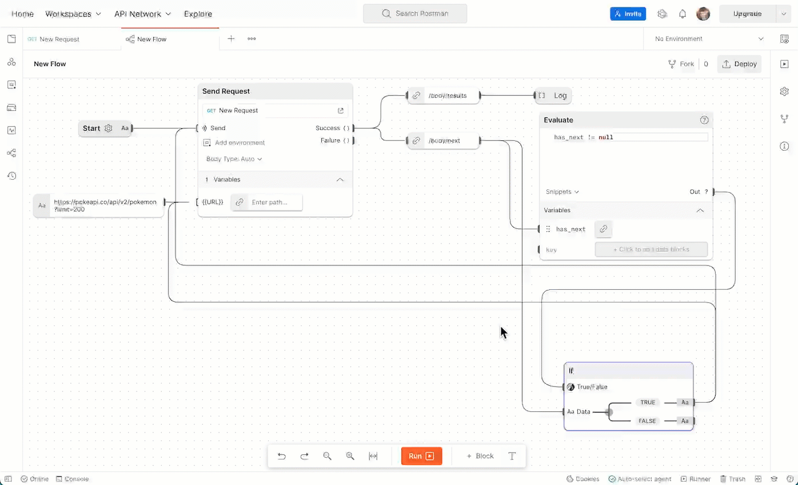

Congratulations, you've created your first flow!

<!-- ------------------------ -->

## Passing data between blocks

Duration: 5

Postman Flows can get data with API requests or directly from the **Start** block. This tutorial shows examples of Postman Flows getting data using both methods and passing data between blocks.

### Getting data and passing it between blocks

These examples get response data with [API requests](https://learning.postman.com/docs/getting-started/sending-the-first-request/) from existing collections in your workspace and from data pasted into the **Start** block. In these examples, the entire response is passed between blocks.

### Getting data with an API request

In this example, the **Send Request** block gets data using a collection's GET request. The **Send Request** block then passes all the data to a **Log** block.

1. [Create a collection](https://learning.postman.com/docs/getting-started/creating-the-first-collection/) named `Random User Collection` and add a GET request with this URL: `https://randomuser.me/api/`.
1. Select **Send**.
   
1. Select **Save**.
1. [Create a new flow](https://learning.postman.com/docs/postman-flows/flows-intro/building-your-first-flow/) and connect a **Send Request** block to the **Start** block.
   
1. In the **Send Request** block, select **Add request** > **Random User Collection** > **New Request**. Each time the flow executes, it will get data using the GET request from the Random User Collection request you created earlier.
   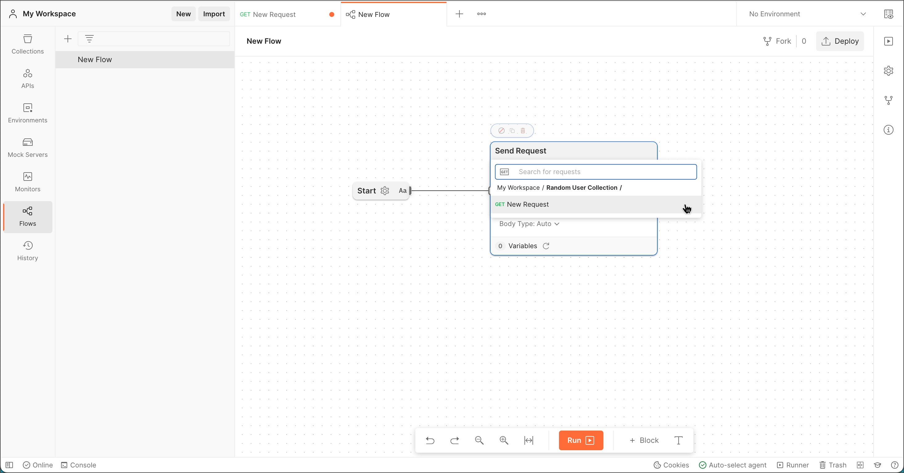
1. Connect a **Log** block to the **Send Request** block's **Success** port.
   
1. Select **Console** then select **Run**. The **Log** block sends the entire response to the console, including request headers, response headers, and the response body.

### Getting data from the Start block

In this example, the flow gets data from the **Start** block and passes it to an **Evaluate** block. The **Evaluate** block passes the entire response to the **Log** block in a variable.

1. [Create a new flow](https://learning.postman.com/docs/postman-flows/flows-intro/building-your-first-flow/) and select the gear icon in the **Start** block.
   
1. Select **Enter Incoming Data** and paste in the sample data below. The flow will use this data every time it executes.
   ```json
   {
     "results": [
       {
         "gender": "female",
         "name": {
           "title": "Miss",
           "first": "Astrid",
           "last": "Klingenberg"
         },
         "location": {
           "street": {
             "number": 2547,
             "name": "Lyseskrenten"
           },
           "city": "Tvedestrand",
           "state": "Oppland",
           "country": "Norway",
           "postcode": "6523",
           "coordinates": {
             "latitude": "44.5909",
             "longitude": "130.7502"
           },
           "timezone": {
             "offset": "+9:00",
             "description": "Tokyo, Seoul, Osaka, Sapporo, Yakutsk"
           }
         },
         "email": "astrid.klingenberg@example.com",
         "login": {
           "uuid": "263e48e9-1d6d-4d18-9458-27b1b7bad1b9",
           "username": "lazycat514",
           "password": "francois",
           "salt": "YAY2fGhq",
           "md5": "0ed2300b7aad0843267d658db0f22f2a",
           "sha1": "57ef1b1c5cac06feb6712ac863b7c9d6292e400e",
           "sha256": "5312eee0d8693e522aa62814fb49fb3239bad5326ca0f37011a97704978a4add"
         },
         "dob": {
           "date": "1984-03-11T08:50:14.752Z",
           "age": 38
         },
         "registered": {
           "date": "2003-09-27T19:45:20.432Z",
           "age": 19
         },
         "phone": "57680755",
         "cell": "96350131",
         "id": {
           "name": "FN",
           "value": "11038429851"
         },
         "picture": {
           "large": "https://randomuser.me/api/portraits/women/68.jpg",
           "medium": "https://randomuser.me/api/portraits/med/women/68.jpg",
           "thumbnail": "https://randomuser.me/api/portraits/thumb/women/68.jpg"
         },
         "nat": "NO"
       }
     ],
     "info": {
       "seed": "4be1e2e93f6d34ba",
       "results": 1,
       "page": 1,
       "version": "1.4"
     }
   }
   ```
1. Select the **Language** dropdown list and select **JSON**.
   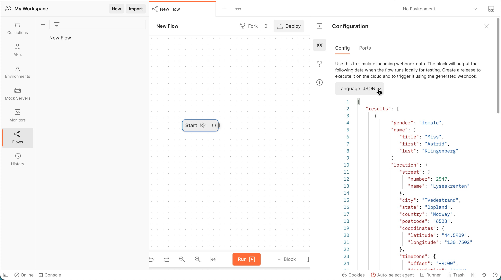
1. Connect an **Evaluate** block to the **Start** block.
1. In the **Evaluate** block, select **key** and enter `body`. This assigns all the data received from the **Start** block to the variable `body`.
   
1. In the **Evaluate** block, select **Enter FQL query** and enter `body`. This sends all the data in the `body` variable to the **Evaluate** block's output.
1. Connect a **Log** block to the **Evaluate** block.
   
1. Select **Console** then select **Run**. The flow gets the data from the **Start** block, routes it to the **Evaluate** block, and passes the entire response to the **Log** block, which displays the data in the console.

### Passing specified data between blocks

You can extract specific values from response data in a number of ways using variables and [Flows Query Language (FQL)](https://learning.postman.com/docs/postman-flows/flows-query-language/introduction-to-fql/). The example below uses FQL in an **Evaluate** block to get the `country` field value from sample response data in the **Start** block.

1. [Create a new flow](https://learning.postman.com/docs/postman-flows/flows-intro/building-your-first-flow/) and select the gear icon in the **Start** block.
   
1. Select **Enter Incoming Data** and paste in the sample data below. The flow will use this data every time it executes.
   ```json
   {
     "results": [
       {
         "gender": "female",
         "name": {
           "title": "Miss",
           "first": "Astrid",
           "last": "Klingenberg"
         },
         "location": {
           "street": {
             "number": 2547,
             "name": "Lyseskrenten"
           },
           "city": "Tvedestrand",
           "state": "Oppland",
           "country": "Norway",
           "postcode": "6523",
           "coordinates": {
             "latitude": "44.5909",
             "longitude": "130.7502"
           },
           "timezone": {
             "offset": "+9:00",
             "description": "Tokyo, Seoul, Osaka, Sapporo, Yakutsk"
           }
         },
         "email": "astrid.klingenberg@example.com",
         "login": {
           "uuid": "263e48e9-1d6d-4d18-9458-27b1b7bad1b9",
           "username": "lazycat514",
           "password": "francois",
           "salt": "YAY2fGhq",
           "md5": "0ed2300b7aad0843267d658db0f22f2a",
           "sha1": "57ef1b1c5cac06feb6712ac863b7c9d6292e400e",
           "sha256": "5312eee0d8693e522aa62814fb49fb3239bad5326ca0f37011a97704978a4add"
         },
         "dob": {
           "date": "1984-03-11T08:50:14.752Z",
           "age": 38
         },
         "registered": {
           "date": "2003-09-27T19:45:20.432Z",
           "age": 19
         },
         "phone": "57680755",
         "cell": "96350131",
         "id": {
           "name": "FN",
           "value": "11038429851"
         },
         "picture": {
           "large": "https://randomuser.me/api/portraits/women/68.jpg",
           "medium": "https://randomuser.me/api/portraits/med/women/68.jpg",
           "thumbnail": "https://randomuser.me/api/portraits/thumb/women/68.jpg"
         },
         "nat": "NO"
       }
     ],
     "info": {
       "seed": "4be1e2e93f6d34ba",
       "results": 1,
       "page": 1,
       "version": "1.4"
     }
   }
   ```
1. Select the **Language** dropdown list and select **JSON**.
   
1. Connect an **Evaluate** block to the **Start** block.
1. In the **Evaluate** block, select **key** and enter `body`. This assigns all the data received from the **Start** block to the variable `body`.
   
1. In the **Evaluate** block, select **Enter FQL query** and enter `body.results.location.country`. This navigates the response data with [FQL](https://learning.postman.com/docs/postman-flows/flows-query-language/introduction-to-fql/) and extracts the value for the `country` field.
1. Connect a **Log** block to the **Evaluate** block.
   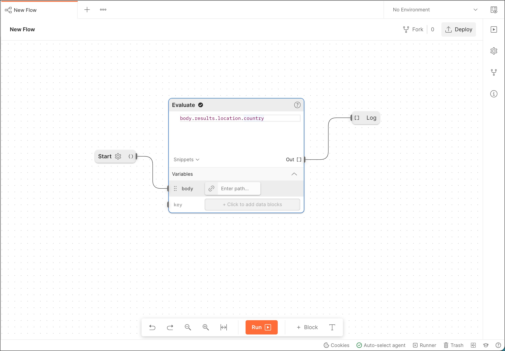
1. Select **Console**.
1. Select **Run**. The **Start** block sends its data to the **Evaluate** block. The FQL in the **Evaluate** block gets the value of the `country` field (`"Norway"`) in the response data and sends it to the **Log** block. `"Norway"` appears in the console.
   

<!-- ------------------------ -->

## Running requests in sequence

Duration: 3

If you have several requests that have no dependency on each other but have to be executed in a particular order, you can use send events to connect your [blocks](https://learning.postman.com/docs/postman-flows/core-concepts/blocks/).

> aside negative
> Check out the example flow: [Chaining requests](https://www.postman.com/postman/workspace/flows-snippets/flow/6267f9315d367a64e7ba06e5)

1. **Add a Send Request block**: Select **+ Block** on the toolbar and select the **Send Reques**t block from the list to add it to your canvas, then select the request. Repeat this until all the requests are added to the canvas.
   
1. **Connect the send events**: Select the dot (success output) of the source block and connect it to the send input of the target block in the order you want the requests to execute.
   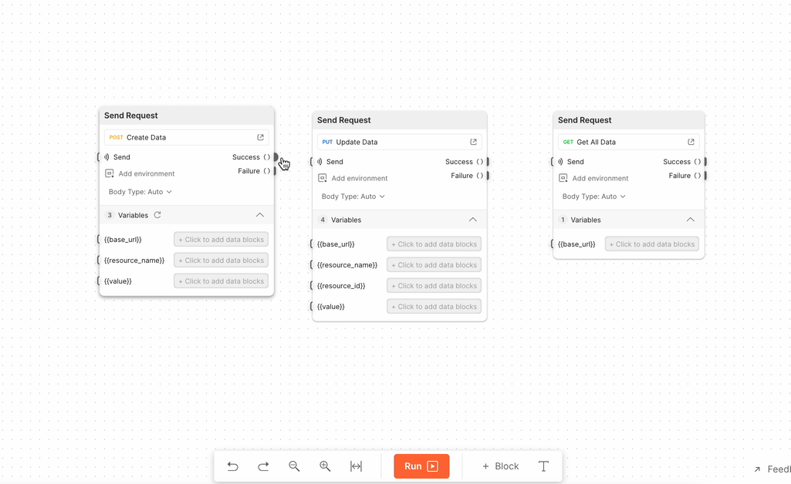
   Here, a POST request is executed and once the request has completed, the PUT request endpoint is called, and then a GET request is called.
   > aside negative
   > **Important**:
   >
   > 1. When a send event connection is made, the input becomes deactivated to show that it will get enabled after the previous blocks get enabled.
   > 1. The send event connection depicts the order in which the blocks will be executed.
   > 1. When using send event, no data is passed from one block to another.
1. **Start the flow**: Start the flow and see the requests run in the order they're configured:
   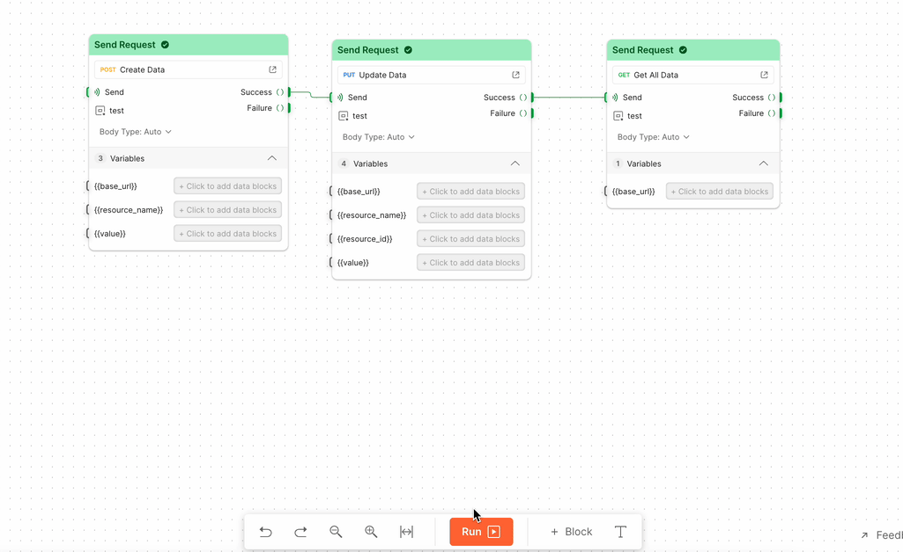
   If you want to use data from one request in another request, you can learn how to do so in [Chaining requests with data](https://learning.postman.com/docs/postman-flows/flows-intro/chaining-requests-with-data/).

<!-- ------------------------ -->

## Using authorization with Postman Flows

Duration: 2

Most APIs require authorization to access their data. Postman Flows can include credentials in its API requests, explicitly or as variables. This tutorial creates a simple flow that uses a global variable to access the OpenAI API with a secret key.

### Create a secret key for the API

This example flow uses a secret key to access the OpenAI API. To get your secret key:

1. In your browser, go to `https://beta.openai.com/account/api-keys` and select Sign up.
1. Follow the prompts to create and sign in to an OpenAI account.
1. Return to `https://beta.openai.com/account/api-keys` and create a secret key.
1. Copy and paste your secret key in a secure but accessible location. You'll use it in a later step.

### Create a variable for the secret key

By assigning your secret key value to a variable, you can keep your key secure and easily include it in multiple **Send Request** blocks and flows.

1. In your Postman workspace, select the environment quick look icon in the [workbench](https://learning.postman.com/docs/getting-started/navigating-postman/#environment-selector-and-environment-quick-look).
1. Next to **Globals**, select **Edit** (or **Add**).
1. Add a variable named `auth` and paste `Bearer <your secret key>` in the **INITIAL VALUE** field. For example: `Bearer ab-123456789876543212345678987654321`
1. Under TYPE, select secret from the dropdown list.
   
1. Select **Save**.
1. Close the **Globals** tab.

### Create a collection and a request

1. [Create a collection](https://learning.postman.com/docs/getting-started/creating-the-first-collection/) named `OpenAI Collection` and add a GET request with this URL: `https://api.openai.com/v1/models`.
1. Select the **Authorization** tab.
1. Next to **Type**, select **API Key** from the dropdown list.
1. Select the **Key** field and enter `Authorization`.
1. Select the **Value** field and enter `{{auth}}`.
1. Select **Send** then **Save Response > Save as example**.
   
1. Select the **GET New Request** tab and select **Save**.
   

### Create a flow

1. [Create a new flow](https://learning.postman.com/docs/postman-flows/flows-intro/building-your-first-flow/) and connect a **Send Request** block to the **Start** block.
1. In the **Send Request** block, select **Add request > OpenAI Collection > New Request**. The `{{auth}}` variable appears at the bottom of the **Send Request** block.
   
1. Connect a **Log** block to the **Send Request** block's **Success** port.
1. Select **Run** then select **Console**. The flow gets your secret key from the `{{auth}}` variable and includes it in the API request. The API accepts the secret key and sends the response with a `200` code, visible in the console.
   

<!-- ------------------------ -->

## Using response data in a request

Duration: 3

This tutorial shows how to take data from a GET response and use it in a GET request in [Postman Flows](https://learning.postman.com/docs/postman-flows/flows-intro/flows-overview/).

The Random User API returns a randomly chosen set of user data for each GET request, unless you include a seed as a query parameter. This tutorial takes the seed from a GET response and includes it as a query parameter in another GET request so that both GET requests return the same user’s data.

### Create a collection and a request

1. Create a collection named `Random User Collection` and add a GET request named `First Request`.
1. Enter this URL in the request: `https://randomuser.me/api/`.
   
1. Select **Send** then **Save Response > Save as example**.  
   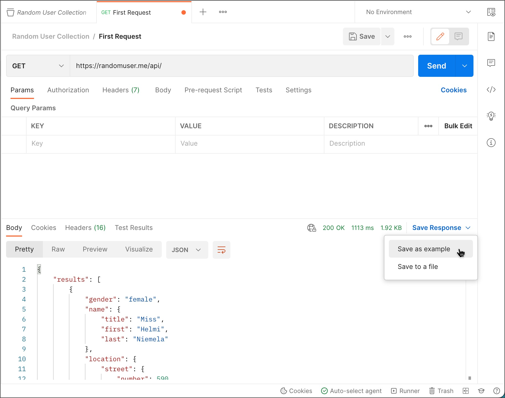
1. Select the **GET First Request** tab and select **Save**.
1. Add another GET request named 1.
1. Enter the same URL as the first request: 1.
1. Select `Key` and enter seed.
1. Select `Value` and enter the variable `{{seedVar}}`.
   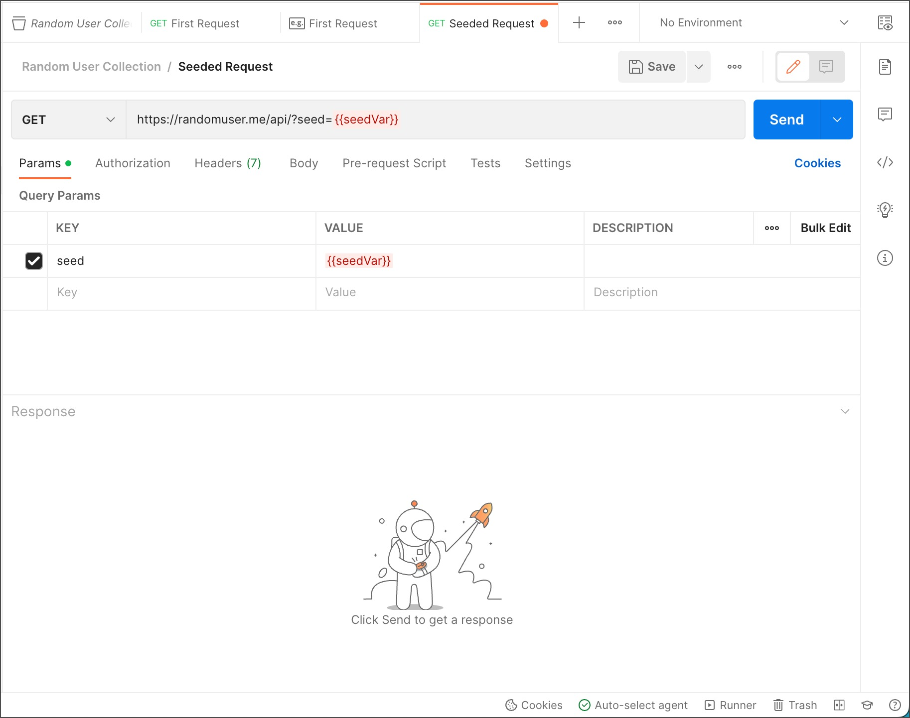
   > aside negative
   > The variable is unresolved in the request now, but it will receive a value in Postman Flows.
1. Select **Save**.

### Create a flow

1. Create a new flow and connect a **Send Request** block to the **Start** block.
1. In the **Send Request** block, select **Add request > Random User Collection > First Request**.
   
1. Connect a **Select** block to the **Send Request** block's **Success** port.
1. In the **Select** block select **Enter path…** then **/body/info/seed**.
   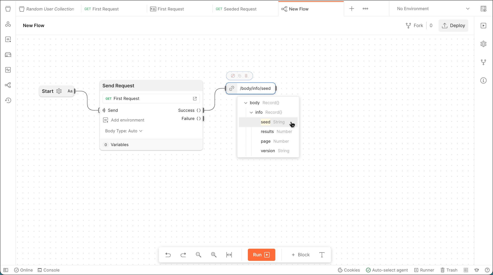
1. Create another **Send Request** block but don’t connect it yet.
1. In the new **Send Request** block, select **Add request > Random User Collection > Seeded Request**. The `{{seedVar}}` variable appears at the bottom of the block.
   
1. Connect the **Select** block to the port next to `{{seedVar}}`.
1. Connect a **Log** block to the second **Send Request** block’s **Success** port.
   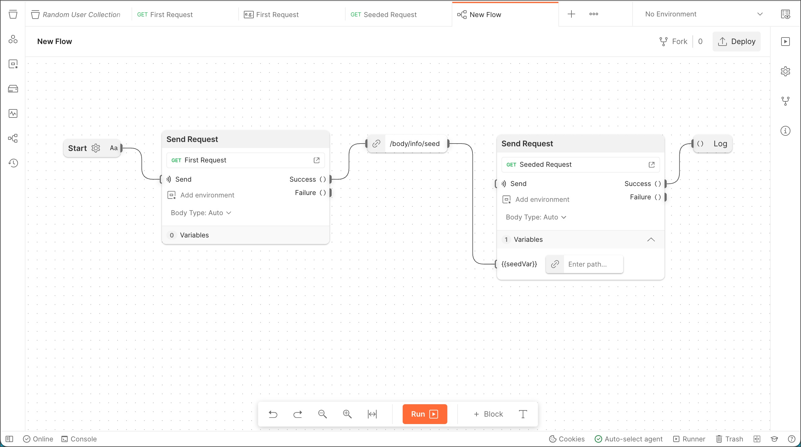
1. Select **Run** then select **Console**. Look at the two GET requests in the console and notice the second request includes a seed query. If you look at the response bodies for both GET requests, you’ll see they describe the same random user.
   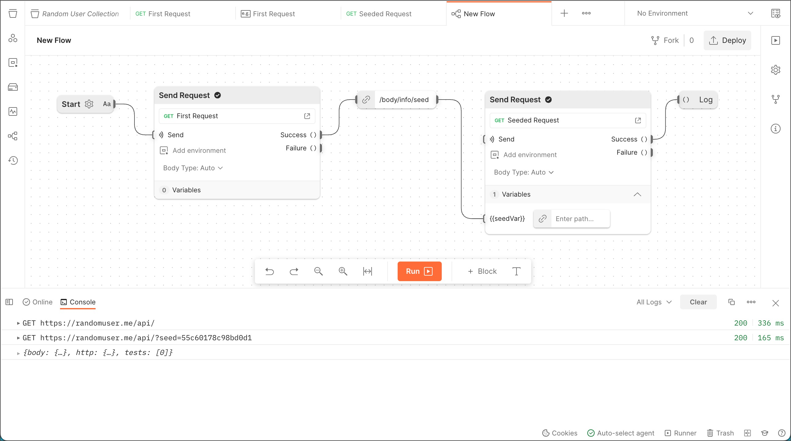
   The first **Send Request** block gets a single random user’s data and sends the response data to a **Select** block. The **Select** block selects the value of the **seed** field from the response data and passes that value to the next **Send Request** block. That **Send Request** block uses the first request's seed as a parameter, returning the same random user as the first **Send Request** block.

<!-- ------------------------ -->

## Using webhooks with Postman Flows

Duration: 3

To create a flow that executes on the Postman servers, create a Start block.


### Testing flows locally

Before starting, enter your test data and run it to see the output on your local console. Test data can be added by clicking the gear icon on the **Start** block. The test data can either be in text or JSON format.


### Deploy your flow

Select **Deploy** and your flow will be running in the cloud. Selecting the **Runs** section of the right pane will display the deployed flow was last updated. The webhook URL can be seen here as well as in the top left corner of the flow.

> aside negative
> Important
> Every time you release, it saves a snapshot of your collections and environments. If you make any changes to these, you will need to release again.

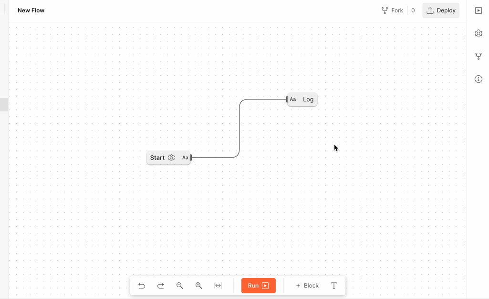

### Trigger the webhook

In the **Runs** section, select **View** to observe the flow running in the cloud. The logs will be visible in your client. Make a POST request to trigger the webhook endpoint and observe your flow executing in the cloud.

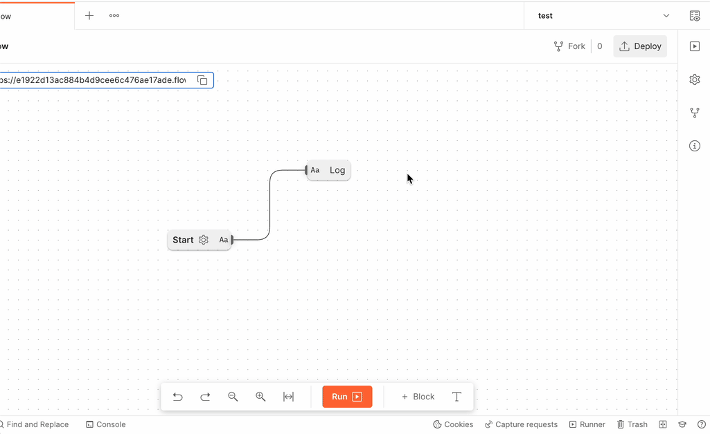

<!-- ------------------------ -->

## Next Steps

Duration: 1

If you want to learn more about Postman Flows, review the [official documentation]([https://learning.postman.com/docs/postman-flows/tutorials/building-your-first-flow/](https://learning.postman.com/docs/postman-flows/gs/flows-overview/)) for more details.

- Examples of flows: [Brewing Postman Flows workspace](https://www.postman.com/postman/workspace/brewing-postman-flows/overview)
- Reference for blocks and data types: [Postman Flows reference docs](https://learning.postman.com/docs/postman-flows/reference/blocks-list/)
- Flows Query Language (FQL) can be used to parse and transform JSON data to get the fields and structure you want: [Introduction to FQL docs](https://learning.postman.com/docs/postman-flows/flows-query-language/introduction-to-fql/)
- Livestream: [AI Powered Sentiment Analysis with Postman Flows and ChatGPT](https://youtube.com/live/0kAQb3Q4WCQ)

### What we've covered

- how to build your first flow
- how to pass data between blocks
- how to run requests in sequence
- how to use authorization with Postman Flows
- how to use response data in a request
- how to use webhooks with Postman Flows
