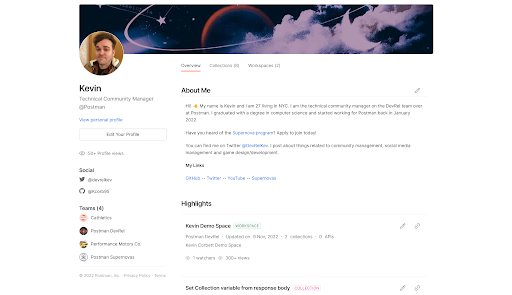

author: kcorb95
id: postman_supernovas
summary: Become a Postman ambassador and empower the API developer & tester community by building community around the world today.
categories: Getting-Started
environments: web
status: Draft 
feedback link: https://github.com/loopDelicious/pmquickstarts
tags: Getting Started, Developer, Tester, Automation, Badge

# Become a Postman Supernova
<!-- ------------------------ -->
## Overview 
Duration: 2

### What is a Postman Supernova?
Supernovas are leaders who are passionate about APIs, testing, and building new things. Supernovas contribute in a variety of ways including organizing and running meetups, sharing their knowledge at workshops and at in-person and virtual events. Supernovas are *not* Postman employees but ambassadors who are a part of Postman's global community and help educate and empower others.

### Can I Be a Postman Supernova?
If you enjoy learning and sharing your knowledge with other developers, then you should apply to be a Postman Supernova!

### Postman Supernovas must:
- Create or share technical content via public speaking, organizing events, videos or blog posts.
- Make quarterly contributions to the program.
- Be active participants and leaders in a technical community.
- Uphold Postman’s core values of being curious, collaborating, experimenting and being resourceful.

[Apply To Be a Supernova](https://www.postman.com/company/supernovas-program/)

### Prerequisites
- Must have [applied](https://www.postman.com/company/supernovas-program/) to the program.
- Met with Postman's Technical Community Manager ([Kevin](https://twitter.com/DevRelKev))

### What You’ll Learn
- How to complete required trainings to be the best Supernova that you can be.
- Publish your public workspace & profile.
- Plan and conduct your first qualifying contribution.
- Gain access to Postman's Slack channel, badges & more.

### What You’ll Need 
- A [Postman](https://postman.com/) Account

### What You’ll Build 
- A public Postman workspace and profile to showcase your work.

<!-- ------------------------ -->
## Required Trainings
Duration: 2

In order to be the best, most qualified Supernova that you can be, we require all Supernovas to complete 1 to 2 of the following trainings:

- We recommend following the “[30 Days of Postman](https://www.postman.com/postman/workspace/30-days-of-postman-for-developers/overview)” challenge and completing 15 days of your choosing.
*After being accepted into the program, you must complete the full 30 days and claim the additional badge within your first 30 days.*
- If you are already familiar with Postman, perhaps the “[15 Days of Postman](https://www.postman.com/postman/workspace/15-days-of-postman-for-testers/overview)” challenge is a little more your speed.
- Another option that grants a badge upon completion is the [Introduction to HTTP APIs in Postman](https://quickstarts.postman.com/guide/introduction_to_postman/index.html?index=..%2F..index#0) quickstarts tutorial.
- Postman Supernova, Valentin Despa put together an excellent “[Intro to Postman](https://youtu.be/2oOSnxZ28fA)” video series.
- The “[Good Documentation Checklist](https://www.postman.com/postman/workspace/postman-team-collections/documentation/1559645-4b520b0d-cf53-41be-8d24-0e0136416091)” collection is also a great reference to beef up your collection making skills.

Completion of these training materials is vital to your success as a Postman Supernova! 😁

<!-- ------------------------ -->
## Public Workspace & Profile
Duration: 2

### Postman Public Workspace
Your Postman public workspace is the home for all of your work.
Here you can share all of your other workspaces, links and important collections to give others in the community a chance to see your work.

**New to public workspaces?**
 
[How to Set Up Your First Public Workspace in 5 Easy Steps](https://blog.postman.com/how-to-set-up-public-workspaces/) blog post, [documentation](https://learning.postman.com/docs/collaborating-in-postman/public-workspaces/).

---

#### When to Create a Public Workspace
Public workspaces are a valuable tool to assist in making polished presentations. You can use a workspace for all of your talks and public work.
 

**Examples:**
 
\- If you’re consistently speaking/publishing about mocks, you could have a specific public workspace for everything mocking related.
 
\- When you find an API you’re particularly excited about, make an API, or want a dedicated space for a project, those could be separate public workspaces.
 
\- If you have a passion project or something topical.

#### Example Public Workspaces

[Public Portfolio](https://www.postman.com/devrel/workspace/f3bda588-0f0b-4519-b57d-9c4f8655bf41/overview): Kevin organizes his contributions to the community such as videos, blogs, streams and other workspaces or collections as well as important links in a “master” workspace.

[Content](https://www.postman.com/odevodyssey/workspace/dev-odyssey-s-public-workspace/overview): Supernova Orest Danylewycz uses his public workspace to show how use Postman in unique and interesting ways.

[Postman Tips & Tricks](https://www.postman.com/praveendvd-public/workspace/postman-tricks-and-tips/overview): Supernova Praveen Mathew documents his answers when he helps others on the Postman Community form and Stack Overflow.

[Peloton Data Playground](https://www.postman.com/carson-hunter-team/workspace/peloton/overview): Postmanaut Carson Hunter created a way to access and visualize workout data from their Peloton bike.

[LGBTQ+ Pride](https://www.postman.com/postman/workspace/lgbtq-pride): Created by the Postman DevRel team to celebrate LGBTQ+ Pride month.

### Postman Public Profile

Your [Postman Public profile](https://postman.postman.co/settings/me) is another great place to showcase your work. 
 
Adding a proper profile picture, banner and your contact/social media links will help increase your exposure.
 
An informative and inviting public profile can help increase adoption of your APIs.

<!-- ------------------------ -->
## Making Your Contribution
Duration: 1

### Before Your Contribution

Our definition of what makes a qualifying contribution is flexible. As long as the event or content is public, talks about Postman and/or APIs, has the goals of community building & education, then it counts.

Contributions can be in any language and in any timezones. An event or video does **not** have to be in English or in an American-friendly timezone.
We value our global community and strongly encourage building local communities of your own!

Events are also not required to be exclusively in-person or virtual. Feel free to host any variations including hybrid events to your preferences.

We are here to support you as well. We’re excited to meet the communities that you’re involved with, and to support your growth in ours. We are happy to help promote your contribution on the official Postman social media channels as well as provide feedback and ideas for events/content contributions.

### Types of Contributions
  
**Speaking**
- Types of events include but are not limited to: meetups, conferences, webinars, workshops, lunch n’ learns. Events can be virtual, in person, or hybrid.

  
**Hosting/Organizing**
- We ask that your event be **public** and open to all.
- Please ensure that your event has a published [Code of Conduct](https://www.postman.com/legal/events-code-of-conduct/).
- Do not feel pressured to have high attendance. There is no minimum requirement :)

  
**Content**
- Recommended types include: Videos, Blogs, Articles, Trainings
- Content should have an equal amount of work and effort put into it as you would for organizing or speaking at an event.
Shorter videos (> 3 minutes) are welcome, but we may require more than one if that’s the case.
- [Quickstarts](https://quickstarts.postman.com/) could always use translation assistance!

<!-- ------------------------ -->
## Contribution Proposal
Duration: 1

### Submit Your Contribution Proposal
Before you can be invited to the program, you will need to complete your first qualifying contribution. Whether that be speaking at or hosting an event, writing a blog post/article or creating a video, you will need to submit your idea for approval.

**This includes:**
 
\- Confirmation that you completed your training
 
\- Links to your public profile and public workspace
 
\- Abstract for your contribution including type, description, relevant links and proposed date if relevant.

After being approved we will share links to your event or content contribution on the Postman social media channels. We ask that you also make a post on the [Postman community forums](https://community.postman.com/categories). 

<!-- ------------------------ -->
## After Contributing
Duration: 1

From this point on, you are now an official Postman Supernova! 
Reach out via email to let us know so we can begin onboarding. 
If your contribution was an event, please include links to images or recordings of your event. 

We will send you official announcement graphics and post on the Postman social media channels to celebrate. You will also be awarded the Postman Supernova badge via email and invite you to our Slack channel where you can meet other Supernovas, promote your events, ask questions, request resources and message us directly.

We would like to thank you for your contribution and celebrate your Supernova achievement by sending you some free Postman Supernova swag.

<!-- ------------------------ -->
## What's Next?
Duration: 1

To remain in the program, we require regular event participation or content contributions, approximately one event (speaking/hosting) or two content contributions per-quarter.

You’ll have lots of support from the Postman team. Whether you’re experienced or brand new to public tech events, we’re here. We are all expanding our networks and opportunities are opening up more frequently than ever.

We understand that things happen and sometimes you are too busy to make your contribution for the quarter. If however you miss two quarters in a row, this can result in your graduation from the program. Note that this is not a permanent thing, you may re-apply to join the program when you are able to dedicate more time again :)

<!-- ------------------------ -->
## Conclusion
Duration: 1

Congratulations if you made it this far!  
You stand tall among the few. By this point, you have completed your trainings, built your public workspace & public profile, completed your first contribution and have been invited to the Supernova program.

If you're ready to start your journey and become a Postman Supernova, [apply today](https://www.postman.com/company/supernovas-program/).

<!-- ------------------------ -->
## Code of Conduct
Duration: 1

We take our [Code of Conduct](https://www.postman.com/legal/events-code-of-conduct/) very seriously.

Postman Supernovas are leaders, and we all have a responsibility to uphold community values.