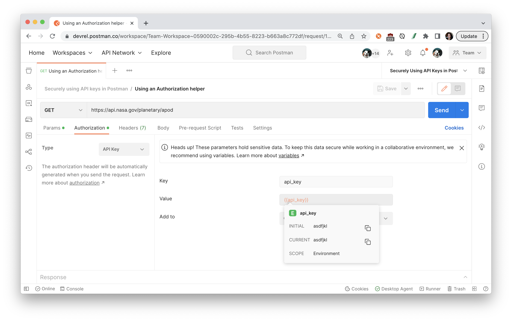
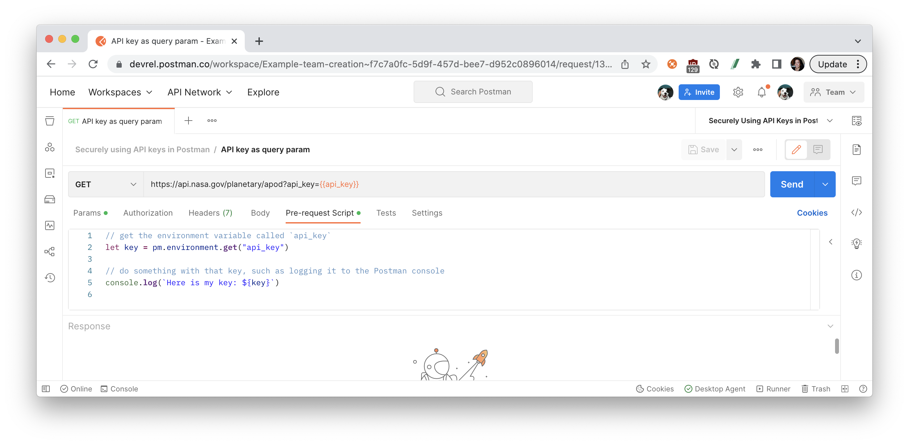
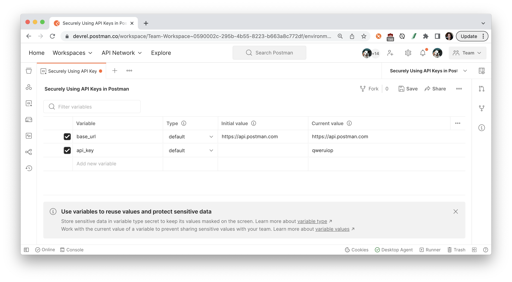
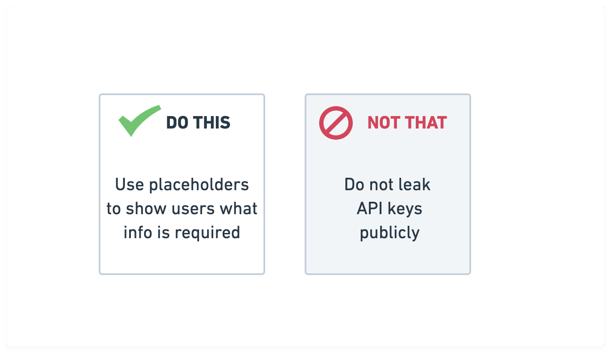
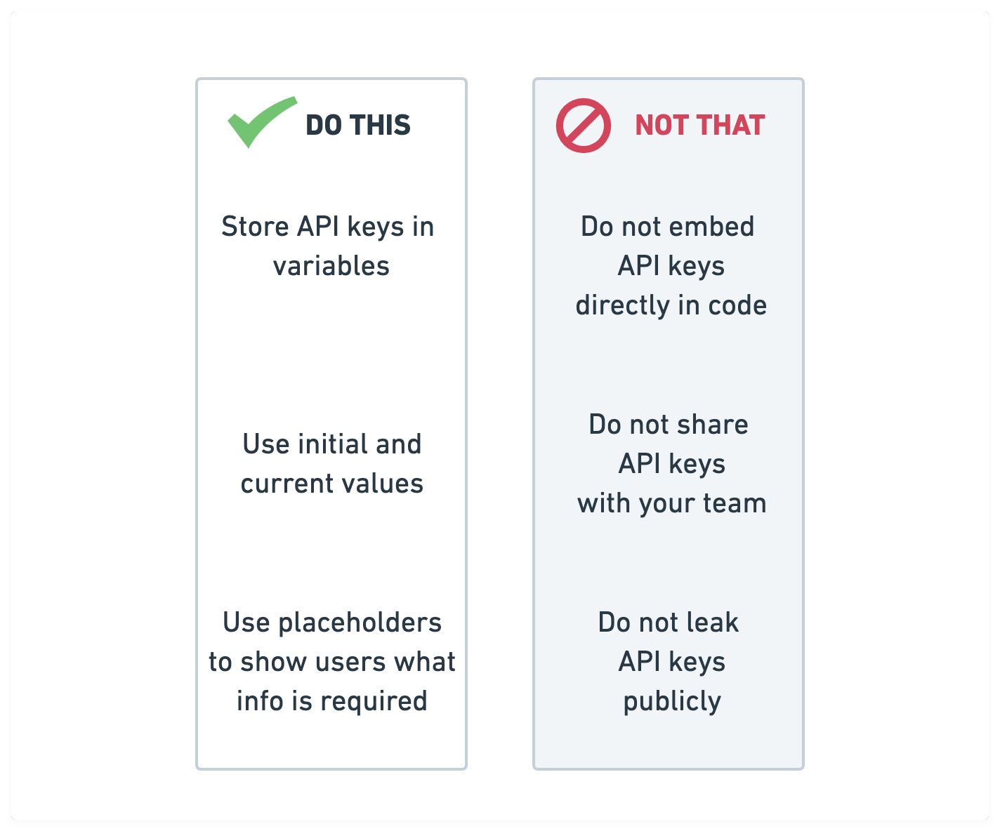

author: Joyce
id: securing_api_keys
summary: Three ways to securely work with API keys
categories: Getting-Started
environments: web
status: Published
feedback link: https://github.com/loopDelicious/pmquickstarts
tags: Getting Started, Developer, Tester, Security

# Securely Using API Keys in Postman

<!-- ------------------------ -->

## Overview

Duration: 1

> aside negative
> This tutorial was originally posted [here](https://www.postman.com/postman/workspace/postman-team-collections/collection/1559645-3118cfc8-97a9-4133-a5c7-093784d50d20?ctx=documentation).

If you work with APIs, then you already know there’s many ways to prove your identity and gain access to an API, such as API keys. To help you use API keys as effectively as possible, let’s walk through some common pitfalls we see come up, and learn how to handle sensitive data in Postman.

### What You’ll Learn

- Store API keys in variables
- Use initial and current values for variables
- Use placeholders to show users what info is required

### What You’ll Need

- a [Postman Account](https://identity.getpostman.com/signup)

### What You’ll Build

- A Postman collection and environment with examples of authorizing APIs

Let’s look at three ways to securely work with API keys. Build your own example by following this step-by-step tutorial, or fork the example collection and environment in [this workspace](https://www.postman.com/postman/workspace/postman-team-collections/overview) to follow along.

- Fork the [example collection](https://www.postman.com/postman/workspace/postman-team-collections/collection/1559645-3118cfc8-97a9-4133-a5c7-093784d50d20): Securely using API keys in Postman
- Fork the [example environment](https://www.postman.com/postman/workspace/postman-team-collections/environment/1559645-8157cb13-916b-43bd-ba9b-40cc9c465c68): Securely using API keys in Postman
- Or fork the collection and environment by clicking the **Run in Postman** button below.
   
  [](https://god.gw.postman.com/run-collection/1559645-3118cfc8-97a9-4133-a5c7-093784d50d20?action=collection%2Ffork&collection-url=entityId%3D1559645-3118cfc8-97a9-4133-a5c7-093784d50d20%26entityType%3Dcollection%26workspaceId%3D34f3a42c-18a7-4ad6-83fb-2c05767d63a7#?env%5BSecurely%20using%20API%20keys%20in%20Postman%5D=W3sia2V5IjoiYmFzZV91cmwiLCJ2YWx1ZSI6Imh0dHBzOi8vYXBpLmdldHBvc3RtYW4uY29tIiwiZW5hYmxlZCI6dHJ1ZX0seyJrZXkiOiJhcGlfa2V5IiwidmFsdWUiOiJ5b3VyLW5hc2Eta2V5IiwiZW5hYmxlZCI6dHJ1ZX0seyJrZXkiOiJwb3N0bWFuX2FwaV9rZXkiLCJ2YWx1ZSI6InlvdXItcG9zdG1hbi1rZXkiLCJlbmFibGVkIjp0cnVlfV0=)

<!-- ------------------------ -->

## Do not embed your API keys directly in code

Duration: 2

Instead of hard-coding your API keys, you can store them as [variables](https://learning.postman.com/docs/sending-requests/variables/) in Postman. In the same way you use variables for parameterized data, you can also use variables to decouple your secrets from the rest of your code. Storing your API key as a variable allows you to revoke, or refresh, the value in a single spot. There are different [variable scopes](https://learning.postman.com/docs/sending-requests/variables/#variable-scopes) to suit different use cases.

Let’s follow an example to store an API key as an environment variable. Using Postman environments allows you to decouple specific variables so they can be used alongside different collections and shared separately with other team members and collaborators.

[Create an environment](https://learning.postman.com/docs/sending-requests/managing-environments/#creating-environments) and add an environment variable called `api_key`, and **Save** your changes.

Postman displays the active environment in the environment selector, located in the top right of the workbench. You can also access all environments from **Environments** in the sidebar and select the set active icon next to an environment to make it the active environment.

Variables can be referenced in text fields with double curly braces, as you can see here with the **Authorization** tab. Hover over the variable name to inspect the variable's value and scope.

Variables can also be referenced in script fields, such as by using `pm.environment.get()`:

<!-- ------------------------ -->

## Do not share your API keys with your team

Duration: 2

If you’re sharing an environment with your team, keep your tokens private by only updating the current value. This also ensures that you don’t override the team’s value.

For global, collection, and environment variables, you can distinguish between an [initial and current value](https://learning.postman.com/docs/postman/variables-and-environments/managing-environments/#adding-environment-variables). The current value is local to your session within your Postman app. If you log out of Postman, those values will disappear. The current value is never synced to your account or shared with your team—unless you choose to persist it—which keeps it more secure.

Let’s walk through an example in which I share an environment with my team without sharing my personal API key.

[Share the environment](https://learning.postman.com/docs/sending-requests/managing-environments/#working-with-environments-as-a-team) with your team by moving it to a team workspace:

Initial values are accessible to your team in the workspace. For example, if you want to share information like a base URL of `https://api.getpostman.com` for your API, those initial values will be accessible to the team. If someone with an environment editor role updates that initial value to v2 of the API like `https://api.getpostman.com/v2`, the updated initial value is shared with the team:

Current values are restricted to your session within your Postman app. If you log out and log back into Postman, those values will be gone. The current value is never synced to your account or shared with your team—unless you choose to persist it. When you’re working with a team, you can keep your private information as a current value so your team doesn’t have access to it. Current values are restricted to your session:

You can also define environment variables by **Type**. Variables are automatically assigned the default type when created, which is shown as plain text and has no extra properties. Users with editor role can change sensitive variables to [secret type](https://learning.postman.com/docs/sending-requests/variables/#variable-types), which masks the initial and current values for all workspace members. Secret type can be used to prevent unintentional disclosure of sensitive data, including API secrets, passwords, tokens, and keys.

<!-- ------------------------ -->

## Do not leak your API keys publicly

Duration: 2

If you’re sharing [Postman-generated documentation](https://learning.postman.com/docs/publishing-your-api/documenting-your-api/) with your team, or especially publicly, make sure you don’t accidentally leak secrets.

Let’s walk through an example in which I [publish my API documentation](https://learning.postman.com/docs/publishing-your-api/publishing-your-docs/) publicly without leaking secrets.

Use placeholder text for your API key’s value. Postman relies on string substitution to render the initial values of environment values in the documentation. Display a dummy token or placeholder text—like `your-nasa-key` seen in the next image—to indicate what value to use. (Note: If you leave the value blank, Postman will display no information in the rendered web documentation.)

When you’re ready to publish the collection and environment, go ahead and [preview the documentation](https://learning.postman.com/docs/postman/api-documentation/publishing-your-docs/#configuring-your-public-docs) to scan for secrets. Postman will warn you about anything that appears to be a sensitive token, so you can make any updates before publishing the documentation:

<!-- ------------------------ -->

## Next Steps

Duration: 1

### What we've covered

To sum it all up, when you’re using API keys, keep your secrets safe with Postman by following these three tips:

- Store API keys in variables
- Use initial and current values
- Use placeholders to show users what info is required

### Additional resources

For more on API keys and security, see our [“How We’re Protecting Your Postman API Keys in GitHub” blog post](https://blog.postman.com/how-were-protecting-your-postman-api-keys-in-github/). You can also check out [Google’s best practices for securely using API keys](https://support.google.com/googleapi/answer/6310037) in Google Cloud Platform (GCP) applications.
