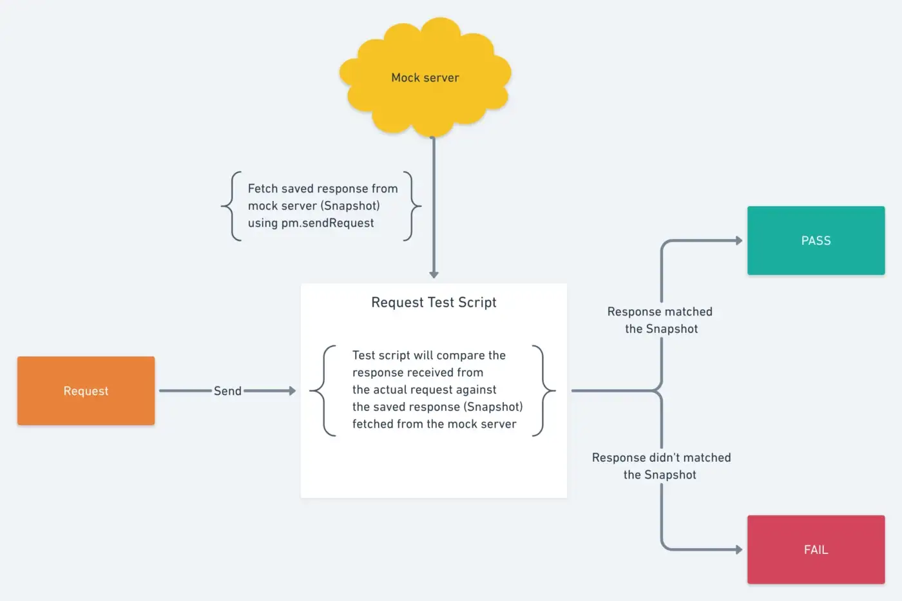

author: Prashant Agrawal
id: snapshot_testing
summary: Three different snapshot testing strategies
categories: Tester
environments: web
status: Published
feedback link: https://github.com/loopDelicious/pmquickstarts
tags: Developer, Tester, Automation, Intermediate

# Snapshot testing using Postman

<!-- ------------------------ -->

## Overview

Duration: 1

Negative
: This course was originally created by [Prashant Agrawal](https://www.linkedin.com/in/prashantagrawal1) and has been modified to suit the Quickstart format.

### Prerequisites

- A Postman account
- Introductory knowledge of APIs

### What You’ll Learn

- Extend the Postman sandbox with external libraries.
- Run tests locally using the Postman runner.
- Automate testing as part of your continuous integration (CI) pipeline using Newman, Postman’s command-line runner.
- Streamline regression testing cycles using Postman monitors.
- Perform snapshot testing using Postman mock servers.

### What You’ll Build

- A Postman Collection consisting of requests, variables, and tests.

<!-- ------------------------ -->

## What is Snapshot Testing?

Duration: 7

Writing tests, most of the times is not a breeze. [Writing good tests with acceptable code coverage takes time, effort, practice, and patience](https://hackernoon.com/common-excuses-why-developers-dont-test-their-software-908a465e122c). Probably that’s why you would find “Write Tests” as the last to-do item in most developers’ task list. This situation gets worse in the case of startups or early-stage companies because the time, effort and resources spent on writing tests are not justified by the business.

In this lesson, we will talk about **Snapshot Testing**, a style of testing which removes much of the manual coding and boilerplate, leaving the test runner to compare the produced result against a saved _snapshot_. Snapshot testing became a major thing for UI tests, thanks to [Jest test runner](https://jestjs.io/docs/en/snapshot-testing) by Facebook that includes it by default. Before starting on how to get this working in Postman, let us first understand what is Snapshot Testing in principle.

### What is Snapshot Testing?

Imagine a unit test.

```javascript
const add = (a, b) => a + b;
it("adds numbers", () => {
  expect(add(2, 3)).toBe(5);
});
```

The test computes a value using a call to `add(2, 3)` and compares it to a hard-coded value of `5`. How did we get this expected value `5`? Well, I (the human developer) took a piece of paper and a pencil and added `2 + 3`. Easy.

Imagine a real-world unit test. Would computing the expected value be as simple as adding two small numbers? No. A more complex algorithm would generate a large object as a result, not a single number. For example, if we are unit testing an API response that response could be a really big nested JSON object.

Ideally, you would either write tests for each and every individual property of the response or write a huge schema that this response will validate against. This sounds good if you have 2–5 requests but imagine doing this same tedious task for 100s of requests.

Now imagine what if you could test this something like

```javascript
it("returns top seller item", () =>
  api.get().then((item) => expect(item).toMatchSnapshot()));
```

The `item` returned from the API should match its saved snapshot. Here a snapshot is nothing but just the **Gold Standard** of how your `item` should look like.

### Snapshot testing strategies

Ideally, a snapshot should be exactly equal to the result that you are trying to test but in reality, this might not be true (especially in the case of APIs). Therefore, based on your specific needs and type of responses that you are trying to test, you can choose any of the following snapshot testing strategies for your APIs:

1. **Response should exactly match the saved snapshot.** This strategy is useful if your API response is static and doesn’t change often. The downside of this approach is that it is too rigid, any small change (even the one that you are not worried about) will cause the test to fail.
1. **Response should have a snapshot as its subset.** This strategy makes sure that if new properties get added to the response, it doesn’t affect your test. This strategy is not helpful if your response consists of properties whose values are dynamic.
1. **Response should match the JSON Schema generated from the saved snapshot.** This strategy generates a basic schema from your save snapshot and check the validity of the API response against this generated Schema. If you want more control on how this Schema should look like then you can create the Schema manually and save it as a snapshot, rather than saving the expected API response. This requires a bit of effort when creating a Schema but it will make sure that it establishes a defined contract about the structure of response with the author of the API.

<!-- ------------------------ -->

## Snapshot Testing in Postman

Duration: 5

Now that we have seen what is a Snapshot and what Snapshot Testing is about, let us build it out for the requests inside Postman. [Postman](https://www.postman.com/) is an API Development Environment (ADE) which means it comes with all the building blocks that we would need to achieve snapshot testing.

1.  [Create a collection](https://learning.getpostman.com/docs/postman/collections/creating_collections/) and save a request in that collection. This will be the request for which we will be saving as a snapshot.
1.  As we saw in the previous section, snapshots are nothing but an ideal representation of how the result should look like. We will save our request and its response as [Example in Postman](https://learning.getpostman.com/docs/postman/collections/examples/), which in essence will behave as a snapshot of this request. This is very helpful because rather than a separate place, your snapshots can exist alongside the request you want to test. This makes it really easy to debug in case of failing tests. So, now we go ahead, send the request and save the response as an example.
1.  In the previous step we saved our snapshot, but how will we use them in our Test Scripts?? Well, Postman allows you to create Mock Servers on top of your collection and the response of these Mock requests is the response that you saved in the Example. So let’s create a mock server on the collection.
1.  Now what we need to do is fetch the snapshot from the Mock server that we created, inside our test script so that we can compare it against the actual API response. We need to first [create the Mock](https://learning.getpostman.com/docs/postman/mock_servers/setting_up_mock) endpoint from where we will be fetching the snapshot and then use [`pm.sendRequest()`](http://blog.getpostman.com/2017/10/03/send-asynchronous-requests-with-postmans-pm-api/) to fetch the snapshot.
1.  I recommend adding this script at the [collection or folder level](https://learning.getpostman.com/docs/postman/scripts/pre_request_scripts/#adding-a-pre-request-script-to-a-collection-or-folder) so that whenever you add any new request, all you need to do is save its response as an Example and you will get a snapshot test for that request out of the box. Also updating the Test becomes as simple as updating the Example response with the updated snapshot.

](assets/snapshot_testing.png)

To help you get started with snapshot testing I have already published a Postman collection with all the above strategies. Fork the sample collection in the next section.

<!-- ------------------------ -->

## Fork the collection

Duration: 3

](assets/snapshot.png)

To set up Snapshot Testing for your APIs you can use this collection as reference.

1.  Fork the collection to your own workspace. The collection Test Script already contains all the script required for this. Select the collection, tab over to **Tests** and review the code.
    </br>
    [](https://god.gw.postman.com/run-collection/1559645-f8f51fd3-13eb-4049-8603-9e8f7b787fbe?action=collection%2Ffork&collection-url=entityId%3D1559645-f8f51fd3-13eb-4049-8603-9e8f7b787fbe%26entityType%3Dcollection%26workspaceId%3D70c7199b-6aee-49a6-a90f-025ad614f294)
2.  Send the request and get a response for the API you want to create a Snapshot test.
3.  Save the response as [an Example](https://learning.postman.com/docs/sending-requests/examples/) to that request. This will work as your Snapshot.
4.  [Create a Mock server](https://learning.postman.com/docs/designing-and-developing-your-api/mocking-data/mocking-with-examples/) on top of the collection.
5.  Update the `snapshotURL` in **Collection Variables** with the Mock server url that you created above.

This collection contains three different Snapshot testing strategies. You can choose any of them according to your use case and your response structure.

<!-- ------------------------ -->

## Next Steps

Duration: 1

So as you can see how simply we created our very own snapshot testing framework using Postman. It also fits very well with other testing strategies like [Consumer-driven Contract Testing](https://medium.com/postman-engineering/consumer-driven-contract-testing-using-postman-f3580dba5370).

For more interesting workflows and testing strategies, follow [Postman Engineering](https://medium.com/postman-engineering).

### Additional resources

- [Snapshot testing for APIs using Postman](https://medium.com/better-practices/snapshot-testing-for-apis-using-postman-7f9f26295d6b) blog
- [Test examples in Postman](https://www.postman.com/postman/workspace/test-examples-in-postman/overview) workspace
