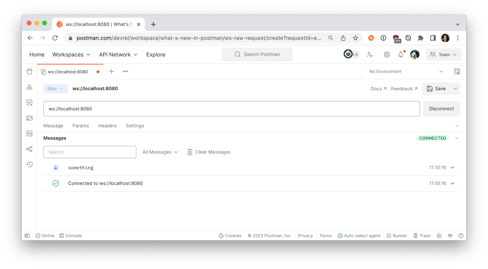
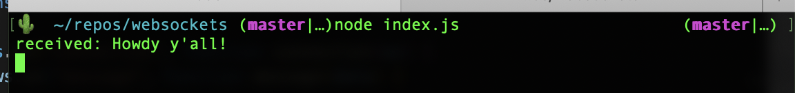

author: Joyce
id: websockets_node
summary: Set up a WebSockets server in Node.js
categories: Getting Started
environments: web
status: Published
feedback link: https://github.com/loopDelicious/pmquickstarts
tags: Getting Started, Developer

# Set up a WebSockets server in Node.js

<!-- ------------------------ -->

## Overview

Duration: 1

WebSockets are great for building real-time functionality into web applications, such as communicating financial trading data or IoT sensor data.

The [WebSocket protocol](https://www.rfc-editor.org/rfc/rfc6455) provides a way to exchange data between a client and server over a persistent connection. The data can be passed in both directions with low latency and overhead, and without breaking the connection. This means the server can independently send data to the client without the client having to request it, and vice versa.

In this tutorial, let’s create a WebSocket server, and use Postman to send and receive messages across the WebSocket connection.

### Prerequisites

- [Node.js](https://nodejs.org/en/) installed on your machine

### What You’ll Learn

- how to run a WebSockets server locally
- how to establish a WebSockets connection
- how to send and receive WebSocket messages

### What You’ll Need

- [VSCode](https://code.visualstudio.com/download) Installed
- [NodeJS](https://nodejs.org/en/download/) Installed

### What You’ll Build

- A WebSockets server in Node.js

<!-- ------------------------ -->

## Create the Node.js server

Duration: 3

In your terminal, make a new directory called `websockets`.

```bash
$ mkdir websockets
```

Navigate into the new directory.

```bash
$ cd websockets
```

Install [`ws`](https://www.npmjs.com/package/ws), a WebSockets library for Node.js.

```bash
$ npm install ws
```

Installing the WebSockets library like this also initializes your Node.js project and creates a package where your project files are stored. Open the `websockets` directory using your preferred text editor, like VSCode. You should see the project files scaffolded as below.


Look inside the `package.json` file to see the `ws` dependency. Add the `"type": "module"` to the `package.json` so we can load an ES module in the next step. Your `package.json` should look like the following.

```json
{
  "type": "module",
  "dependencies": {
    "ws": "^8.12.0"
  }
}
```

In the root directory, create a file called `index.js` and paste the following code from the [`ws`](https://www.npmjs.com/package/ws) documentation for a “Simple server”. This code initializes the WebSockets server. Upon establishing a connection between the client and this server (once running), the server will send the message “something” to the client.

```js
import { WebSocketServer } from "ws";

const wss = new WebSocketServer({ port: 8080 });

wss.on("connection", function connection(ws) {
  ws.on("message", function message(data) {
    console.log("received: %s", data);
  });
  ws.send("something");
});
```

It’s time to run our server locally from the command line.

```bash
$ node index.js
```

In the next step, let's begin sending and receiving messages.

<!-- ------------------------ -->

## Send and receive WebSocket messages

Duration: 3

In Postman, select **New > WebSocket Request** to open a new tab. Enter the WebSocket server URL. A WebSocket URL begins with `ws://` or `wss://` and our server is running on `localhost:8080`. Click **Connect**.



Once Postman establishes the connection to your local server, the **Messages** pane displays a list of messages for the WebSocket connection, including incoming, outgoing, and network messages. You can further inspect the connection details by clicking on “Connected to ws://localhost:8080”.


The connection we established between the Postman client and local server is bidirectional. In addition to receiving messages, we can also send them. Under the **Message** tab, write your own message and **Send**.

If you have good reflexes, you may have seen your outgoing message in the **Messages** pane. If not, filter for the message using the controls or search bar in the **Messages** pane.


Verify the outgoing message was received by your local server.



<!-- ------------------------ -->

## Send system information

Duration: 3

Let’s update our WebSockets server to send something a little more interesting, like our computer’s information, using the [`systeminformation`](https://www.npmjs.com/package/systeminformation) node package. Terminate the running server (**Ctrl + C**) and install the package from the command line.

```bash
$ npm install systeminformation
```

Import the package by adding the following code to the top of `index.js`.

```js
import si from "systeminformation";
```

Add the following code immediately after our WebSocket connection sends the string “something”. Every 1000 milliseconds, we will send a message about the current load on our CPU.

```
 setInterval(async () => {
    const cpuTemp = JSON.stringify(await si.currentLoad());
    ws.send(cpuTemp);
  }, 1000);
```

Save your changes, and restart the local server from the command line.

```
node index.js
```

Return to Postman and **Connect** to the local server. This time we receive information about our CPU every second!


Click on a message to expand the message details and further inspect the data sent from our local server.


The messages will keep coming until you terminate the connection. Use Postman to **Disconnect** from the server.

Now that we have a functioning WebSocket server, we can do more things.

- Slow down the messages coming from the local server. Try updating `1000` milliseconds to `3000` milliseconds to see what happens.
- Instead of sending all the data, try sending only the average load. You may want to inspect the messages in Postman to parse the data properly.

We can write more code to customize our local application. Upon receiving a message from the client, we can do more than logging the message to the console. We can also retrieve data from other sources and perform calculations before sending our messages to the client.

<!-- ------------------------ -->

## Next Steps

Duration: 1

More and more developers are exploring [WebSocket APIs in Postman](https://learning.postman.com/docs/sending-requests/websocket/websocket/). According to Postman’s [State of the API 2022](https://www.postman.com/state-of-api/api-technologies/#api-technologies) report, WebSockets are used by 26% of respondents.


### Additional Resources

Check out these Postman resources to learn more about WebSockets.

- [Guide to Postman WebSockets](https://www.postman.com/postman/workspace/websockets/documentation/14057978-712d684f-c252-4bd9-a7a6-6a893e41adea) collection
- [Using WebSocket requests](https://learning.postman.com/docs/sending-requests/websocket/websocket/) docs
- [WebSocket requests](https://youtu.be/H-7EZVj9D-k) video

### Next Steps

You can use this starter application to explore how to use WebSockets with Internet of Things (IoT) devices and do neat stuff around the home.
